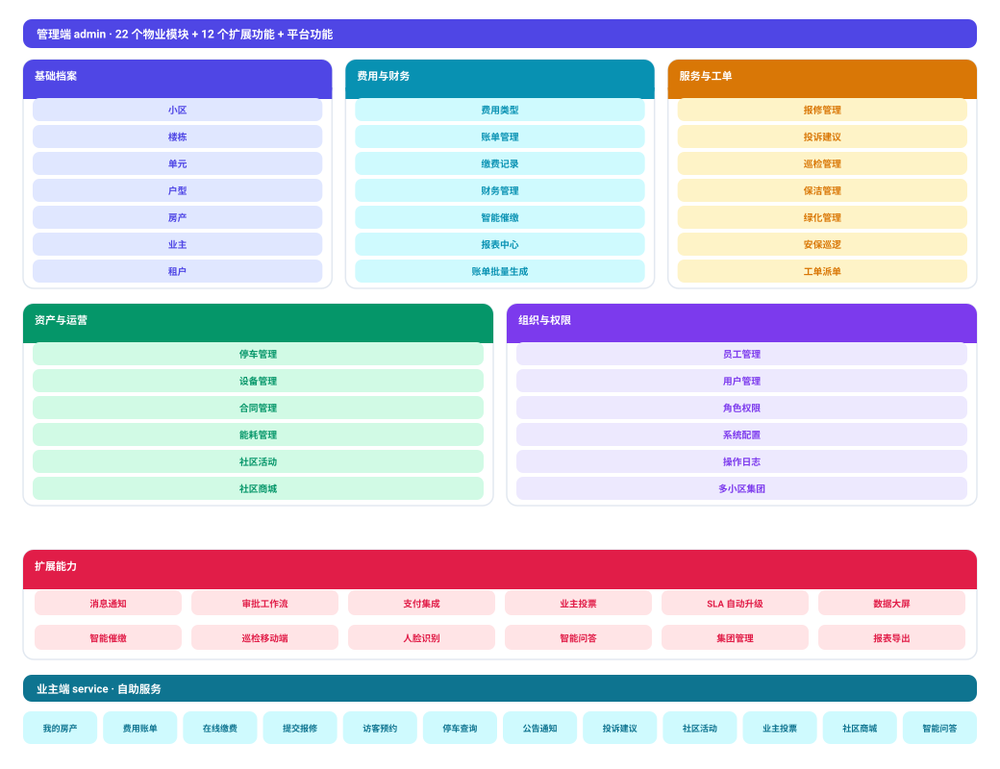

# 物业管理系统 (Property Management Platform)

[English](docs/i18n/en/README.md) | [한국어](docs/i18n/ko/README.md) | [Русский](docs/i18n/ru/README.md) | [Deutsch](docs/i18n/de/README.md) | [Français](docs/i18n/fr/README.md) | [Español](docs/i18n/es/README.md) | [Português](docs/i18n/pt/README.md) | [हिन्दी](docs/i18n/hi/README.md) | [العربية](docs/i18n/ar/README.md) | [বাংলা](docs/i18n/bn/README.md) | [Bahasa Indonesia](docs/i18n/id/README.md) | [日本語](docs/i18n/ja/README.md) | 中文

> Copyright (c) 2026 erik <erik@erik.xyz> — https://erik.xyz


全栈物业管理系统，覆盖22个业务模块 + 12个扩展功能（消息通知/审批工作流/支付/投票/SLA/数据大屏/催缴/巡检/商城/人脸/集团/智能问答）。管理员端（admin）和业主端（service）分离部署，前端覆盖 Flutter Web（PC 管理后台风格）与 HarmonyOS 移动端。

**小筑** 是本项目的宠物 —— 一位楼宇管家：一栋亮着灯的公寓楼，戴管家帽、拿工单板，胸前工牌打勾。它出现在安装向导、错误页、登录页与架构图中，代表「在管的每一栋楼都有人照看」。

## 项目宠物 · 小筑


| 项 | 说明 |
|----|------|
| 形象 | 拟人化楼宇管家（亮窗代表在管房源，工单板代表派单闭环） |
| 配色 | 靛蓝 `#4F46E5` + 暖橙 `#F59E0B`，与前端主题一致 |
| 矢量文件 | [docs/images/pet_xiaozhu.svg](docs/images/pet_xiaozhu.svg)（语言无关，13 种语言共用） |
| 图标标记 | [docs/images/favicon.svg](docs/images/favicon.svg)，已部署到 `admin/public/`、`service/public/`、`apps/flutter/web/`、`admin/apps/flutter/web/` |
| 已接入 | 安装向导 3 步 + 已安装页 · 404 / 504 错误页（内联矢量）· 业主端与管理端 Flutter 登录页 · 四个 Web 入口的浏览器标签图标 · 架构图横切栏 |

## 项目结构

```
property-management-platform/
├── admin/                         # 管理员端 webman v2 项目
│   ├── app/
│   │   ├── admin/controller/      # 管理端控制器
│   │   ├── api/v1/controller/     # 公开 API 控制器
│   │   ├── common/                # 公共工具类
│   │   ├── middleware/            # 中间件（认证/鉴权/限流/安全）
│   │   ├── model/                 # 数据模型（Eloquent ORM）
│   │   ├── queue/                 # 队列任务
│   │   └── process/               # 进程管理
│   ├── apps/
│   │   ├── flutter/               # 管理后台 Flutter Web（PC 风格）
│   │   └── harmonyos/             # 管理后台 HarmonyOS App
│   ├── config/                    # 配置文件（含中文注释）
│   ├── database/
│   │   └── backup/                # 数据库备份脚本
│   ├── resource/
│   │   └── translations/          # 国际化语言文件（zh_CN / en）
│   ├── docs/                      # 管理端文档
│   ├── tests/                     # 单元测试
│   └── public/                    # Web 入口
├── service/                       # 业主业务端 webman v2 项目
│   ├── app/
│   │   ├── api/v1/controller/     # 业主端 API 控制器
│   │   ├── common/                # 公共工具类
│   │   ├── middleware/            # 中间件
│   │   ├── model/                 # 数据模型
│   │   └── process/               # 进程管理
│   ├── config/                    # 配置文件
│   ├── resource/
│   │   └── translations/          # 国际化语言文件
├── apps/
│   ├── flutter/                   # 业主端 Flutter Web（PC 风格）
│   └── harmonyos/                 # 业主端 HarmonyOS App
└── docs/                          # 项目文档
    ├── ARCHITECTURE.md
    ├── ARCHITECTURE_DESIGN.md
    ├── ARCHITECTURE_DIAGRAM.md    # 系统架构图
    ├── FLOWCHART.md               # 业务流程图
    ├── FUNCTION_DIAGRAM.md        # 功能模块图
    ├── LIFECYCLE_DIAGRAM.md       # 生命周期图
    ├── SECURITY_ARCHITECTURE.md   # 安全架构图
    ├── API.md
    ├── FEATURES.md
    └── FEATURE_DESIGN.md
```


## 项目规模

| 层 | 数量 | 详情 |
|----|------|------|
| 数据库表 | 65张 | 全部 `management_` 前缀，BIGINT 非自增主键 |
| PHP 模型 | admin 64 / service 57 | 均为 Eloquent 模型，含 encryptable 加密字段；service 端 57 为模型文件数（含 BaseModel 基类） |
| admin 控制器 | 58个 | 通用管理 + 22个物业模块 + 12个扩展功能 |
| service 控制器 | 17个 | 业主端全部 API |
| API 路由 | 178 | admin 125 + service 53 |
| Flutter 管理后台 | 42页 | admin 42个页面模块，96文件/6,662行 |
| Flutter 业主端 | 13页 | 费用/报修/停车/访客/活动/通知/投票/商城/智能问答/人脸，32文件/3,582行 |
| HarmonyOS | 7页 | 登录/首页/账单/报修(2)/公告/个人中心，11文件/927行 |
| 测试 | 459个 | admin 258个(619断言) + service 201个(661断言)，详见 [测试报告](docs/tests/) |

## 系统架构与设计图

> 以下四张为手绘 SVG（中英双版，英文版 `*_en.svg`）；更细的 Mermaid 图表见 [架构图](docs/ARCHITECTURE_DIAGRAM.md) · [流程图](docs/FLOWCHART.md) · [功能图](docs/FUNCTION_DIAGRAM.md) · [生命周期图](docs/LIFECYCLE_DIAGRAM.md) · [安全架构图](docs/SECURITY_ARCHITECTURE.md)

### 架构设计


### 功能设计



### 生命周期


### 核心业务流程


### 19层安全纵深防御


## 功能模块（22大模块 + 12扩展）

| 批次 | 模块 | 状态 |
|------|------|------|
| 第1批 | 小区、楼栋、单元、户型、房产、业主、租户、费用、报修、公告（10模块） | ✅ 全部完成 |
| 第2批 | 停车、设备、投诉、访客、合同、财务（6模块）+ 面板可视化 + Excel/PDF导出（平台功能） | ✅ 全部完成 |
| 第3批 | 安保巡逻、保洁、绿化、社区活动、能耗、员工（6模块） | ✅ 全部完成 |
| 扩展 | 消息通知、审批工作流、支付集成、业主投票、SLA自动升级、数据大屏、智能催缴、巡检移动端、社区商城、人脸识别、多小区集团管理、智能问答（12模块） | ✅ 全部完成 |
| 平台功能 | 报表中心（收支趋势 / 收缴率 / 业务分布 / 欠费排行 / PDF导出）+ 业主起始页统计（投诉 / 活动 / 投票 / 未读消息） | ✅ 全部完成 |

## 技术栈

### 后端
- **框架**: webman v2 (workerman/webman)
- **语言**: PHP 8.3+
- **数据库**: MySQL 8.0+，表前缀 `management_`，主键 BIGINT 非自增
- **搜索引擎**: Elasticsearch 8.x
- **缓存**: Redis 7.x

### 核心依赖
| 包名 | 用途 |
|------|------|
| `erikwang2013/snowflake-php` | 全局唯一 BIGINT 主键生成 |
| `erikwang2013/hashids` | API 层 ID 加解密 |
| `erikwang2013/jwt-webman` | JWT 认证（HS256） |
| `erikwang2013/encryption` | API 传输敏感数据 AES-256-CBC 加密 |
| `erikwang2013/encryptable` | 数据库敏感字段加解密 |
| `erikwang2013/webman-scout` | Elasticsearch 数据同步与全文检索 |
| `erikwang2013/season` | 国家旗帜数据 |
| `erikwang2013/security-php` | 安全工具检测 |
| `erikwang2013/poster-php` | 敏感操作随机验证码 |
| `phpoffice/phpspreadsheet` | Excel 导出 |
| `barryvdh/laravel-dompdf` | PDF 导出 |
| `hg/apidoc` | API 接口文档自动生成 |

### 前端
- **Flutter 3.x** + GetX（含 i18n） + Dio + fl_chart + flutter_svg（宠物矢量图） — PC 风格 Web 管理后台
- **HarmonyOS ArkTS** + @ohos.net.http — 移动端 App

### API 文档

全部 API 端点与参数说明见独立文档 [docs/API.md](docs/API.md)。启动服务后也可访问 apidoc 自动生成的交互式文档：

| 端 | 地址 | 分组 |
|----|------|------|
| 管理端 | `http://localhost:8787/apidoc` | 10组（common/dashboard/system/property-core/property-aux/property-adv/extensions/export/import/upload） |
| 业主端 | `http://localhost:8788/apidoc` | 9组（公开接口/首页/费用/报修/反馈/停车/活动/个人/扩展） |

### 国际化

- **PHP 后端**: symfony/translation，语言文件位于 `resource/translations/{zh_CN,en}/messages.php`
- **Flutter Web**: GetX `Translations`，`apps/flutter/lib/i18n/messages.dart`
- **默认语言**: 简体中文（zh_CN），支持英语（en）切换
- **请求头**: 支持通过 `Accept-Language` 请求头控制响应语言

## 安全体系（19层纵深防御）

1. 点击验证码 → 2. 密码二次确认 → 3. poster 随机验证 → 4. security-php 安全扫描 → 5. SecurityFilter 攻击拦截 → 6. HTTPS + AES-256-CBC 传输加密 → 7. JWT HS256 认证 → 8. 并发会话限制(最多3个) → 9. 账号锁定(5次失败/15分钟) → 10. RBAC 权限鉴权(method.path 粒度) → 11. Redis 滑动窗口限流 → 12. Redis 熔断器(支付/回调快速失败+半开探测) → 13. Hashids ID 保护 → 14. 请求体敏感字段加密 → 15. DB 字段加密存储 → 16. 展示层数据脱敏 → 17. 操作日志全量审计(8平台来源端) → 18. CSP 头防护 → 19. PDF 版权水印

## 代码规范

- 所有新建文件头包含版权声明：`Copyright (c) 2026 erik <erik@erik.xyz> — https://erik.xyz`
- 全局函数/类引用使用 `use` 导入，不加前置 `\`
- 配置文件包含中文注释说明每个配置项
- 主键 ID 使用 BIGINT UNSIGNED NOT NULL，由 snowflake-php 应用层生成
- API 传输 ID 使用 hashids 加解密

## 快速开始

### 方式一：一键安装脚本（最快）

```bash
bash scripts/deploy.sh
# 自动完成：git pull → 生成双端 .env 与密钥 → Docker Compose 启动
# → 数据库初始化（幂等）→ 监控冒烟验证
# 管理端 http://localhost:8787 · 业务端 http://localhost:8788
```

> 要求：Docker + Docker Compose。脚本幂等，可重复执行；详见 [scripts/deploy.sh](scripts/deploy.sh)。

### 方式三：Web 安装向导

启动管理端后访问 `http://localhost:8787/install`，通过界面完成数据库配置和后台管理员账户创建。

```bash
cd admin
cp .env.example .env
composer install
php start.php start -d
# 访问 http://localhost:8787/install 完成安装
```

详见 [安装指南](docs/INSTALL.md)。

### 方式四：手动安装

#### 环境要求

- PHP 8.1+
- MySQL 8.0+
- Redis 6.0+
- Composer 2.x
- Flutter SDK 3.x（前端开发）

#### 1. 初始化数据库

```bash
mysql -u root -e "CREATE DATABASE IF NOT EXISTS management DEFAULT CHARSET utf8mb4 COLLATE utf8mb4_unicode_ci;"
mysql -u root management < docs/install.sql
```

#### 2. 启动管理端

```bash
cd admin
cp .env.example .env
# 编辑 .env 修改数据库密码等配置
composer install
php start.php start -d
# 管理端运行在 http://localhost:8787
```

### 3. 启动业务端

```bash
cd service
cp .env.example .env
# 编辑 .env 修改数据库密码等配置
composer install
php start.php start -d
# 业务端运行在 http://localhost:8788
```

### 4. 启动前端（开发）

```bash
cd apps/flutter
flutter pub get
flutter run -d chrome
```

### 5. 运行测试

```bash
# 管理端测试
cd admin && php vendor/bin/phpunit

# 业务端测试
cd service && php vendor/bin/phpunit
```

| 项目 | 测试数 | 断言数 | 通过率 |
|------|--------|--------|--------|
| admin | 260 | 622 | 100% (2个DB门控跳过) |
| service | 201 | 744 | 100% (8个DB门控跳过) |
| **合计** | **461** | **1366** | — |

service 测试覆盖: 全部 19 个 API 控制器、6 个中间件、模型/公共服务类、安全与特性回归
全部模块单元测试 + API 自动化 + 端到端测试报告见 [docs/tests/](docs/tests/)（admin-unit-report / service-unit-report / api-report / e2e-report / go-unit-report / rust-unit-report）

### Docker 部署

```bash
cd admin
cp .env.docker .env
docker-compose up -d
# 包含 Nginx + PHP + MySQL + Redis + Elasticsearch
```

## 部署拓扑

```
Nginx (:443) → admin webman (:8787) + service webman (:8788) → MySQL + Redis + Elasticsearch
静态文件: Flutter Web build/
```

## 使用说明

### 管理端（admin）

1. 浏览器访问 `http://localhost:8787`，使用默认管理员账号登录（见下表）。
2. **初始化基础数据**：依次录入 小区 → 楼栋 → 单元 → 户型 → 房产，再通过 业主管理 绑定业主。
3. **日常运营**：
   - 费用管理：配置费用类型 → 账单管理批量生成账单 → 业主线上/线下缴费；
   - 报修管理：业主提交报修 → 管理员派单 → 进度更新 → 完成评价；
   - 报表中心：按日期范围查看 收支趋势 / 收缴率 / 业务分布 / 欠费排行，一键导出 PDF。
4. **系统管理**：用户管理（新增管理员）、角色权限（RBAC 授权）、系统配置（键值对）、操作日志（审计追溯）。

### 业主端（service）

1. 访问 `http://localhost:8788`（或 Flutter Web / HarmonyOS App），注册/登录业主账号。
2. 起始页查看：我的房产、待缴费用、维修工单、待处理投诉、进行中活动/投票、未读消息。
3. 常用操作：在线缴费、提交报修、访客预约、停车查询、社区活动报名、投票、智能问答。

### 移动端

- **Flutter Web**：`cd apps/flutter && flutter run -d chrome`（业主端）
- **HarmonyOS**：使用 DevEco Studio 打开 `apps/harmonyos` 构建运行。

## 默认管理员

| 用户名 | 密码 | 角色 |
|--------|------|------|
| admin | admin123 | 超级管理员 |

> 生产环境请立即修改默认密码。

## 文档索引

| 文档 | 说明 |
|------|------|
| [安装指南](docs/INSTALL.md) | 从零部署指南，含数据库初始化、Docker 部署、常见问题 |
| [合并安装脚本](docs/install.sql) | 全部 65 张表 + RBAC 权限种子数据，一键导入 |
| [版本对比](docs/EDITIONS.md) | 基础版(Lite) / 标准版(Standard) / 完整版(Full) 功能与技术指标对比 |
| [架构设计文档](docs/ARCHITECTURE_DESIGN.md) | 系统分层架构、中间件执行链、安全纵深防御设计 |
| [架构文档](docs/ARCHITECTURE.md) | Mermaid 架构图（系统拓扑、请求生命周期、数据加密、部署） |
| [系统架构图](docs/ARCHITECTURE_DIAGRAM.md) | 全景架构、分层详图、部署架构（Mermaid 可视化） |
| [业务流程图](docs/FLOWCHART.md) | 认证流程、费用管理、报修处理、房产管理、投诉、访客 |
| [功能模块图](docs/FUNCTION_DIAGRAM.md) | 34模块全景、依赖关系、管理后台功能树、业主端功能地图 |
| [生命周期图](docs/LIFECYCLE_DIAGRAM.md) | 请求生命周期、实体生命周期、Token生命周期、CRUD全流程 |
| [安全架构图](docs/SECURITY_ARCHITECTURE.md) | 18层纵深防御全景、攻击面防护矩阵、加密全链路、审计追溯体系 |
| [功能设计文档](docs/FEATURE_DESIGN.md) | 34模块功能规格说明 |
| [功能文档](docs/FEATURES.md) | 功能清单与模块概览 |
| [接口文档](docs/API.md) | 全部 API 端点与参数说明 |

## 支持项目

感谢您的支持！

|  |  |
|:---:|:---:|
| 微信支付 | 支付宝 |

### 全球转账打赏

支持来自全球的银行转账，收款账户为香港 ZA Bank（众安银行）：

| 项目 | 信息 |
|------|------|
| 收款人姓名 | WANG KEXUN |
| 收款账户号码 | 881015918251 |
| 收款银行 | ZA Bank Limited |
| SWIFT Code | AABLHKHHXXX |
| 银行编号 | 387 |
| 银行地址 | Core F, Cyberport 3, 100 Cyberport Road, Hong Kong |

> **跨境汇款代理银行（中转银行）**：以下为代理银行（中转银行）信息，非收款银行信息。请向汇款银行查询是否需要提供代理银行信息。
>
> - **汇入港元、人民币及美元**（Citibank N.A. Hong Kong）：SWIFT `CITIHKXXXX`，银行编号 006，分行编号 391，地址：Citibank Tower, Citibank Plaza, 3 Garden Road, Central, Hong Kong
> - **汇入其他币种**（THE BANK OF NEW YORK MELLON）：SWIFT `IRVTUS3NXXX`，地址：240 GREENWICH STREET, NEW YORK, United States

欢迎支持本项目！

### 虚拟币打赏 (Crypto Donation)

如果这个项目对你有帮助，欢迎扫描二维码打赏支持，谢谢！

| 主网 (Network) | 二维码 (QR Code) | 钱包地址 (Wallet Address) |
|---|---|---|
| BNB Smart Chain (BEP20) | [](docs/coin/1.jpg) | `0x355d429f97511897ccb4e271ec888205f9ab6629` |
| Tron (TRC20) | [](docs/coin/2.jpg) | `TEdDHWLajt1XvqtPDWmQctdrJaC3pzZZzz` |
| Ethereum (ERC20) | [](docs/coin/3.jpg) | `0x355d429f97511897ccb4e271ec888205f9ab6629` |
| Aptos | [](docs/coin/4.jpg) | `0x836e3780edfc3f7b2372b39e2a1a3a5d7adfaccd96c726f21cfde1b50dd68030` |
| Plasma | [](docs/coin/5.jpg) | `0x355d429f97511897ccb4e271ec888205f9ab6629` |
| Polygon POS | [](docs/coin/6.jpg) | `0x355d429f97511897ccb4e271ec888205f9ab6629` |
| Solana | [](docs/coin/7.jpg) | `2hfhboHdmdrYsY25XfQSsEWxq5ip4EQsR7f4AzSRMUyr` |
| The Open Network (TON) | [](docs/coin/8.jpg) | `UQB9kFQohzmXUir9QSSZq01iwl9aQZIDdBpNmDklljRtCoGK` |
| Arbitrum One | [](docs/coin/9.jpg) | `0x355d429f97511897ccb4e271ec888205f9ab6629` |
| AVAX C-Chain | [](docs/coin/10.jpg) | `0x355d429f97511897ccb4e271ec888205f9ab6629` |

## License

MIT License. See [LICENSE](LICENSE) for details.
