# Property Management Platform

[中文](README.md) | English

> Copyright (c) 2026 erik <erik@erik.xyz> — https://erik.xyz

A full-stack property management system covering 22 business modules + 12 extension features (notifications, approval workflow, payments, voting, SLA, collections, inspections, marketplace, face recognition, group management, AI Q&A). The admin panel and owner service are independently deployed, with Flutter Web (PC-style dashboard) and HarmonyOS mobile clients.

## Project Structure

```
property-management-platform/
├── admin/                         # Admin panel — webman v2 project
│   ├── app/
│   │   ├── admin/controller/      # Admin controllers
│   │   ├── api/v1/controller/     # Public API controllers
│   │   ├── common/                # Shared utilities
│   │   ├── middleware/            # Middleware (auth/authz/rate-limit/security)
│   │   ├── model/                 # Data models (Eloquent ORM)
│   │   ├── queue/                 # Queue jobs
│   │   └── process/               # Process management
│   ├── apps/
│   │   ├── flutter/               # Admin Flutter Web (PC dashboard style)
│   │   └── harmonyos/             # Admin HarmonyOS App
│   ├── config/                    # Config files (with Chinese annotations)
│   ├── database/
│   │   ├── migrations/            # SQL migration files
│   │   └── backup/                # Database backup scripts
│   ├── resource/
│   │   └── translations/          # i18n language files (zh_CN / en)
│   ├── docs/                      # Admin documentation
│   ├── tests/                     # Unit tests
│   └── public/                    # Web entry point
├── service/                       # Owner-facing API — webman v2 project
│   ├── app/
│   │   ├── api/v1/controller/     # Owner API controllers
│   │   ├── common/                # Shared utilities
│   │   ├── middleware/            # Middleware
│   │   ├── model/                 # Data models
│   │   └── process/               # Process management
│   ├── config/                    # Config files
│   ├── resource/
│   │   └── translations/          # i18n language files
│   └── database/migrations/       # SQL migration files
├── apps/
│   ├── flutter/                   # Owner portal Flutter Web (PC style)
│   └── harmonyos/                 # Owner portal HarmonyOS App
└── docs/                          # Project documentation
    ├── ARCHITECTURE.md
    ├── ARCHITECTURE_DESIGN.md
    ├── ARCHITECTURE_DIAGRAM.md    # System architecture diagram
    ├── FLOWCHART.md               # Business flowchart
    ├── FUNCTION_DIAGRAM.md        # Function module diagram
    ├── LIFECYCLE_DIAGRAM.md       # Lifecycle diagram
    ├── SECURITY_ARCHITECTURE.md   # Security architecture diagram
    ├── API.md
    ├── FEATURES.md
    └── FEATURE_DESIGN.md
```

## Project Scale

| Layer | Count | Details |
|-------|-------|---------|
| Database Tables | 64 | All `erik_` prefix, BIGINT non-auto-increment PK |
| PHP Models | 58 | With encryptable field encryption |
| Admin Controllers | 46 | General admin + 22 modules + 12 extensions |
| Service Controllers | 17 | Complete owner-facing API |
| API Routes | 150+ | admin 100+ + service 50+ |
| Flutter Pages | 10 | Login/Home/Fee(3)/Repair(3)/Profile/Announcements |
| HarmonyOS | Complete scaffold | Service layer + Auth + Login/Home pages |
| Tests | 18/18 passing | 45 assertions, 100% pass rate |

## System Architecture & Design Diagrams

> Overview diagrams below. See detailed charts: [Architecture](docs/ARCHITECTURE_DIAGRAM.md) · [Flowchart](docs/FLOWCHART.md) · [Functions](docs/FUNCTION_DIAGRAM.md) · [Lifecycle](docs/LIFECYCLE_DIAGRAM.md) · [Security](docs/SECURITY_ARCHITECTURE.md)

### System Architecture Overview



### Core Business Flow



### Function Module Overview



### Entity Lifecycle



### 18-Layer Defense-in-Depth Security



## Feature Modules (22 Modules)

| Batch | Modules | Status |
|-------|---------|--------|
| Batch 1 | Community, Building, Unit, RoomType, Room, Owner, Tenant, Fee, Repair, Announcement (10) | ✅ Complete |
| Batch 2 | Parking, Equipment, Complaint, Visitor, Contract, Finance + Dashboard + Export (8) | ✅ Complete |
| Batch 3 | Patrol, Cleaning, Green, Activity, Energy, Staff (6) | ✅ Complete |
| Extensions | Notifications, Approval, Payment, Voting, SLA, Collection, Inspection, Mall, Face, Group, Knowledge (12) | ✅ Complete |

## Tech Stack

### Backend
- **Framework**: webman v2 (workerman/webman)
- **Language**: PHP 8.3+
- **Database**: MySQL 8.0+, table prefix `erik_`, BIGINT non-auto-increment PKs
- **Search Engine**: Elasticsearch 8.x
- **Cache**: Redis 7.x

### Core Dependencies

| Package | Purpose |
|---------|---------|
| `erikwang2013/snowflake-php` | Globally unique BIGINT primary key generation |
| `erikwang2013/hashids` | API-layer ID encryption/decryption |
| `erikwang2013/jwt-webman` | JWT authentication (HS256) |
| `erikwang2013/encryption` | API transport AES-256-CBC encryption |
| `erikwang2013/encryptable` | Database field encryption |
| `erikwang2013/webman-scout` | Elasticsearch data sync and full-text search |
| `erikwang2013/season` | Country flag data |
| `erikwang2013/security-php` | Security scanning |
| `erikwang2013/poster-php` | Sensitive operation verification |
| `phpoffice/phpspreadsheet` | Excel export |
| `barryvdh/laravel-dompdf` | PDF export |
| `hg/apidoc` | API documentation auto-generation |

### Frontend
- **Flutter 3.x** + GetX (with i18n) + Dio + fl_chart — PC-style web dashboard
- **HarmonyOS ArkTS** + @ohos.net.http — Mobile client

### API Documentation

Start the services and access the auto-generated apidoc:

| Side | URL | Groups |
|------|-----|--------|
| Admin | `http://localhost:8787/apidoc` | 7 groups (Common/Dashboard/System/Core/Aux/Advanced/Extensions) |
| Service | `http://localhost:8788/apidoc` | 9 groups (Public/Home/Fee/Repair/Feedback/Parking/Activity/Profile/Extensions) |

### Internationalization (i18n)
- **PHP Backend**: symfony/translation, language files in `resource/translations/{zh_CN,en}/messages.php`
- **Flutter Web**: GetX `Translations`, `lib/i18n/messages.dart`
- **Default**: Simplified Chinese (zh_CN), fallback to English (en)

## Security (18-Layer Defense-in-Depth)

1. Click Captcha → 2. Password Confirmation → 3. Random Verification → 4. Security Scan → 5. Attack Interception (XSS/SQLi/CSRF) → 6. HTTPS + AES-256-CBC → 7. JWT HS256 → 8. Concurrent Session Limit (max 3) → 9. Account Lockout (5 failures/15 min) → 10. RBAC (method.path granularity) → 11. Redis Sliding Window Rate Limit → 12. Hashids ID Protection → 13. Request Body Encryption → 14. DB Field Encryption → 15. Display Masking → 16. Full Audit Trail (8 platform sources) → 17. CSP Headers → 18. PDF Copyright Watermark

## Coding Standards

- All new files include copyright header: `Copyright (c) 2026 erik <erik@erik.xyz> — https://erik.xyz`
- Use `use` imports instead of `\` prefix for global functions/classes
- Config files include Chinese annotations for each setting
- Primary keys: `BIGINT UNSIGNED NOT NULL`, generated by snowflake-php at the application layer
- API-layer ID transmission uses hashids encoding

## Quick Start

### Option 1: Web Installer (Recommended)

Start the admin panel and open `http://localhost:8787/install` to configure the database and create an admin account through the UI.

```bash
cd admin
cp .env.example .env
composer install
php start.php start -d
# Visit http://localhost:8787/install to complete setup
```

See [Installation Guide](docs/INSTALL.md) for details.

### Option 2: Manual Setup

#### Requirements

- PHP 8.1+
- MySQL 8.0+
- Redis 6.0+
- Composer 2.x
- Flutter SDK 3.x (for frontend development)

#### 1. Initialize Database

```bash
# Create database
mysql -u root -e "CREATE DATABASE IF NOT EXISTS property_management DEFAULT CHARSET utf8mb4 COLLATE utf8mb4_unicode_ci;"

# Import merged install script (all 65 tables + RBAC seed data)
mysql -u root property_management < docs/install.sql
```

#### 2. Start Admin Panel

```bash
cd admin
cp .env.example .env
# Edit .env to configure database credentials
composer install
php start.php start -d
# Admin API runs at http://localhost:8787
```

### 3. Start Owner Service

```bash
cd service
cp .env.example .env
# Edit .env to configure database credentials
composer install
php start.php start -d
# Service API runs at http://localhost:8788
```

### 4. Start Frontend (Dev)

```bash
cd apps/flutter
flutter pub get
flutter run -d chrome
```

### 5. Run Tests

```bash
# Admin tests
cd admin && php vendor/bin/phpunit

# Service tests
cd service && php vendor/bin/phpunit
```

| Project | Tests | Assertions | Pass Rate |
|---------|-------|------------|-----------|
| admin | 60 | 164 | 93.3% (4 pre-existing config issues) |
| service | 18 | 45 | 100% |

Service test coverage: Snowflake ID generation, Hashids encode/decode, unified response format, database schema validation, i18n translation files

### Docker Deployment

```bash
cd admin
cp .env.docker .env
docker-compose up -d
# Includes Nginx + PHP + MySQL + Redis + Elasticsearch
```

## Deployment Topology

```
Nginx (:443) → admin webman (:8787) + service webman (:8788) → MySQL + Redis + Elasticsearch
Static files: Flutter Web build/
```

## Default Admin Account

| Username | Password | Role |
|----------|----------|------|
| admin | admin123 | Super Admin |

> Change the default password immediately in production.

## Document Index

| Document | Description |
|----------|-------------|
| [Installation Guide](docs/INSTALL.md) | Deployment guide: database init, Docker, FAQ |
| [Install SQL](docs/install.sql) | All 65 tables + RBAC seed data, single import |
| [Editions Comparison](docs/EDITIONS.md) | Lite / Standard / Full edition feature and spec comparison |
| [Architecture Design](docs/ARCHITECTURE_DESIGN.md) | Layered architecture, middleware chain, security defense-in-depth |
| [Architecture Diagrams](docs/ARCHITECTURE.md) | Mermaid diagrams (topology, request lifecycle, data encryption, deployment) |
| [Architecture Diagram](docs/ARCHITECTURE_DIAGRAM.md) | System architecture, layered detail, deployment (Mermaid visualization) |
| [Business Flowchart](docs/FLOWCHART.md) | Auth flow, fee management, repair handling, property, complaint, visitor |
| [Function Diagram](docs/FUNCTION_DIAGRAM.md) | 34 modules overview, dependencies, admin feature tree, owner portal map |
| [Lifecycle Diagram](docs/LIFECYCLE_DIAGRAM.md) | Request lifecycle, entity lifecycle, token lifecycle, CRUD flow |
| [Security Architecture](docs/SECURITY_ARCHITECTURE.md) | 18-layer defense-in-depth, attack surface matrix, encryption chain, audit system |
| [Feature Design](docs/FEATURE_DESIGN.md) | 34 module feature specifications |
| [Features](docs/FEATURES.md) | Feature checklist and module overview |
| [API Reference](docs/API.md) | Complete API endpoints and parameters |

## Support

Thank you for your support!

|  |  |
|:---:|:---:|
| WeChat Pay | Alipay |

Your support is greatly appreciated!

## License

MIT License. See [LICENSE](LICENSE) for details.
