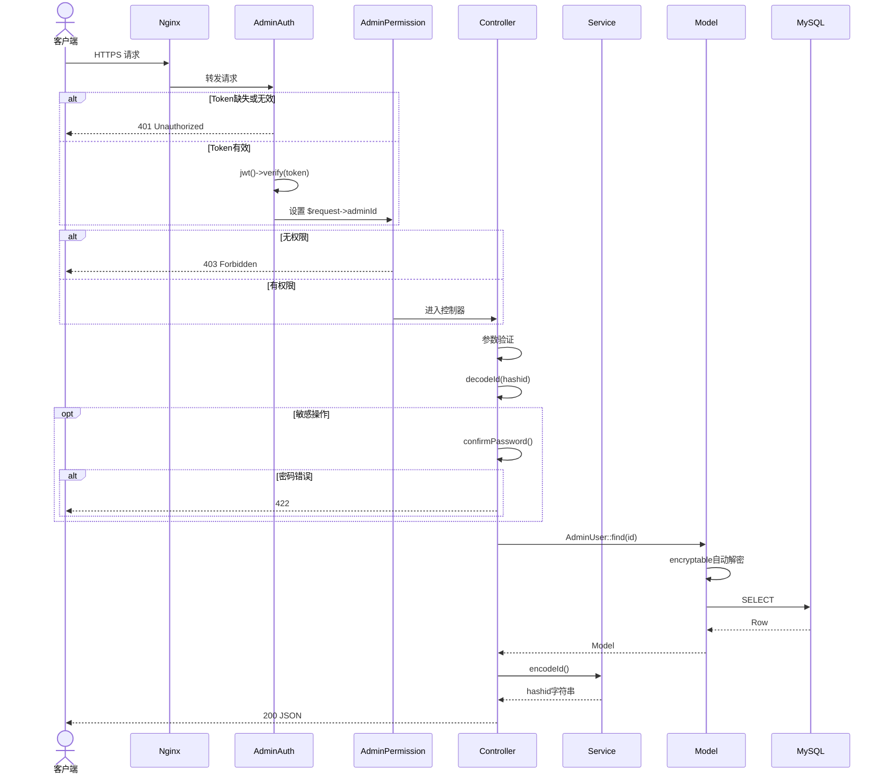

# 请求生命周期

> **历史文档（2026-10-30）**：ES/Scout、HarmonyOS、Angular/React 前端，以及报修、投诉、访客、合同、财务、社区活动、能耗、消息通知、审批、投票、催缴、集团、问答、巡检、商城、人脸、大屏等模块已移除。当前功能与架构以 README.md / docs/ 目录为准。

```mermaid
sequenceDiagram
    actor C as 客户端
    participant N as Nginx
    participant MW1 as AdminAuth
    participant MW2 as AdminPermission
    participant CTL as Controller
    participant SVC as Service
    participant MDL as Model
    participant DB as MySQL

    C->>N: HTTPS 请求
    N->>MW1: 转发请求

    alt Token缺失或无效
        MW1-->>C: 401 Unauthorized
    else Token有效
        MW1->>MW1: jwt()->verify(token)
        MW1->>MW2: 设置 $request->adminId
    end

    alt 无权限
        MW2-->>C: 403 Forbidden
    else 有权限
        MW2->>CTL: 进入控制器
    end

    CTL->>CTL: 参数验证
    CTL->>CTL: decodeId(hashid)

    opt 敏感操作
        CTL->>CTL: confirmPassword()
        alt 密码错误
            CTL-->>C: 422
        end
    end

    CTL->>MDL: AdminUser::find(id)
    MDL->>MDL: encryptable自动解密
    MDL->>DB: SELECT
    DB-->>MDL: Row
    MDL-->>CTL: Model

    CTL->>SVC: encodeId()
    SVC-->>CTL: hashid字符串

    CTL-->>C: 200 JSON
```
