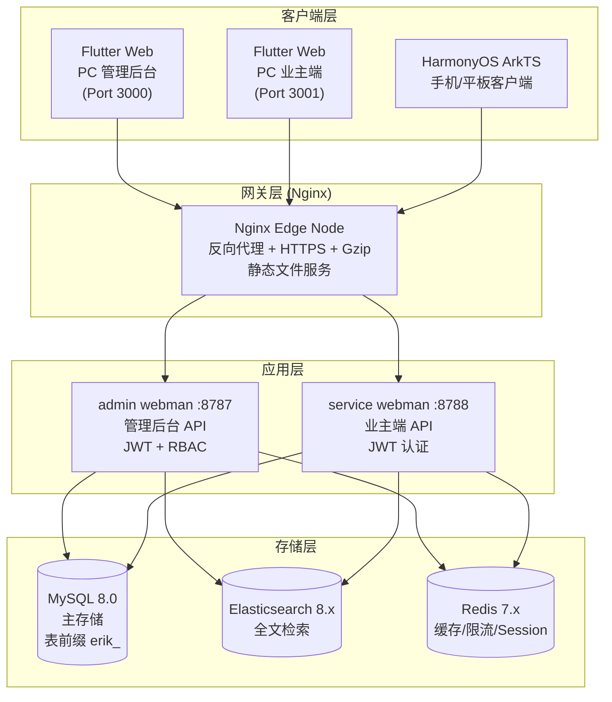
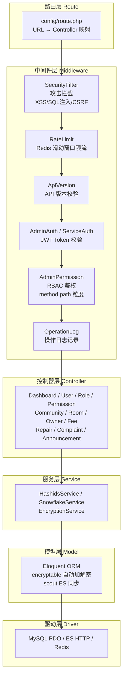
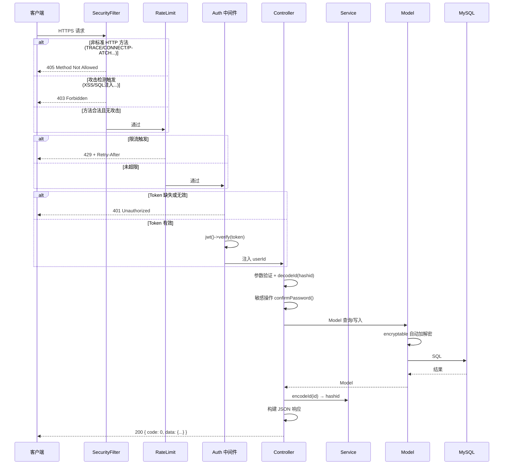
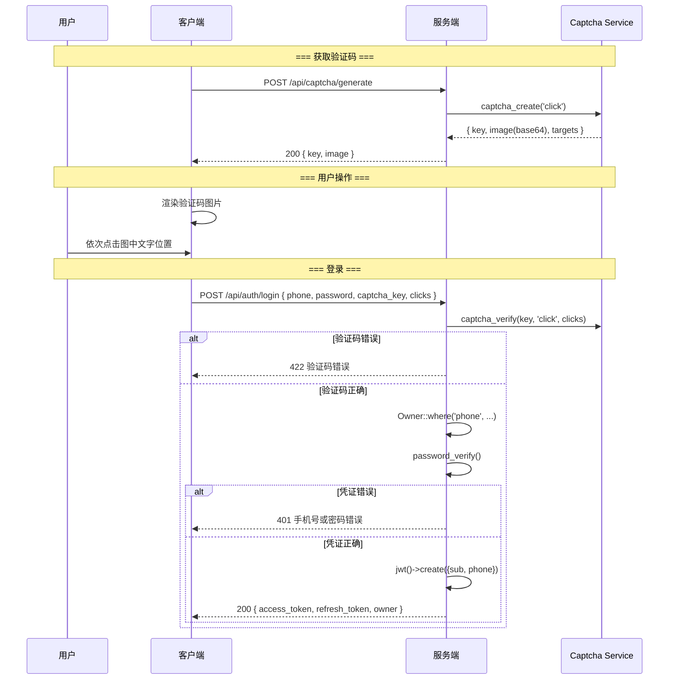
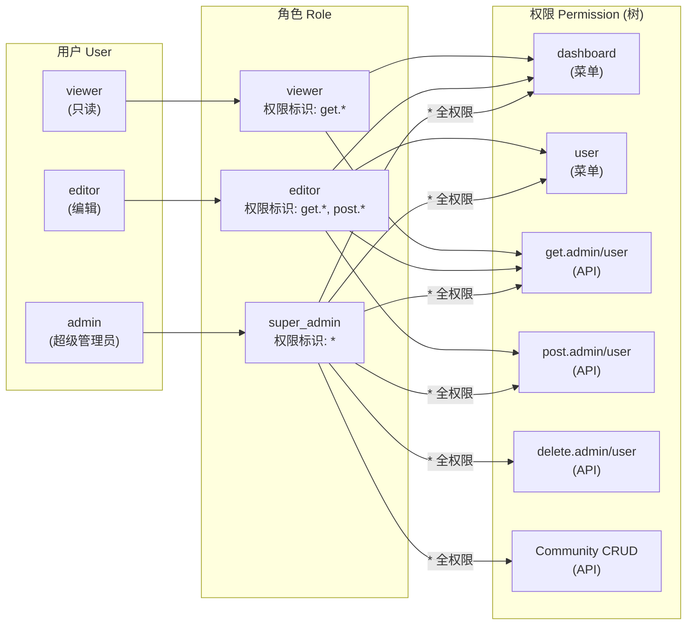
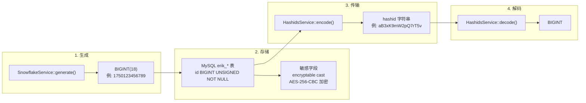
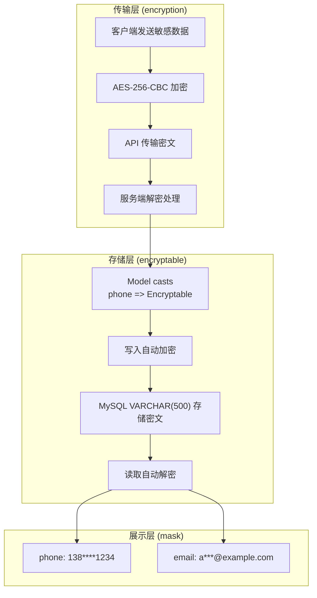
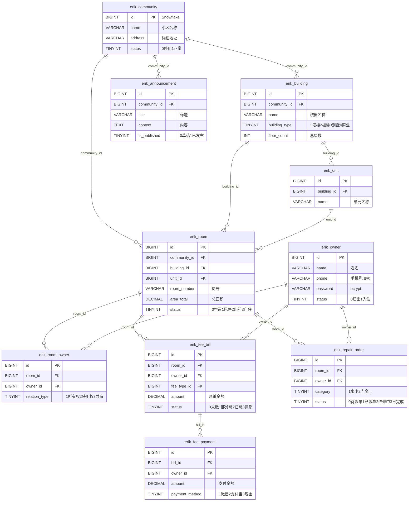
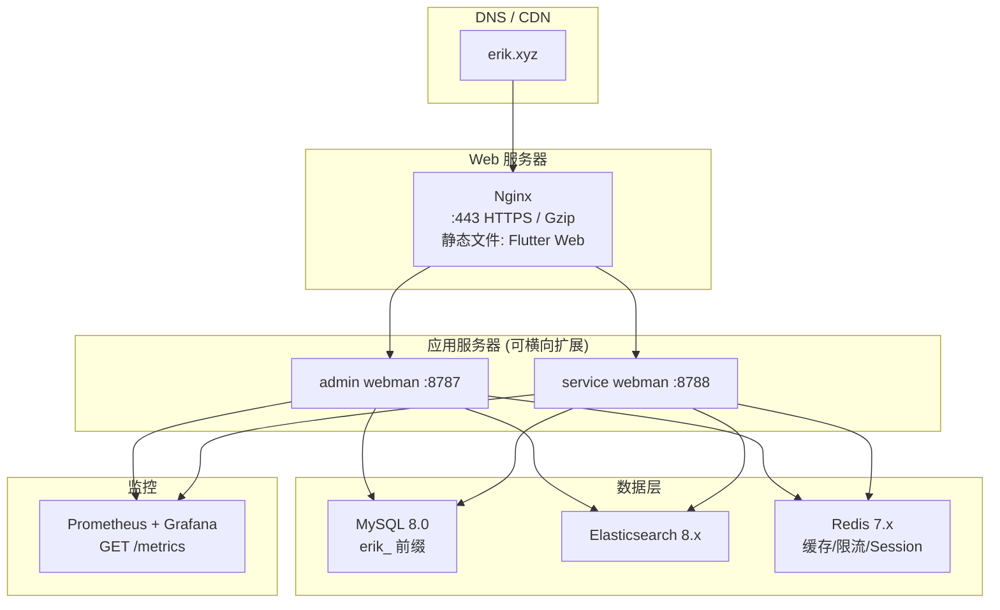
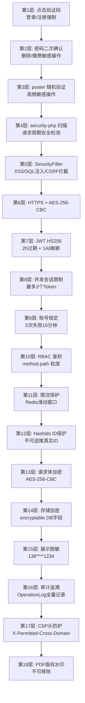

# 架构文档 (Architecture)

> Copyright (c) 2026 erik <erik@erik.xyz> — https://erik.xyz

> 以下 Mermaid 图表在 GitHub / GitLab / VS Code 中可自动渲染。其他环境请使用 [Mermaid Live Editor](https://mermaid.live/) 查看。

---

## 1. 系统拓扑架构

---

## 2. 后端分层架构

---

## 3. 请求生命周期

---

## 4. 认证流程（含点击验证码）

---

## 5. RBAC 权限模型

---

## 6. ID 全生命周期

---

## 7. 数据加密分层

---

## 8. 数据库 ER 关系（第1批）

---

## 9. 部署拓扑

---

## 10. 安全纵深防御全景

