# 系统架构图 (System Architecture Diagram)

> Copyright (c) 2026 erik <erik@erik.xyz> — https://erik.xyz

---

## 0. 架构设计总图

> 英文版：`images/design_architecture_en.svg` · 分层与部署细节见下文

## 1. 系统全景架构

---

## 2. 分层架构详图

---

## 3. 部署架构

