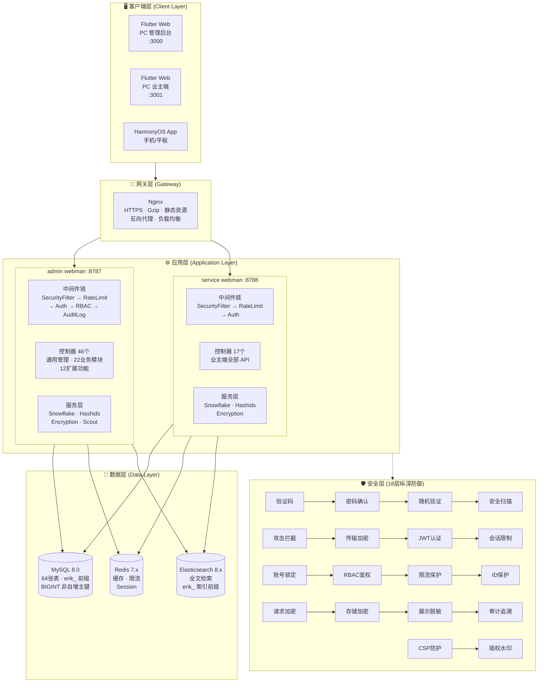
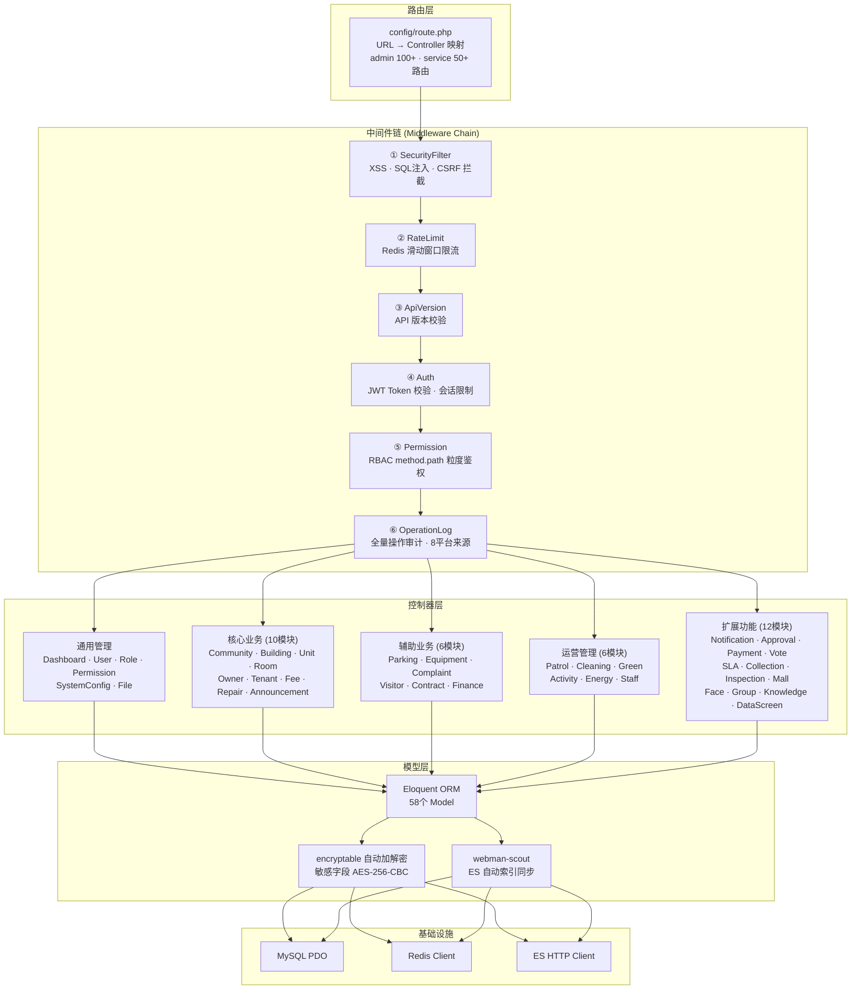
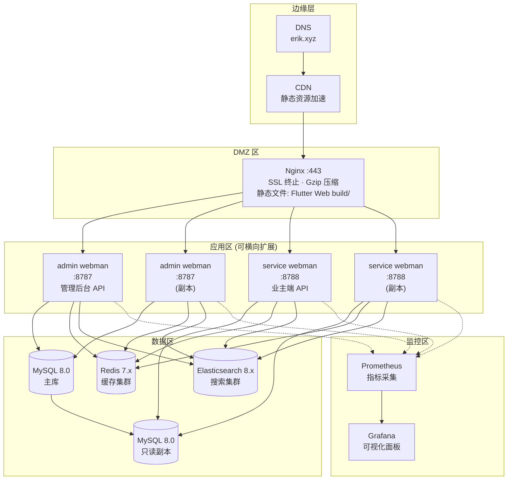

# 系统架构图 (System Architecture Diagram)

> Copyright (c) 2026 erik <erik@erik.xyz> — https://erik.xyz

以下 Mermaid 图表在 GitHub / GitLab / VS Code 中自动渲染。

---

## 1. 系统全景架构

---

## 2. 分层架构详图

---

## 3. 部署架构

