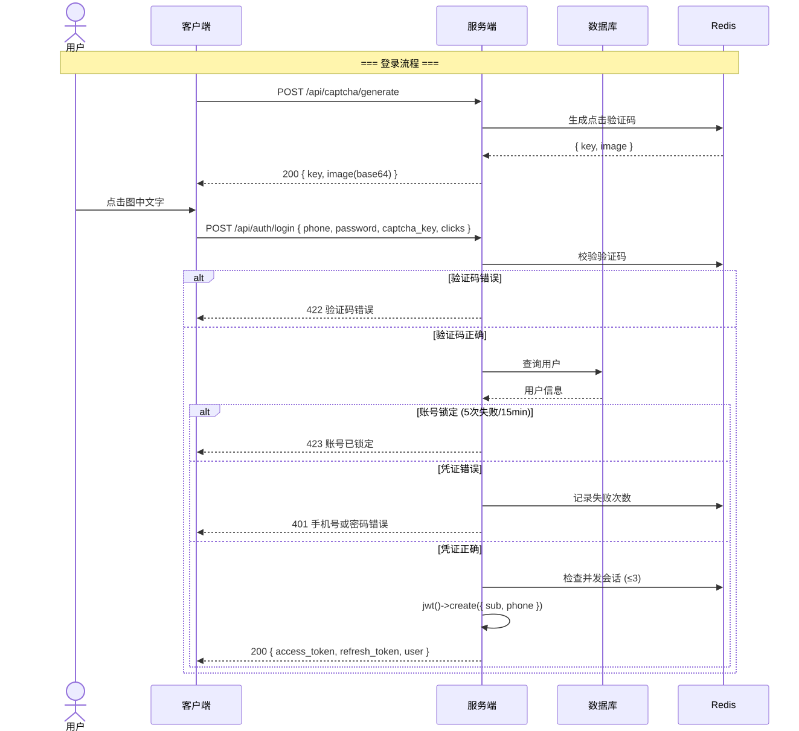

# 业务流程图 (Business Flowchart)

> Copyright (c) 2026 erik <erik@erik.xyz> — https://erik.xyz

---

## 1. 用户认证流程

---

## 2. 核心业务流程 — 费用管理

---

## 3. 报修处理流程

---

## 4. 房产管理流程

---

## 5. 投诉建议处理流程

---

## 6. 访客通行流程

