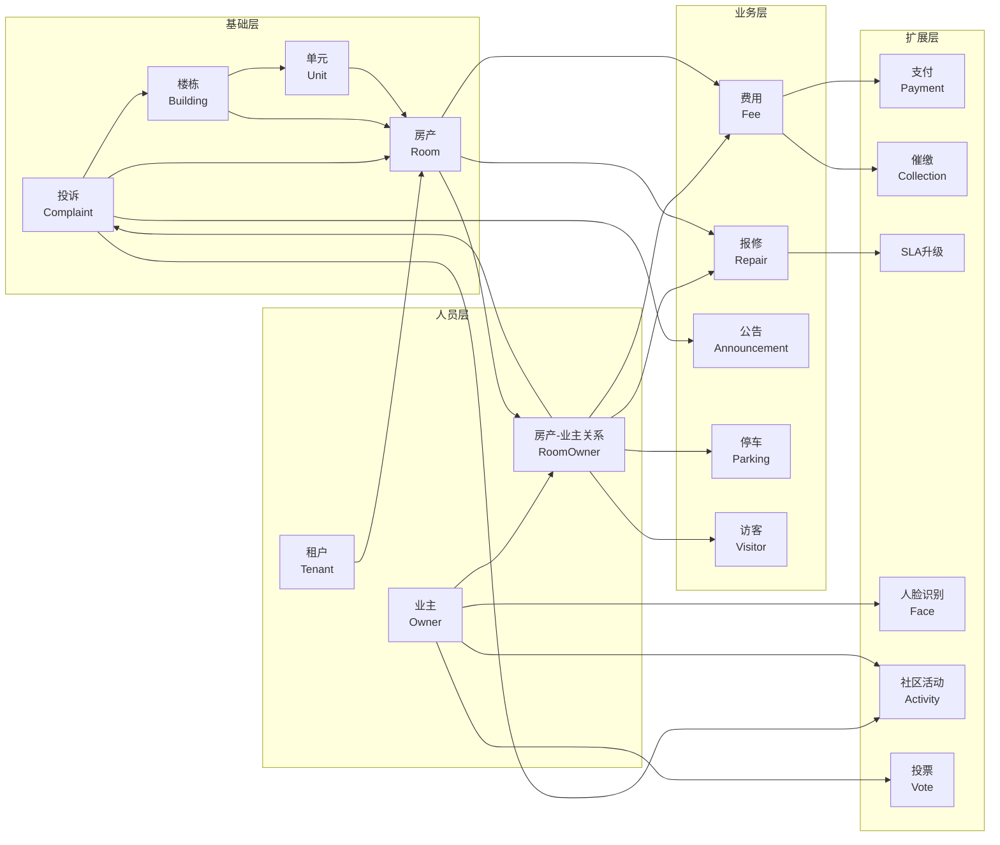

# 功能模块图 (Function Module Diagram)

> Copyright (c) 2026 erik <erik@erik.xyz> — https://erik.xyz

以下 Mermaid 图表在 GitHub / GitLab / VS Code 中自动渲染。

---

## 1. 功能模块全景

```mermaid
graph TB
    subgraph PLATFORM["物业管理系统 — 34个功能模块"]
        direction TB

        subgraph ADMIN_SYS["系统管理 (5模块)"]
            direction LR
            AS1["仪表盘<br/>Dashboard"]
            AS2["用户管理<br/>User"]
            AS3["角色权限<br/>RBAC"]
            AS4["系统配置<br/>Config"]
            AS5["操作审计<br/>AuditLog"]
        end

        subgraph CORE["核心业务 — 第1批 (10模块)"]
            direction LR
            C1["小区管理<br/>Community"]
            C2["楼栋管理<br/>Building"]
            C3["单元管理<br/>Unit"]
            C4["户型管理<br/>RoomType"]
            C5["房产管理<br/>Room"]
            C6["业主管理<br/>Owner"]
            C7["租户管理<br/>Tenant"]
            C8["费用管理<br/>Fee"]
            C9["报修管理<br/>Repair"]
            C10["公告通知<br/>Announcement"]
        end

        subgraph AUX["辅助业务 — 第2批 (6模块)"]
            direction LR
            AU1["停车管理<br/>Parking"]
            AU2["设备管理<br/>Equipment"]
            AU3["投诉建议<br/>Complaint"]
            AU4["访客管理<br/>Visitor"]
            AU5["合同管理<br/>Contract"]
            AU6["财务管理<br/>Finance"]
        end

        subgraph OPS["运营管理 — 第3批 (6模块)"]
            direction LR
            OP1["安保巡逻<br/>Patrol"]
            OP2["保洁管理<br/>Cleaning"]
            OP3["绿化管理<br/>Green"]
            OP4["社区活动<br/>Activity"]
            OP5["能耗管理<br/>Energy"]
            OP6["员工管理<br/>Staff"]
        end

        subgraph EXT["扩展功能 — 第4批 (12模块)"]
            direction LR
            EX1["消息通知<br/>Notification"]
            EX2["审批工作流<br/>Approval"]
            EX3["支付集成<br/>Payment"]
            EX4["业主投票<br/>Vote"]
            EX5["SLA升级<br/>SLA"]
            EX6["智能催缴<br/>Collection"]
            EX7["巡检移动端<br/>Inspection"]
            EX8["社区商城<br/>Mall"]
            EX9["人脸识别<br/>Face"]
            EX10["集团管理<br/>Group"]
            EX11["智能问答<br/>AI Q&A"]
            EX12["数据大屏<br/>DataScreen"]
        end
    end

    CORE --> AUX --> OPS --> EXT
    ADMIN_SYS -.-> CORE & AUX & OPS & EXT
```

---

## 2. 模块依赖关系

---

## 3. 管理后台功能树

```mermaid
graph TD
    ROOT["管理后台<br/>Admin Panel"] --> DASH["📊 仪表盘"]
    ROOT --> SYS["⚙️ 系统管理"]
    ROOT --> PROP["🏘️ 物业管理"]
    ROOT --> SVC["🛠️ 业务服务"]
    ROOT --> OPS["📋 运营管理"]
    ROOT --> EXT["🚀 扩展功能"]

    DASH --> D1["实时统计面板"]
    DASH --> D2["趋势图表"]
    DASH --> D3["分布统计"]
    DASH --> D4["操作日志流"]

    SYS --> S1["用户管理"]
    SYS --> S2["角色权限"]
    SYS --> S3["系统配置"]
    SYS --> S4["文件管理"]
    SYS --> S5["操作审计"]

    PROP --> P1["小区 → 楼栋 → 单元"]
    PROP --> P2["户型管理"]
    PROP --> P3["房产管理"]
    PROP --> P4["业主管理"]
    PROP --> P5["租户管理"]

    SVC --> V1["费用管理"]
    SVC --> V2["报修管理"]
    SVC --> V3["停车管理"]
    SVC --> V4["设备管理"]
    SVC --> V5["合同管理"]

    OPS --> O1["安保巡逻"]
    OPS --> O2["保洁管理"]
    OPS --> O3["绿化管理"]
    OPS --> O4["社区活动"]
    OPS --> O5["能耗管理"]
    OPS --> O6["员工管理"]

    EXT --> E1["消息通知"]
    EXT --> E2["审批工作流"]
    EXT --> E3["支付集成"]
    EXT --> E4["业主投票"]
    EXT --> E5["SLA自动升级"]
    EXT --> E6["智能催缴"]
    EXT --> E7["巡检移动端"]
    EXT --> E8["社区商城"]
    EXT --> E9["人脸识别"]
    EXT --> E10["集团管理"]
    EXT --> E11["智能问答"]
    EXT --> E12["数据大屏"]
```

---

## 4. 业主端功能地图

```mermaid
graph TD
    OWNER["🏠 业主端<br/>Service Panel"] --> HOME["首页"]
    OWNER --> PROPERTY["我的房产"]
    OWNER --> FEE["费用中心"]
    OWNER --> REPAIR["报修服务"]
    OWNER --> COMPLAINT["投诉建议"]
    OWNER --> PARKING["停车管理"]
    OWNER --> ACTIVITY["社区活动"]
    OWNER --> MALL["社区商城"]
    OWNER --> PROFILE["个人中心"]

    HOME --> H1["公告通知"]
    HOME --> H2["消息提醒"]
    HOME --> H3["快捷入口"]

    PROPERTY --> PR1["房产列表"]
    PROPERTY --> PR2["产权信息"]
    PROPERTY --> PR3["家庭成员"]

    FEE --> F1["账单查询"]
    FEE --> F2["在线缴费"]
    FEE --> F3["缴费记录"]
    FEE --> F4["费用统计"]

    REPAIR --> R1["提交报修"]
    REPAIR --> R2["报修进度"]
    REPAIR --> R3["历史记录"]
    REPAIR --> R4["服务评价"]

    COMPLAINT --> C1["提交投诉"]
    COMPLAINT --> C2["处理进度"]
    COMPLAINT --> C3["满意度评价"]

    PARKING --> PK1["我的车位"]
    PARKING --> PK2["车辆管理"]
    PARKING --> PK3["停车记录"]

    ACTIVITY --> A1["活动列表"]
    ACTIVITY --> A2["报名参与"]
    ACTIVITY --> A3["活动回顾"]

    MALL --> M1["商品浏览"]
    MALL --> M2["购物车"]
    MALL --> M3["我的订单"]

    PROFILE --> PF1["个人信息"]
    PROFILE --> PF2["安全设置"]
    PROFILE --> PF3["消息中心"]
    PROFILE --> PF4["访客预约"]
```

