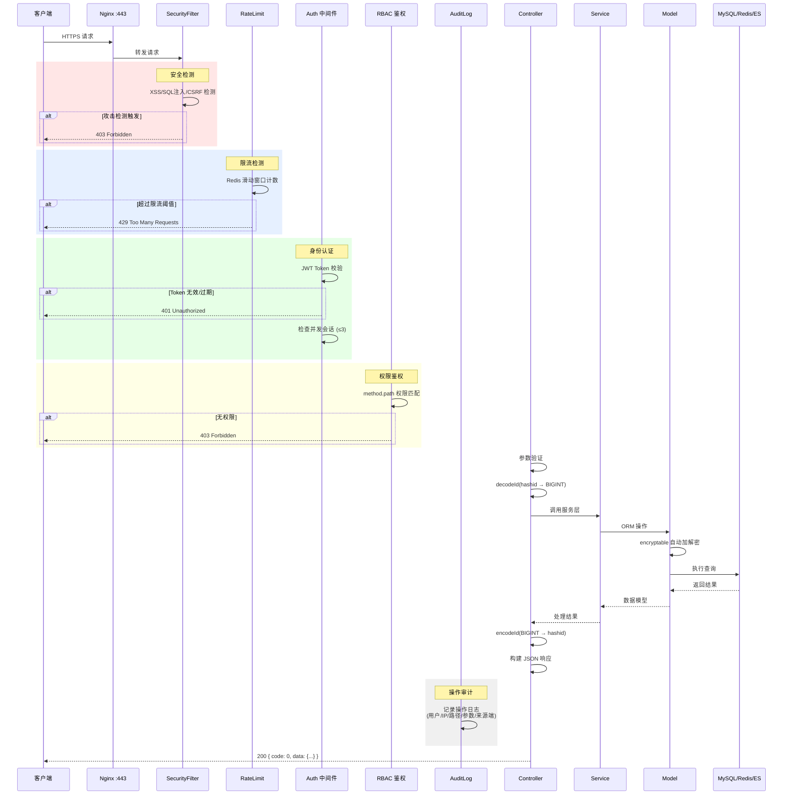
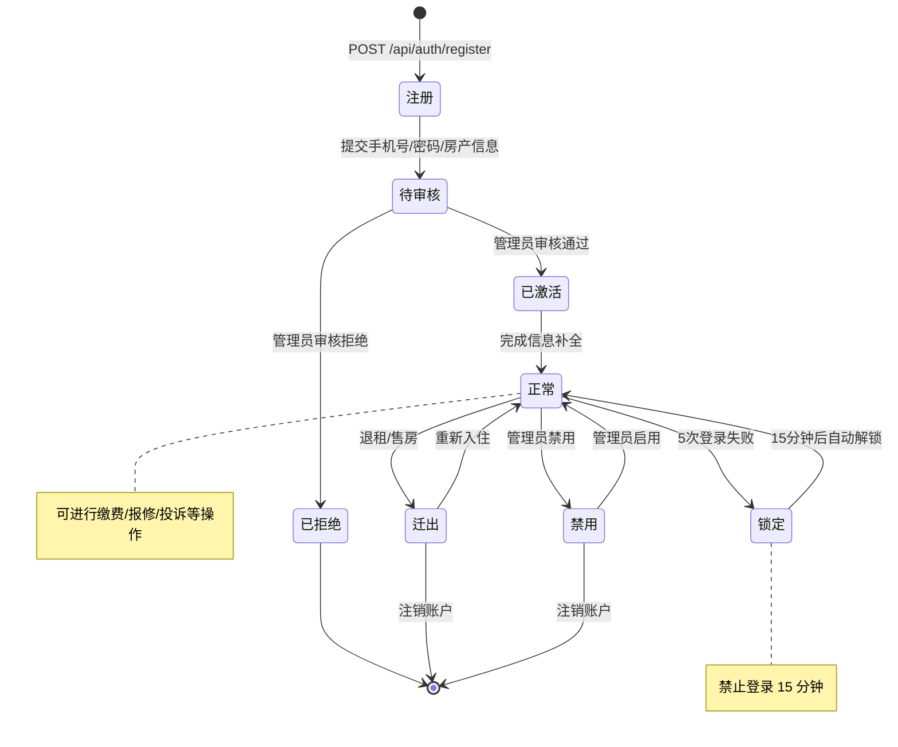
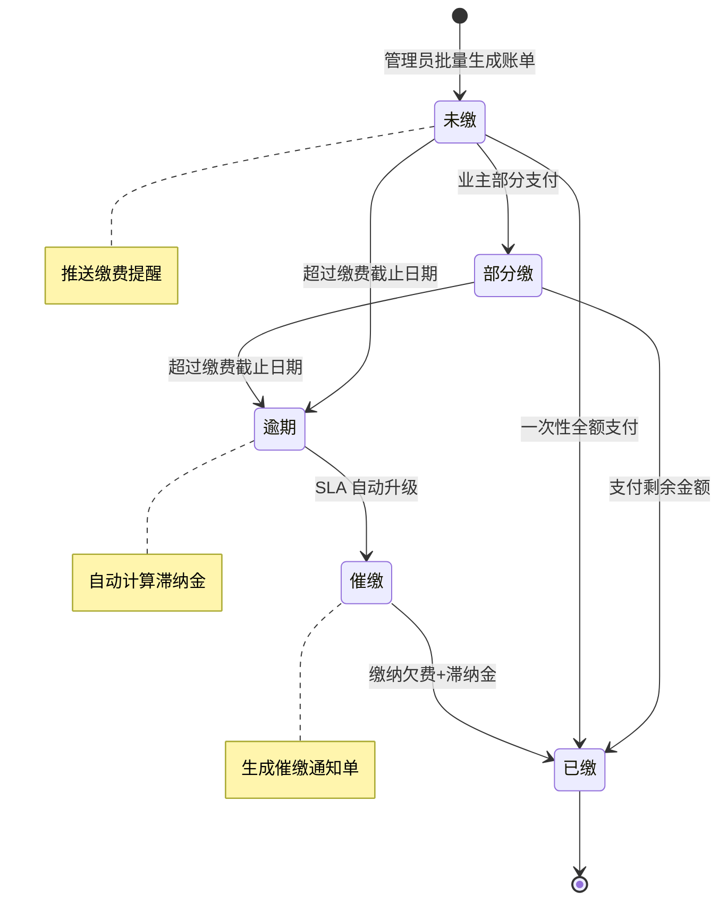
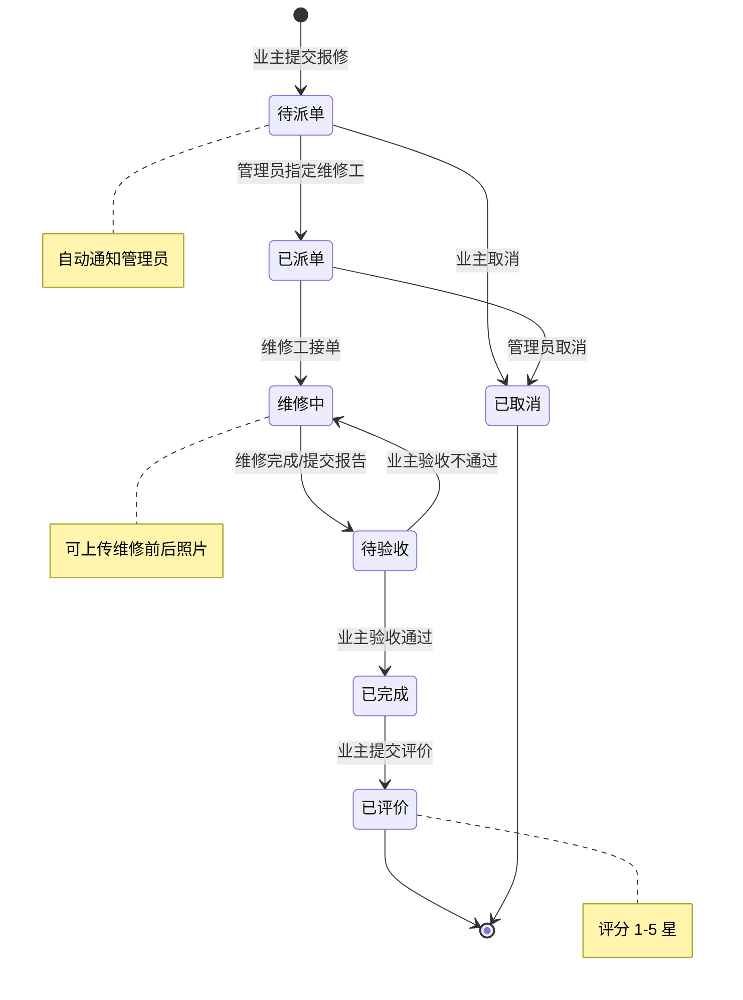
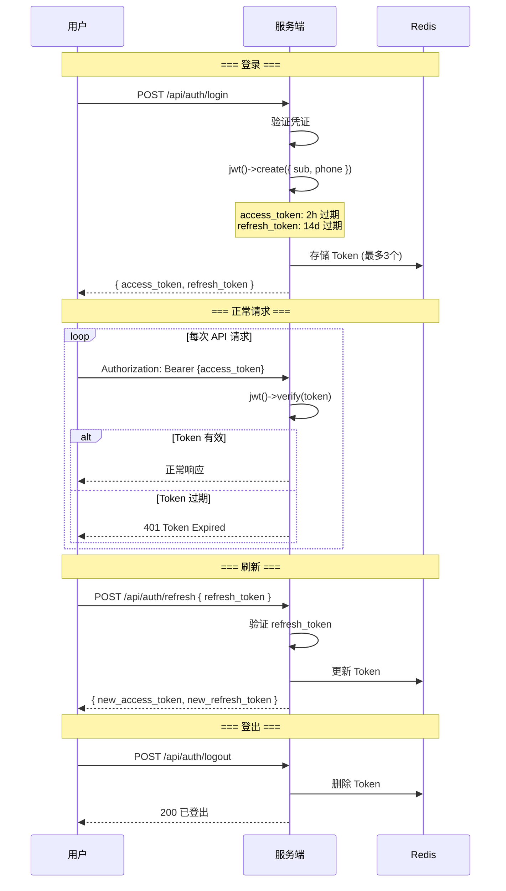

# 生命周期图 (Lifecycle Diagram)

> Copyright (c) 2026 erik <erik@erik.xyz> — https://erik.xyz

以下 Mermaid 图表在 GitHub / GitLab / VS Code 中自动渲染。

---

## 1. 请求生命周期

---

## 2. 数据实体生命周期 — 业主 (Owner)

---

## 3. 数据实体生命周期 — 费用账单 (Fee Bill)

---

## 4. 数据实体生命周期 — 报修工单 (Repair Order)

---

## 5. JWT Token 生命周期

---

## 6. 数据库记录完整生命周期

```mermaid
flowchart TB
    subgraph CREATE["1️⃣ 创建"]
        C1["生成 Snowflake ID<br/>BIGINT(18) 全局唯一"]
        C2["填充业务数据"]
        C3["encryptable 加密敏感字段"]
        C4["INSERT INTO erik_*"]
        C5["webman-scout 同步 ES 索引"]
        C1 --> C2 --> C3 --> C4 --> C5
    end

    subgraph READ["2️⃣ 读取"]
        R1["接收请求 → decodeId(hashid)"]
        R2["Model::find() / query()"]
        R3["encryptable 自动解密"]
        R4["encodeId() → hashid 返回"]
        R5["敏感字段脱敏展示"]
        R1 --> R2 --> R3 --> R4 --> R5
    end

    subgraph UPDATE["3️⃣ 更新"]
        U1["权限校验 (RBAC)"]
        U2["敏感操作 → confirmPassword()"]
        U3["Model::update()"]
        U4["encryptable 自动加密新值"]
        U5["ES 索引自动更新"]
        U6["OperationLog 记录变更"]
        U1 --> U2 --> U3 --> U4 --> U5 --> U6
    end

    subgraph DELETE["4️⃣ 删除"]
        D1["权限校验 (RBAC)"]
        D2["敏感操作 → confirmPassword()"]
        D3["poster 随机验证码"]
        D4["软删除 / 硬删除"]
        D5["ES 索引同步删除"]
        D6["OperationLog 记录"]
        D1 --> D2 --> D3 --> D4 --> D5 --> D6
    end

    CREATE --> READ
    READ --> UPDATE
    UPDATE --> READ
    UPDATE --> DELETE
```

