# 生命周期图 (Lifecycle Diagram)

> Copyright (c) 2026 erik <erik@erik.xyz> — https://erik.xyz

---

## 1. 请求生命周期

---

## 2. 数据实体生命周期 — 业主 (Owner)

---

## 3. 数据实体生命周期 — 费用账单 (Fee Bill)

---

## 4. 数据实体生命周期 — 报修工单 (Repair Order)

---

## 5. JWT Token 生命周期

---

## 6. 数据库记录完整生命周期

