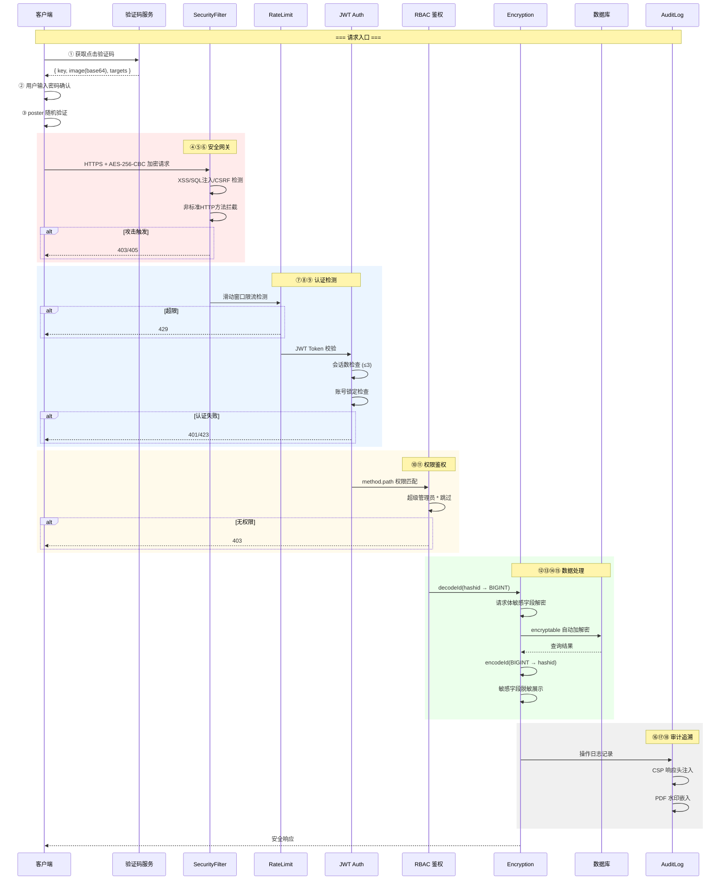
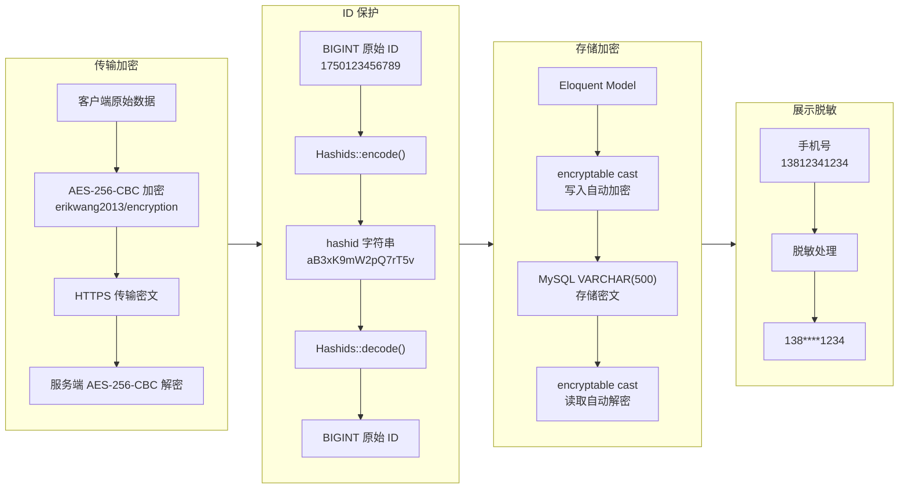
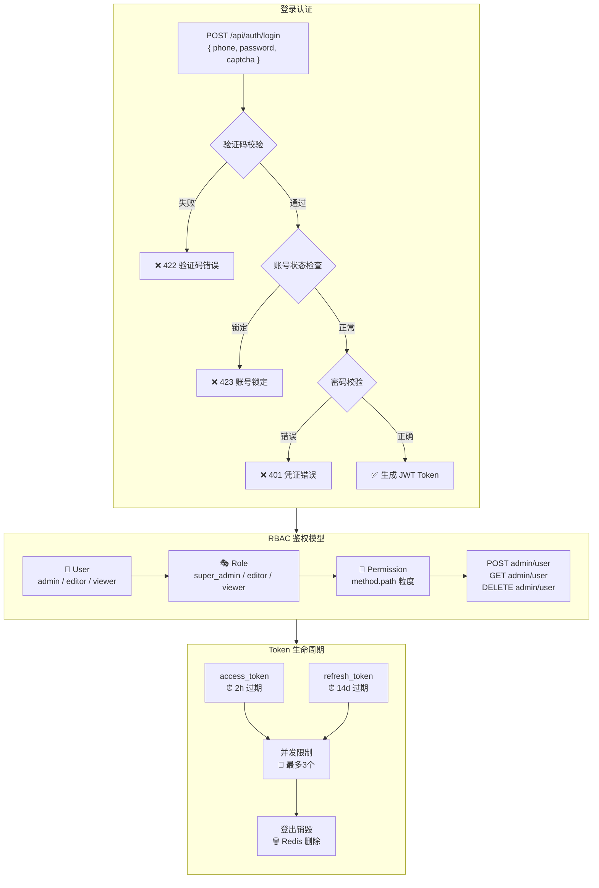
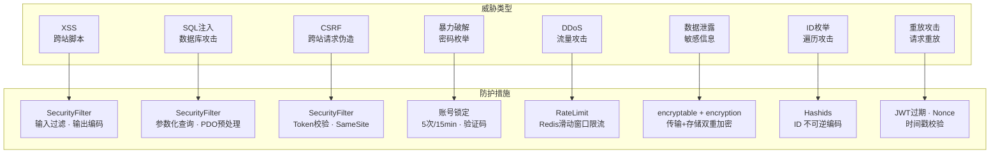
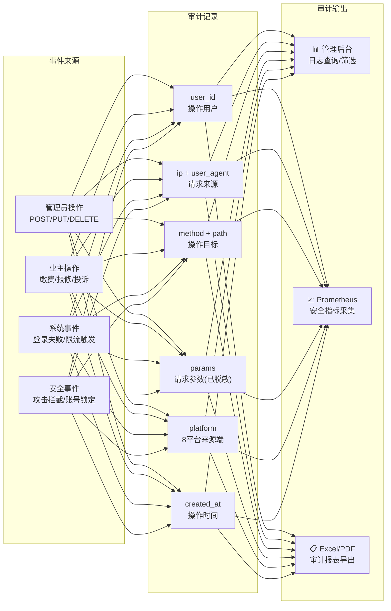

# 安全架构图 (Security Architecture Diagram)

> Copyright (c) 2026 erik <erik@erik.xyz> — https://erik.xyz

以下 Mermaid 图表在 GitHub / GitLab / VS Code 中自动渲染。

---

## 1. 18层纵深防御全景

```mermaid
flowchart TB
    subgraph ACCESS["🔐 接入层 (Access Layer)"]
        direction LR
        L1["① 点击验证码<br/>captcha_create('click')<br/>登录/注册强制"]
        L2["② 密码二次确认<br/>confirmPassword()<br/>删除/缴费敏感操作"]
        L3["③ poster 随机验证<br/>高频敏感操作<br/>独立验证码通道"]
        L4["④ security-php 扫描<br/>请求周期安全检测<br/>恶意行为识别"]
    end

    subgraph GATE["🛡️ 网关层 (Gateway Layer)"]
        direction LR
        L5["⑤ SecurityFilter<br/>XSS · SQL注入 · CSRF<br/>非标准HTTP方法拦截"]
        L6["⑥ HTTPS + AES-256-CBC<br/>传输层加密<br/>erikwang2013/encryption"]
    end

    subgraph AUTH["🔑 认证层 (Auth Layer)"]
        direction LR
        L7["⑦ JWT HS256<br/>access_token: 2h<br/>refresh_token: 14d"]
        L8["⑧ 并发会话限制<br/>最多3个Token<br/>Redis 会话管理"]
        L9["⑨ 账号锁定<br/>5次失败/15分钟<br/>Redis 失败计数"]
    end

    subgraph AUTHZ["⚖️ 鉴权层 (AuthZ Layer)"]
        direction LR
        L10["⑩ RBAC 鉴权<br/>method.path 粒度<br/>超级管理员 * 跳过"]
        L11["⑪ 限流保护<br/>Redis 滑动窗口<br/>可配置阈值"]
    end

    subgraph DATA["🔒 数据层 (Data Layer)"]
        direction LR
        L12["⑫ Hashids ID 保护<br/>不可逆推真实ID<br/>API 传输 hashid"]
        L13["⑬ 请求体加密<br/>AES-256-CBC<br/>敏感字段加密传输"]
        L14["⑭ 存储加密<br/>encryptable cast<br/>DB 字段自动加解密"]
        L15["⑮ 展示脱敏<br/>138****1234<br/>a***@example.com"]
    end

    subgraph AUDIT["📝 审计层 (Audit Layer)"]
        direction LR
        L16["⑯ 操作日志全量审计<br/>8平台来源端自动检测<br/>用户/IP/路径/参数"]
        L17["⑰ CSP 头防护<br/>X-Permitted-Cross-Domain<br/>浏览器安全策略"]
        L18["⑱ PDF 版权水印<br/>不可移除<br/>Dompdf 渲染"]
    end

    ACCESS --> GATE --> AUTH --> AUTHZ --> DATA --> AUDIT
```

---

## 2. 请求安全处理链路

---

## 3. 数据加密全链路

---

## 4. 认证与授权模型

---

## 5. 攻击面防护矩阵

---

## 6. 审计追溯体系

