# 安全架构图 (Security Architecture Diagram)

> Copyright (c) 2026 erik <erik@erik.xyz> — https://erik.xyz

---

## 1. 18层纵深防御全景

---

## 2. 请求安全处理链路

---

## 3. 数据加密全链路

---

## 4. 认证与授权模型

---

## 5. 攻击面防护矩阵

---

## 6. 审计追溯体系

