# مخطط بنية النظام (System Architecture Diagram)

> Copyright (c) 2026 erik <erik@erik.xyz> — https://erik.xyz

> English edition: `../../../images/design_architecture_en.svg`

---

## 1. البنية الشاملة للنظام

---

## 2. مخطط البنية الطبقية التفصيلي

---

## 3. بنية النشر

