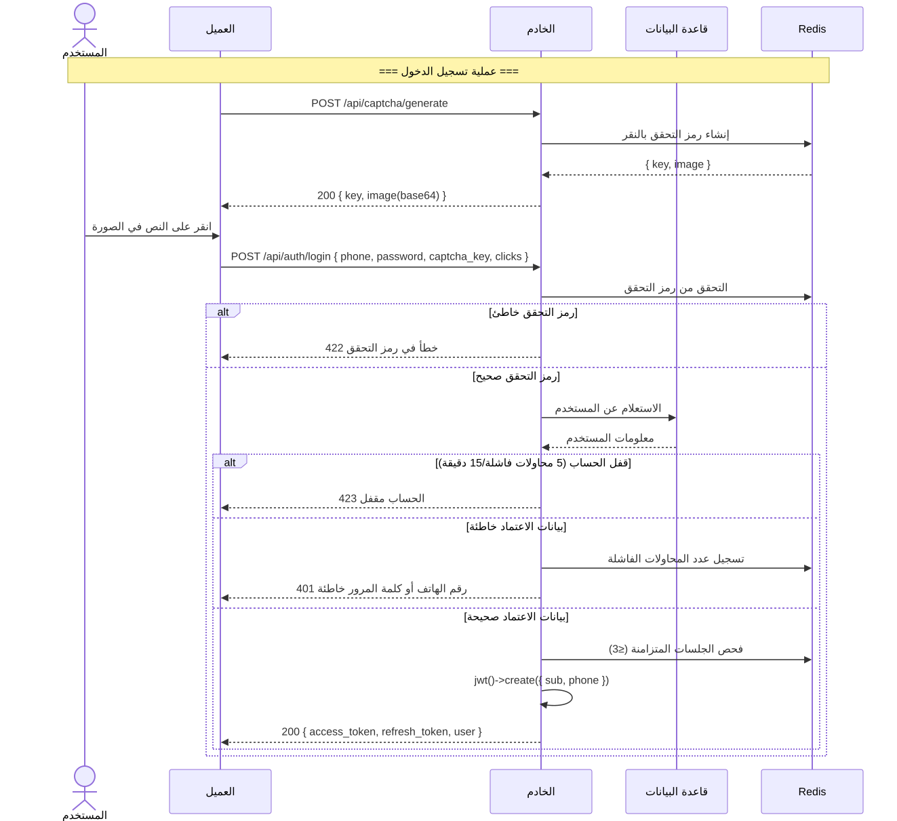
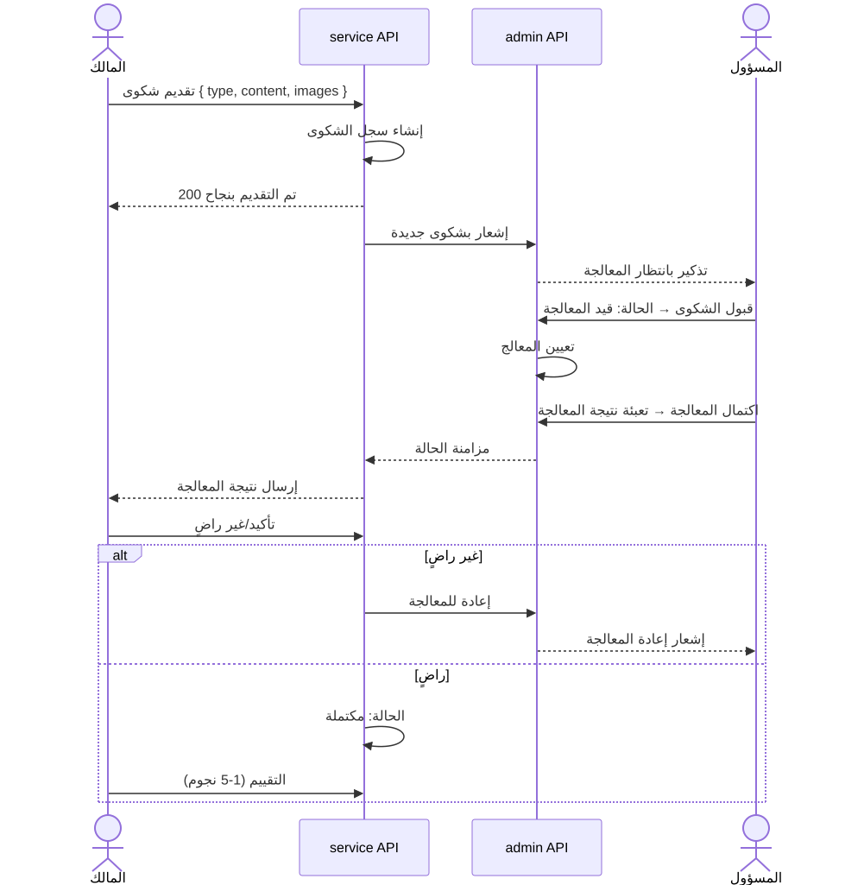

# مخططات العمليات التجارية (Business Flowchart)

> Copyright (c) 2026 erik <erik@erik.xyz> — https://erik.xyz

---

## 1. عملية مصادقة المستخدم

---

## 2. العملية التجارية الأساسية — إدارة الرسوم

---

## 3. عملية معالجة طلبات الإصلاح

---

## 4. عملية إدارة العقارات

---

## 5. عملية معالجة الشكاوى والاقتراحات

---

## 6. عملية مرور الزوار

