# مخطط الوحدات الوظيفية (Function Module Diagram)

> Copyright (c) 2026 erik <erik@erik.xyz> — https://erik.xyz

---

## 1. نظرة شاملة على الوحدات الوظيفية

---

## 2. علاقات التبعية بين الوحدات

---

## 3. شجرة وظائف لوحة الإدارة

---

## 4. خريطة وظائف بوابة الملاك

