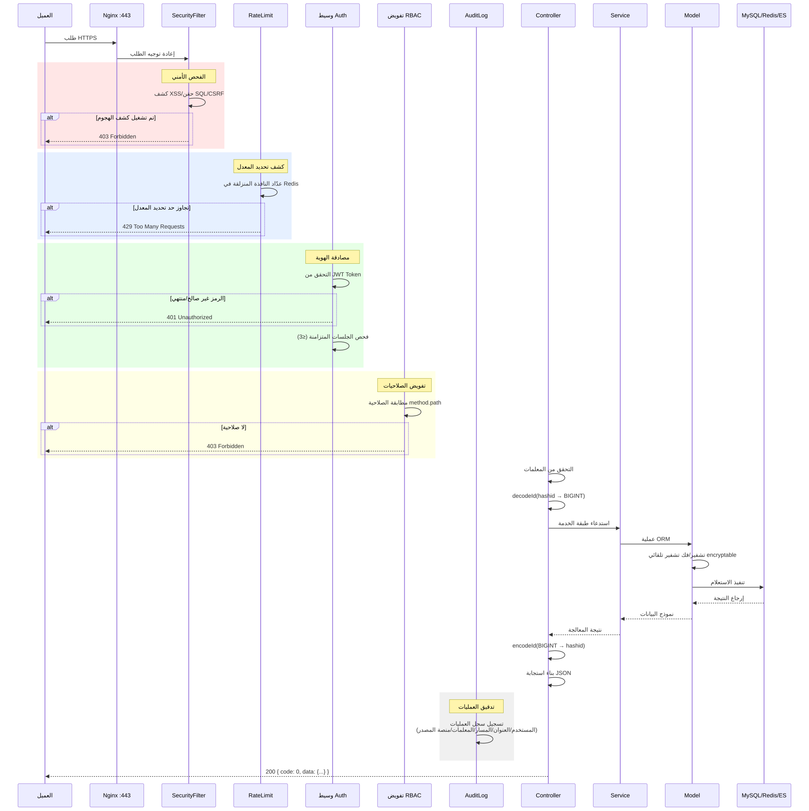
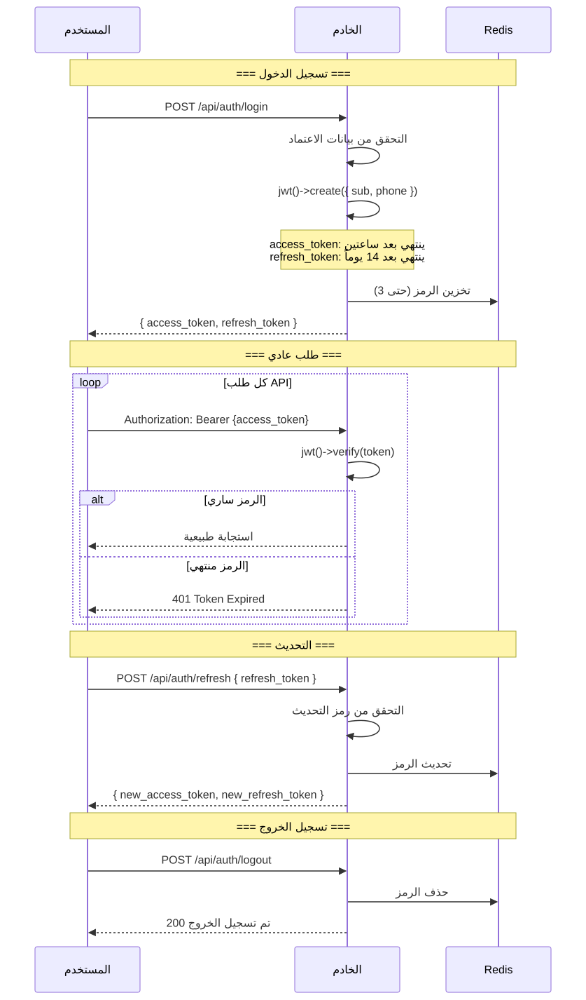

# مخطط دورة الحياة (Lifecycle Diagram)

> Copyright (c) 2026 erik <erik@erik.xyz> — https://erik.xyz

> English edition: `../../../images/design_lifecycle_en.svg`

---

## 1. دورة حياة الطلب

---

## 2. دورة حياة الكيان — المالك (Owner)

---

## 3. دورة حياة الكيان — فاتورة الرسوم (Fee Bill)

---

## 4. دورة حياة الكيان — طلب الإصلاح (Repair Order)

---

## 5. دورة حياة JWT Token

---

## 6. دورة الحياة الكاملة لسجل قاعدة البيانات

