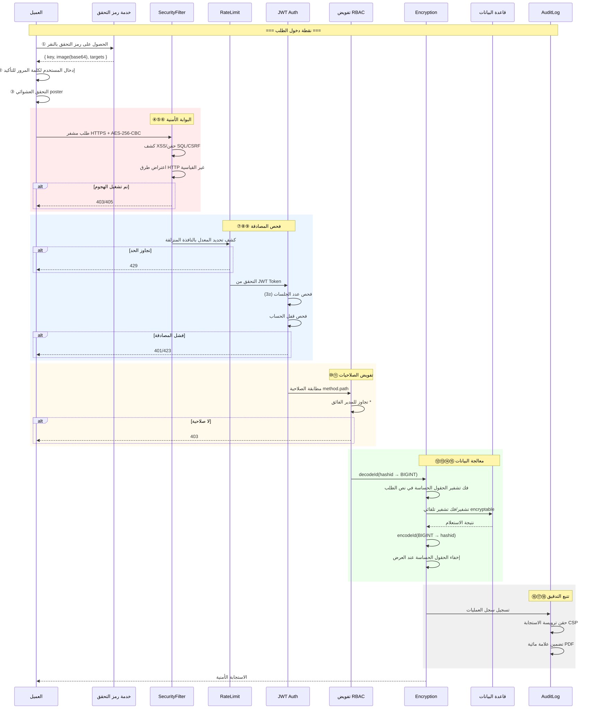

# مخطط البنية الأمنية (Security Architecture Diagram)

> Copyright (c) 2026 erik <erik@erik.xyz> — https://erik.xyz

---

## 1. نظرة شاملة على الدفاع المتعمق من 18 طبقة

---

## 2. سلسلة المعالجة الأمنية للطلبات

---

## 3. سلسلة تشفير البيانات الكاملة

---

## 4. نموذج المصادقة والتفويض

---

## 5. مصفوفة حماية سطح الهجوم

---

## 6. نظام تتبع التدقيق

