# সম্পত্তি ব্যবস্থাপনা সিস্টেম (Property Management Platform)

[বাংলা](../bn/README.md) | [中文](../../../README.md)

> Copyright (c) 2026 erik <erik@erik.xyz> — https://erik.xyz

সম্পূর্ণ-স্ট্যাক সম্পত্তি ব্যবস্থাপনা সিস্টেম, ২২টি বিজনেস মডিউল + ১২টি এক্সটেনশন ফিচার (বার্তা বিজ্ঞপ্তি/অনুমোদন ওয়ার্কফ্লো/পেমেন্ট/ভোট/SLA/ডেটা ড্যাশবোর্ড/আদায়/পরিদর্শন/মল/ফেসিয়াল/গ্রুপ/স্মার্ট Q&A) কভার করে। অ্যাডমিন প্যানেল (admin) এবং মালিক পোর্টাল (service) আলাদাভাবে ডিপ্লয় করা হয়; ফ্রন্টএন্ড Flutter Web (PC অ্যাডমিন প্যানেল স্টাইল) এবং HarmonyOS মোবাইল কভার করে।

## প্রকল্পের কাঠামো

```
property-management-platform/
├── admin/                         # অ্যাডমিন প্যানেল webman v2 প্রকল্প
│   ├── app/
│   │   ├── admin/controller/      # অ্যাডমিন প্যানেল কন্ট্রোলার
│   │   ├── api/v1/controller/     # পাবলিক API কন্ট্রোলার
│   │   ├── common/                # সাধারণ ইউটিলিটি ক্লাস
│   │   ├── middleware/            # মিডলওয়্যার (প্রমাণীকরণ/অথরাইজেশন/রেট লিমিট/নিরাপত্তা)
│   │   ├── model/                 # ডেটা মডেল (Eloquent ORM)
│   │   ├── queue/                 # কিউ টাস্ক
│   │   └── process/               # প্রসেস ম্যানেজমেন্ট
│   ├── apps/
│   │   ├── flutter/               # অ্যাডমিন প্যানেল Flutter Web (PC স্টাইল)
│   │   └── harmonyos/             # অ্যাডমিন প্যানেল HarmonyOS App
│   ├── config/                    # কনফিগারেশন ফাইল (চীনা মন্তব্য সহ)
│   ├── database/
│   │   └── backup/                # ডেটাবেস ব্যাকআপ স্ক্রিপ্ট
│   ├── resource/
│   │   └── translations/          # আন্তর্জাতিকীকরণ ভাষা ফাইল (zh_CN / en)
│   ├── docs/                      # অ্যাডমিন প্যানেল ডকুমেন্টেশন
│   ├── tests/                     # ইউনিট টেস্ট
│   └── public/                    # Web এন্ট্রি
├── service/                       # মালিক পোর্টাল webman v2 প্রকল্প
│   ├── app/
│   │   ├── api/v1/controller/     # মালিক পোর্টাল API কন্ট্রোলার
│   │   ├── common/                # সাধারণ ইউটিলিটি ক্লাস
│   │   ├── middleware/            # মিডলওয়্যার
│   │   ├── model/                 # ডেটা মডেল
│   │   └── process/               # প্রসেস ম্যানেজমেন্ট
│   ├── config/                    # কনফিগারেশন ফাইল
│   ├── resource/
│   │   └── translations/          # আন্তর্জাতিকীকরণ ভাষা ফাইল
├── apps/
│   ├── flutter/                   # মালিক পোর্টাল Flutter Web (PC স্টাইল)
│   └── harmonyos/                 # মালিক পোর্টাল HarmonyOS App
└── docs/                          # প্রকল্প ডকুমেন্টেশন
    ├── ARCHITECTURE.md
    ├── ARCHITECTURE_DESIGN.md
    ├── ARCHITECTURE_DIAGRAM.md    # সিস্টেম আর্কিটেকচার ডায়াগ্রাম
    ├── FLOWCHART.md               # বিজনেস ফ্লোচার্ট
    ├── FUNCTION_DIAGRAM.md        # ফাংশন মডিউল ডায়াগ্রাম
    ├── LIFECYCLE_DIAGRAM.md       # লাইফসাইকেল ডায়াগ্রাম
    ├── SECURITY_ARCHITECTURE.md   # নিরাপত্তা আর্কিটেকচার ডায়াগ্রাম
    ├── API.md
    ├── FEATURES.md
    └── FEATURE_DESIGN.md
```

## প্রকল্পের আকার

| স্তর | সংখ্যা | বিবরণ |
|----|------|------|
| ডেটাবেস টেবিল | ৬৫টি | সবগুলো `erik_` প্রিফিক্স, BIGINT নন-অটো-ইনক্রিমেন্ট প্রাইমারি কি |
| PHP মডেল | admin ৬৪ / service ৫৭ | সবগুলো Eloquent মডেল, encryptable এনক্রিপশন ফিল্ড সহ; service-এর ৫৭ হলো মডেল ফাইলের সংখ্যা (BaseModel বেস ক্লাস সহ) |
| admin কন্ট্রোলার | ৫৮টি | সাধারণ ব্যবস্থাপনা + ২২টি সম্পত্তি মডিউল + ১২টি এক্সটেনশন ফিচার |
| service কন্ট্রোলার | ১৭টি | মালিক পোর্টালের সব API |
| API রুট | ১৭৮ | admin ১২৫ + service ৫৩ |
| Flutter অ্যাডমিন প্যানেল | ৪২ পেজ | admin ৪২টি পেজ মডিউল, ৯৬ ফাইল/৬,৬৬২ লাইন |
| Flutter মালিক পোর্টাল | ১৩ পেজ | ফি/মেরামত/পার্কিং/দর্শনার্থী/কার্যক্রম/বিজ্ঞপ্তি/ভোট/মল/স্মার্ট Q&A/ফেসিয়াল, ৩২ ফাইল/৩,৫৮২ লাইন |
| HarmonyOS | ৭ পেজ | লগইন/হোমপেজ/বিল/মেরামত(২)/ঘোষণা/ব্যক্তিগত কেন্দ্র, ১১ ফাইল/৯২৭ লাইন |
| টেস্ট | ১৩৩টি | admin ৯০টি (২১৭ অ্যাসারশন) + service ৪৩টি (২৪৮ অ্যাসারশন) |

## সিস্টেম আর্কিটেকচার ও ডিজাইন ডায়াগ্রাম

> নিচে সারসংক্ষেপ ডায়াগ্রাম; বিস্তারিত চিত্রের জন্য দেখুন [আর্কিটেকচার ডায়াগ্রাম](docs/ARCHITECTURE_DIAGRAM.md) · [ফ্লোচার্ট](docs/FLOWCHART.md) · [ফাংশন ডায়াগ্রাম](docs/FUNCTION_DIAGRAM.md) · [লাইফসাইকেল ডায়াগ্রাম](docs/LIFECYCLE_DIAGRAM.md) · [নিরাপত্তা আর্কিটেকচার ডায়াগ্রাম](docs/SECURITY_ARCHITECTURE.md)

### সিস্টেম প্যানোরামা আর্কিটেকচার



### কোর বিজনেস প্রক্রিয়া



### ফাংশন মডিউল ওভারভিউ



### ডেটা এনটিটি লাইফসাইকেল



### ১৮ স্তরের গভীর নিরাপত্তা প্রতিরক্ষা



## ফাংশন মডিউল (২২টি বড় মডিউল + ১২টি এক্সটেনশন)

| ব্যাচ | মডিউল | অবস্থা |
|------|------|------|
| ১ম ব্যাচ | কমিউনিটি, ভবন, ইউনিট, রুমের ধরন, সম্পত্তি, মালিক, ভাড়াটে, ফি, মেরামতের অনুরোধ, ঘোষণা (১০ মডিউল) | ✅ সব সম্পন্ন |
| ২য় ব্যাচ | পার্কিং, যন্ত্রপাতি, অভিযোগ, দর্শনার্থী, চুক্তি, আর্থিক (৬ মডিউল) + প্যানেল ভিজ্যুয়ালাইজেশন + Excel/PDF এক্সপোর্ট (প্ল্যাটফর্ম ফিচার) | ✅ সব সম্পন্ন |
| ৩য় ব্যাচ | নিরাপত্তা টহল, পরিচ্ছন্নতা, বাগান, কমিউনিটি কার্যক্রম, শক্তি, কর্মচারী (৬ মডিউল) | ✅ সব সম্পন্ন |
| এক্সটেনশন | বার্তা বিজ্ঞপ্তি, অনুমোদন ওয়ার্কফ্লো, পেমেন্ট ইন্টিগ্রেশন, মালিক ভোট, SLA স্বয়ংক্রিয় আপগ্রেড, ডেটা ড্যাশবোর্ড, স্মার্ট আদায়, পরিদর্শন মোবাইল, কমিউনিটি মল, ফেসিয়াল রিকগনিশন, মাল্টি-কমিউনিটি গ্রুপ ব্যবস্থাপনা, স্মার্ট Q&A (১২ মডিউল) | ✅ সব সম্পন্ন |

## টেকনোলজি স্ট্যাক

### ব্যাকএন্ড
- **ফ্রেমওয়ার্ক**: webman v2 (workerman/webman)
- **ভাষা**: PHP 8.3+
- **ডেটাবেস**: MySQL 8.0+, টেবিল প্রিফিক্স `erik_`, প্রাইমারি কি BIGINT নন-অটো-ইনক্রিমেন্ট
- **সার্চ ইঞ্জিন**: Elasticsearch 8.x
- **ক্যাশে**: Redis 7.x

### কোর ডিপেন্ডেন্সি
| প্যাকেজ | ব্যবহার |
|------|------|
| `erikwang2013/snowflake-php` | গ্লোবালি ইউনিক BIGINT প্রাইমারি কি তৈরি |
| `erikwang2013/hashids` | API লেয়ারে ID এনক্রিপশন/ডিক্রিপশন |
| `erikwang2013/jwt-webman` | JWT প্রমাণীকরণ (HS256) |
| `erikwang2013/encryption` | API ট্রান্সমিশনে সংবেদনশীল ডেটা AES-256-CBC এনক্রিপশন |
| `erikwang2013/encryptable` | ডেটাবেস সংবেদনশীল ফিল্ড এনক্রিপশন/ডিক্রিপশন |
| `erikwang2013/webman-scout` | Elasticsearch ডেটা সিঙ্ক ও ফুল-টেক্সট অনুসন্ধান |
| `erikwang2013/season` | দেশের পতাকা ডেটা |
| `erikwang2013/security-php` | নিরাপত্তা টুল ডিটেকশন |
| `erikwang2013/poster-php` | সংবেদনশীল অপারেশনের র্যান্ডম ক্যাপচা |
| `phpoffice/phpspreadsheet` | Excel এক্সপোর্ট |
| `barryvdh/laravel-dompdf` | PDF এক্সপোর্ট |
| `hg/apidoc` | API ইন্টারফেস ডকুমেন্টেশন স্বয়ংক্রিয় তৈরি |

### ফ্রন্টএন্ড
- **Flutter 3.x** + GetX (i18n সহ) + Dio + fl_chart — PC স্টাইল Web অ্যাডমিন প্যানেল
- **HarmonyOS ArkTS** + @ohos.net.http — মোবাইল App

### API ডকুমেন্টেশন

সব API এন্ডপয়েন্ট ও প্যারামিটারের বিবরণ আলাদা ডকুমেন্টে [docs/API.md](docs/API.md)-তে আছে। সার্ভিস চালু করার পর apidoc-এর স্বয়ংক্রিয়-তৈরি ইন্টারঅ্যাকটিভ ডকুমেন্টও অ্যাক্সেস করা যায়:

| এন্ড | ঠিকানা | গ্রুপ |
|----|------|------|
| অ্যাডমিন প্যানেল | `http://localhost:8787/apidoc` | ১০ গ্রুপ (common/dashboard/system/property-core/property-aux/property-adv/extensions/export/import/upload) |
| মালিক পোর্টাল | `http://localhost:8788/apidoc` | ৯ গ্রুপ (পাবলিক ইন্টারফেস/হোমপেজ/ফি/মেরামত/ফিডব্যাক/পার্কিং/কার্যক্রম/ব্যক্তিগত/এক্সটেনশন) |

### আন্তর্জাতিকীকরণ

- **PHP ব্যাকএন্ড**: symfony/translation, ভাষা ফাইল `resource/translations/{zh_CN,en}/messages.php`-তে
- **Flutter Web**: GetX `Translations`, `apps/flutter/lib/i18n/messages.dart`
- **ডিফল্ট ভাষা**: সরলীকৃত চীনা (zh_CN), ইংরেজি (en) সুইচ সমর্থিত
- **রিকোয়েস্ট হেডার**: `Accept-Language` রিকোয়েস্ট হেডার দিয়ে রেসপন্স ভাষা নিয়ন্ত্রণ করা যায়

## নিরাপত্তা ব্যবস্থা (১৮ স্তরের গভীর প্রতিরক্ষা)

১. ক্লিক ক্যাপচা → ২. পাসওয়ার্ড দ্বিতীয় নিশ্চিতকরণ → ৩. poster র্যান্ডম যাচাই → ৪. security-php নিরাপত্তা স্ক্যান → ৫. SecurityFilter আক্রমণ ব্লক → ৬. HTTPS + AES-256-CBC ট্রান্সমিশন এনক্রিপশন → ৭. JWT HS256 প্রমাণীকরণ → ৮. কনকারেন্ট সেশন সীমা (সর্বোচ্চ ৩টি) → ৯. অ্যাকাউন্ট লক (১৫ মিনিটে ৫ বার ব্যর্থ) → ১০. RBAC অনুমতি অথরাইজেশন (method.path গ্রানুলারিটি) → ১১. Redis স্লাইডিং উইন্ডো রেট লিমিট → ১২. Hashids ID সুরক্ষা → ১৩. অনুরোধ বডির সংবেদনশীল ফিল্ড এনক্রিপশন → ১৪. DB ফিল্ড এনক্রিপ্টেড স্টোরেজ → ১৫. ডিসপ্লে লেয়ারে ডেটা মাস্কিং → ১৬. অপারেশন লগ সম্পূর্ণ অডিট (৮টি প্ল্যাটফর্ম উৎস) → ১৭. CSP হেডার সুরক্ষা → ১৮. PDF কপিরাইট ওয়াটারমার্ক

## কোড কনভেনশন

- সব নতুন ফাইলের হেডারে কপিরাইট নোটিশ: `Copyright (c) 2026 erik <erik@erik.xyz> — https://erik.xyz`
- গ্লোবাল ফাংশন/ক্লাস রেফারেন্সে `use` ইমপোর্ট ব্যবহার করুন, অগ্রবর্তী `\` ছাড়া
- কনফিগারেশন ফাইলে প্রতিটি কনফিগ আইটেমের চীনা মন্তব্য থাকে
- প্রাইমারি কি ID BIGINT UNSIGNED NOT NULL, snowflake-php দিয়ে অ্যাপ্লিকেশন লেয়ারে তৈরি
- API ট্রান্সমিশন ID hashids দিয়ে এনক্রিপ্ট/ডিক্রিপ্ট হয়

## দ্রুত শুরু

### পদ্ধতি ১: Web ইনস্টলেশন উইজার্ড (সুপারিশকৃত)

অ্যাডমিন প্যানেল চালু করার পর `http://localhost:8787/install` অ্যাক্সেস করুন, ইন্টারফেসের মাধ্যমে ডেটাবেস কনফিগারেশন এবং অ্যাডমিন অ্যাকাউন্ট তৈরি করুন।

```bash
cd admin
cp .env.example .env
composer install
php start.php start -d
# ইনস্টলেশন সম্পূর্ণ করতে http://localhost:8787/install অ্যাক্সেস করুন
```

বিস্তারিত দেখুন [ইনস্টলেশন গাইড](docs/INSTALL.md)।

### পদ্ধতি ২: ম্যানুয়াল ইনস্টলেশন

#### পরিবেশের প্রয়োজনীয়তা

- PHP 8.1+
- MySQL 8.0+
- Redis 6.0+
- Composer 2.x
- Flutter SDK 3.x (ফ্রন্টএন্ড ডেভেলপমেন্ট)

#### ১. ডেটাবেস ইনিশিয়ালাইজেশন

```bash
mysql -u root -e "CREATE DATABASE IF NOT EXISTS property_management DEFAULT CHARSET utf8mb4 COLLATE utf8mb4_unicode_ci;"
mysql -u root property_management < docs/install.sql
```

#### ২. অ্যাডমিন প্যানেল চালু করুন

```bash
cd admin
cp .env.example .env
# ডেটাবেস পাসওয়ার্ড ইত্যাদি পরিবর্তন করতে .env সম্পাদনা করুন
composer install
php start.php start -d
# অ্যাডমিন প্যানেল চলছে http://localhost:8787-এ
```

### ৩. মালিক পোর্টাল চালু করুন

```bash
cd service
cp .env.example .env
# ডেটাবেস পাসওয়ার্ড ইত্যাদি পরিবর্তন করতে .env সম্পাদনা করুন
composer install
php start.php start -d
# মালিক পোর্টাল চলছে http://localhost:8788-এ
```

### ৪. ফ্রন্টএন্ড চালু করুন (ডেভেলপমেন্ট)

```bash
cd apps/flutter
flutter pub get
flutter run -d chrome
```

### ৫. টেস্ট চালান

```bash
# অ্যাডমিন প্যানেল টেস্ট
cd admin && php vendor/bin/phpunit

# মালিক পোর্টাল টেস্ট
cd service && php vendor/bin/phpunit
```

| প্রকল্প | টেস্ট সংখ্যা | অ্যাসারশন সংখ্যা | পাস রেট |
|------|--------|--------|--------|
| admin | 90 | 217 | 100% |
| service | 43 | 248 | 100% (১টি স্কিপ) |
| **মোট** | **133** | **465** | — |

service টেস্ট কভারেজ: Snowflake ID, Hashids এনকোড/ডিকোড, রেসপন্স ফরম্যাট, ডেটাবেস Schema, i18n অনুবাদ ফাইল

### Docker ডিপ্লয়মেন্ট

```bash
cd admin
cp .env.docker .env
docker-compose up -d
# Nginx + PHP + MySQL + Redis + Elasticsearch অন্তর্ভুক্ত
```

## ডিপ্লয়মেন্ট টপোলজি

```
Nginx (:443) → admin webman (:8787) + service webman (:8788) → MySQL + Redis + Elasticsearch
স্ট্যাটিক ফাইল: Flutter Web build/
```

## ডিফল্ট অ্যাডমিন

| ব্যবহারকারীর নাম | পাসওয়ার্ড | ভূমিকা |
|--------|------|------|
| admin | admin123 | সুপার অ্যাডমিন |

> প্রোডাকশন পরিবেশে অবিলম্বে ডিফল্ট পাসওয়ার্ড পরিবর্তন করুন।

## ডকুমেন্টেশন সূচি

| ডকুমেন্ট | বিবরণ |
|------|------|
| [ইনস্টলেশন গাইড](docs/INSTALL.md) | শূন্য থেকে ডিপ্লয়মেন্ট গাইড, ডেটাবেস ইনিশিয়ালাইজেশন, Docker ডিপ্লয়মেন্ট, সাধারণ সমস্যা সহ |
| [মার্জড ইনস্টলেশন স্ক্রিপ্ট](docs/install.sql) | সব ৬৫টি টেবিল + RBAC অনুমতি সিড ডেটা, এক ক্লিকে ইমপোর্ট |
| [সংস্করণ তুলনা](docs/EDITIONS.md) | বেসিক (Lite) / স্ট্যান্ডার্ড (Standard) / ফুল (Full) ফিচার ও প্রযুক্তিগত মেট্রিক্স তুলনা |
| [আর্কিটেকচার ডিজাইন ডকুমেন্ট](docs/ARCHITECTURE_DESIGN.md) | সিস্টেম লেয়ারড আর্কিটেকচার, মিডলওয়্যার এক্সিকিউশন চেইন, গভীর নিরাপত্তা প্রতিরক্ষা ডিজাইন |
| [আর্কিটেকচার ডকুমেন্ট](docs/ARCHITECTURE.md) | Mermaid আর্কিটেকচার ডায়াগ্রাম (সিস্টেম টপোলজি, রিকোয়েস্ট লাইফসাইকেল, ডেটা এনক্রিপশন, ডিপ্লয়মেন্ট) |
| [সিস্টেম আর্কিটেকচার ডায়াগ্রাম](docs/ARCHITECTURE_DIAGRAM.md) | প্যানোরামা আর্কিটেকচার, লেয়ারড বিস্তারিত ডায়াগ্রাম, ডিপ্লয়মেন্ট আর্কিটেকচার (Mermaid ভিজ্যুয়ালাইজেশন) |
| [বিজনেস ফ্লোচার্ট](docs/FLOWCHART.md) | প্রমাণীকরণ প্রক্রিয়া, ফি ব্যবস্থাপনা, মেরামত প্রক্রিয়াকরণ, সম্পত্তি ব্যবস্থাপনা, অভিযোগ, দর্শনার্থী |
| [ফাংশন মডিউল ডায়াগ্রাম](docs/FUNCTION_DIAGRAM.md) | ৩৪ মডিউল প্যানোরামা, ডিপেন্ডেন্সি সম্পর্ক, অ্যাডমিন প্যানেল ফাংশন ট্রি, মালিক পোর্টাল ফাংশন ম্যাপ |
| [লাইফসাইকেল ডায়াগ্রাম](docs/LIFECYCLE_DIAGRAM.md) | রিকোয়েস্ট লাইফসাইকেল, এনটিটি লাইফসাইকেল, টোকেন লাইফসাইকেল, CRUD সম্পূর্ণ প্রক্রিয়া |
| [নিরাপত্তা আর্কিটেকচার ডায়াগ্রাম](docs/SECURITY_ARCHITECTURE.md) | ১৮ স্তরের গভীর প্রতিরক্ষা প্যানোরামা, আক্রমণ পৃষ্ঠ সুরক্ষা ম্যাট্রিক্স, এনক্রিপশন সম্পূর্ণ চেইন, অডিট ট্রেসেবিলিটি সিস্টেম |
| [ফাংশন ডিজাইন ডকুমেন্ট](docs/FEATURE_DESIGN.md) | ৩৪ মডিউলের ফাংশন স্পেসিফিকেশন |
| [ফাংশন ডকুমেন্ট](docs/FEATURES.md) | ফাংশন তালিকা ও মডিউল ওভারভিউ |
| [API ডকুমেন্ট](docs/API.md) | সব API এন্ডপয়েন্ট ও প্যারামিটারের বিবরণ |

## প্রকল্প সমর্থন

আপনার সমর্থনের জন্য ধন্যবাদ!

|  |  |
|:---:|:---:|
| উইচ্যাট পেমেন্ট | আলিপে |

### গ্লোবাল ব্যাংক ট্রান্সফার দান

বিশ্বব্যাপী ব্যাংক ট্রান্সফার সমর্থিত, প্রাপক অ্যাকাউন্ট হংকংয়ের ZA Bank (ঝোংআন ব্যাংক):

| আইটেম | তথ্য |
|------|------|
| প্রাপকের নাম | WANG KEXUN |
| প্রাপক অ্যাকাউন্ট নম্বর | 881015918251 |
| প্রাপক ব্যাংক | ZA Bank Limited |
| SWIFT Code | AABLHKHHXXX |
| ব্যাংক কোড | 387 |
| ব্যাংকের ঠিকানা | Core F, Cyberport 3, 100 Cyberport Road, Hong Kong |

> **ক্রস-বর্ডার রেমিট্যান্স এজেন্ট ব্যাংক (মধ্যস্থ ব্যাংক)**: নিচে এজেন্ট ব্যাংক (মধ্যস্থ ব্যাংক) তথ্য দেওয়া হলো, এটি প্রাপক ব্যাংকের তথ্য নয়। রেমিট্যান্স ব্যাংককে জিজ্ঞাসা করুন এজেন্ট ব্যাংকের তথ্য প্রয়োজন কিনা।
>
> - **HKD, CNY ও USD স্থানান্তর** (Citibank N.A. Hong Kong): SWIFT `CITIHKXXXX`, ব্যাংক কোড 006, শাখা কোড 391, ঠিকানা: Citibank Tower, Citibank Plaza, 3 Garden Road, Central, Hong Kong
> - **অন্যান্য মুদ্রা স্থানান্তর** (THE BANK OF NEW YORK MELLON): SWIFT `IRVTUS3NXXX`, ঠিকানা: 240 GREENWICH STREET, NEW YORK, United States

প্রকল্পটিকে সমর্থন করতে স্বাগতম!

## License

MIT License. বিস্তারিত জানতে [LICENSE](LICENSE) দেখুন।
