# সিস্টেম আর্কিটেকচার ডায়াগ্রাম (System Architecture Diagram)

> Copyright (c) 2026 erik <erik@erik.xyz> — https://erik.xyz

> English edition: `../../../images/design_architecture_en.svg`

---

## 1. সিস্টেম প্যানোরামা আর্কিটেকচার

---

## 2. লেয়ারড আর্কিটেকচার বিস্তারিত ডায়াগ্রাম

---

## 3. ডিপ্লয়মেন্ট আর্কিটেকচার

