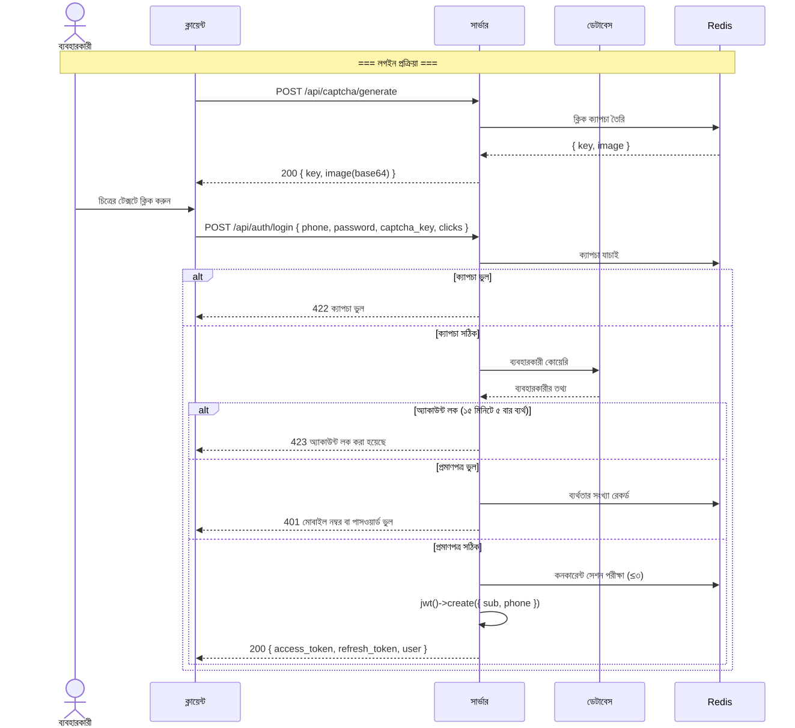
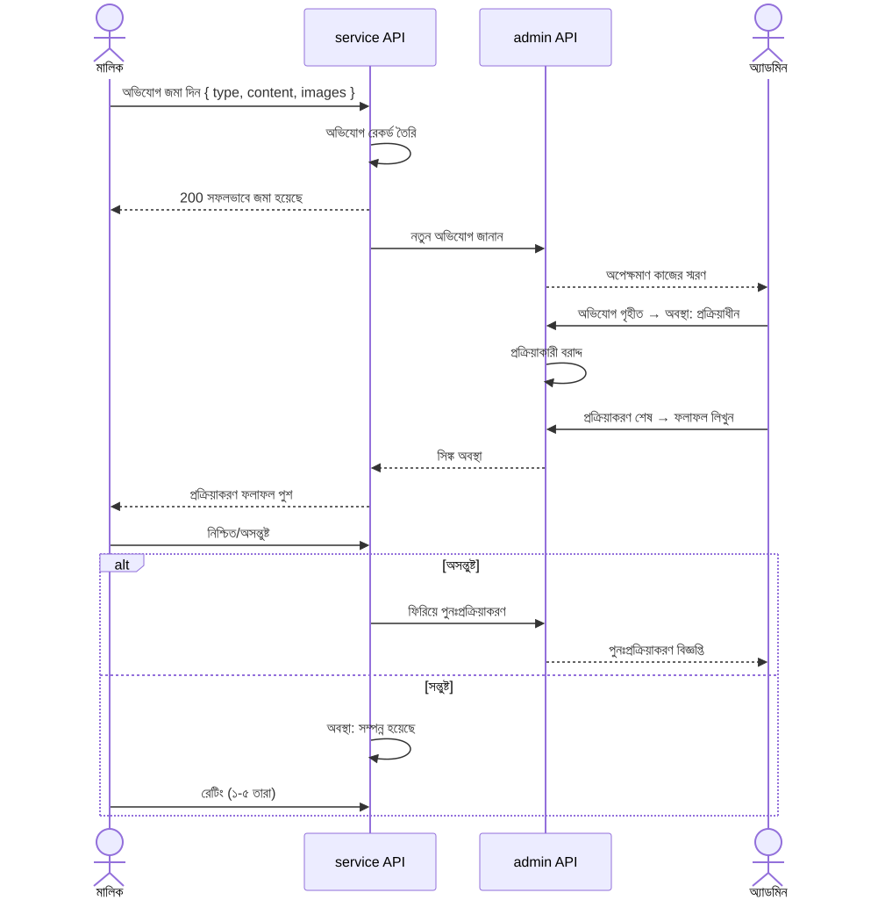

# বিজনেস ফ্লোচার্ট (Business Flowchart)

> Copyright (c) 2026 erik <erik@erik.xyz> — https://erik.xyz

---

## 1. ব্যবহারকারী প্রমাণীকরণ প্রক্রিয়া

---

## 2. কোর বিজনেস প্রক্রিয়া — ফি ব্যবস্থাপনা

---

## 3. মেরামতের অনুরোধ প্রক্রিয়াকরণ প্রক্রিয়া

---

## 4. সম্পত্তি ব্যবস্থাপনা প্রক্রিয়া

---

## 5. অভিযোগ ও পরামর্শ প্রক্রিয়াকরণ প্রক্রিয়া

---

## 6. দর্শনার্থী প্রবেশ প্রক্রিয়া

