# ফাংশন মডিউল ডায়াগ্রাম (Function Module Diagram)

> Copyright (c) 2026 erik <erik@erik.xyz> — https://erik.xyz

---

## 1. ফাংশন মডিউল প্যানোরামা

---

## 2. মডিউল ডিপেন্ডেন্সি সম্পর্ক

---

## 3. অ্যাডমিন প্যানেল ফাংশন ট্রি

---

## 4. মালিক পোর্টাল ফাংশন ম্যাপ

