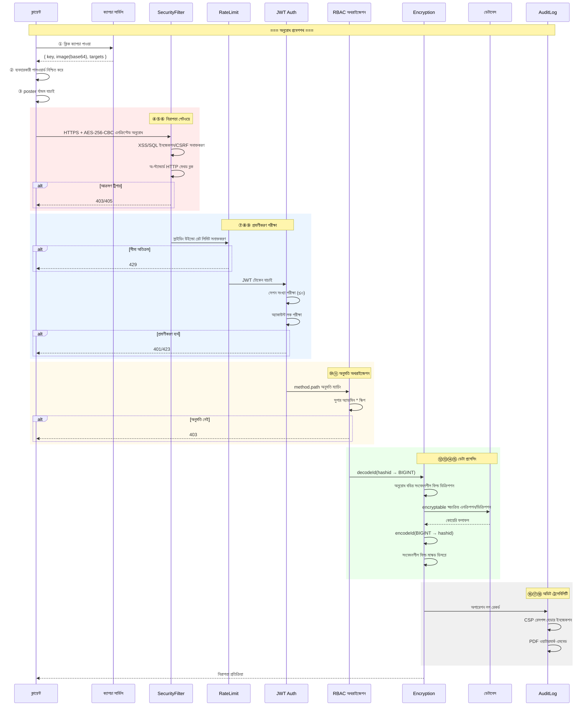

# নিরাপত্তা আর্কিটেকচার ডায়াগ্রাম (Security Architecture Diagram)

> Copyright (c) 2026 erik <erik@erik.xyz> — https://erik.xyz

---

## 1. ১৮ স্তরের গভীর প্রতিরক্ষা প্যানোরামা

---

## 2. রিকোয়েস্ট নিরাপত্তা প্রসেসিং চেইন

---

## 3. ডেটা এনক্রিপশন সম্পূর্ণ চেইন

---

## 4. প্রমাণীকরণ ও অথরাইজেশন মডেল

---

## 5. আক্রমণ পৃষ্ঠ সুরক্ষা ম্যাট্রিক্স

---

## 6. অডিট ট্রেসেবিলিটি সিস্টেম

