# Immobilienverwaltungssystem (Property Management Platform)

[Deutsch](../de/README.md) | [中文](../../../README.md)

> Copyright (c) 2026 erik <erik@erik.xyz> — https://erik.xyz

Vollständiges Immobilienverwaltungssystem mit 22 Geschäftsmodulen + 12 Erweiterungsfunktionen (Benachrichtigungen/Genehmigungsworkflow/Zahlung/Abstimmung/SLA/Daten-Dashboard/Zahlungserinnerung/Inspektion/Shop/Gesichtserkennung/Konzern/Intelligente Fragen & Antworten). Admin-Panel (admin) und Eigentümer-Portal (service) sind getrennt bereitgestellt; das Frontend umfasst Flutter Web (PC-Admin-Stil) und HarmonyOS-Mobilanwendungen.

## Projektstruktur

```
property-management-platform/
├── admin/                         # Admin-Panel webman v2 Projekt
│   ├── app/
│   │   ├── admin/controller/      # Admin-Controller
│   │   ├── api/v1/controller/     # Öffentliche API-Controller
│   │   ├── common/                # Gemeinsame Hilfsklassen
│   │   ├── middleware/            # Middleware (Authentifizierung/Autorisierung/Ratenlimit/Sicherheit)
│   │   ├── model/                 # Datenmodelle (Eloquent ORM)
│   │   ├── queue/                 # Queue-Aufgaben
│   │   └── process/               # Prozessverwaltung
│   ├── apps/
│   │   ├── flutter/               # Admin Flutter Web (PC-Stil)
│   │   └── harmonyos/             # Admin HarmonyOS App
│   ├── config/                    # Konfigurationsdateien (mit chinesischen Kommentaren)
│   ├── database/
│   │   └── backup/                # Datenbank-Backup-Skripte
│   ├── resource/
│   │   └── translations/          # Internationalisierungsdateien (zh_CN / en)
│   ├── docs/                      # Admin-Dokumentation
│   ├── tests/                     # Unit-Tests
│   └── public/                    # Web-Einstiegspunkt
├── service/                       # Eigentümer-Geschäftssystem webman v2 Projekt
│   ├── app/
│   │   ├── api/v1/controller/     # Eigentümer-Portal API-Controller
│   │   ├── common/                # Gemeinsame Hilfsklassen
│   │   ├── middleware/            # Middleware
│   │   ├── model/                 # Datenmodelle
│   │   └── process/               # Prozessverwaltung
│   ├── config/                    # Konfigurationsdateien
│   ├── resource/
│   │   └── translations/          # Internationalisierungsdateien
├── apps/
│   ├── flutter/                   # Eigentümer Flutter Web (PC-Stil)
│   └── harmonyos/                 # Eigentümer HarmonyOS App
└── docs/                          # Projektdokumentation
    ├── ARCHITECTURE.md
    ├── ARCHITECTURE_DESIGN.md
    ├── ARCHITECTURE_DIAGRAM.md    # Systemarchitekturdiagramm
    ├── FLOWCHART.md               # Geschäftsprozessdiagramme
    ├── FUNCTION_DIAGRAM.md        # Funktionsmoduldiagramme
    ├── LIFECYCLE_DIAGRAM.md       # Lebenszyklusdiagramme
    ├── SECURITY_ARCHITECTURE.md   # Sicherheitsarchitekturdiagramm
    ├── API.md
    ├── FEATURES.md
    └── FEATURE_DESIGN.md
```

## Projektumfang

| Ebene | Anzahl | Details |
|----|------|------|
| Datenbanktabellen | 65 | Alle mit `management_`-Präfix, BIGINT-Primärschlüssel ohne Auto-Inkrement |
| PHP-Modelle | admin 64 / service 57 | Alle Eloquent-Modelle, mit encryptable-verschlüsselten Feldern; service 57 ist die Anzahl der Modelldateien (inkl. BaseModel-Basisklasse) |
| admin-Controller | 58 | Allgemeine Verwaltung + 22 Immobilienmodule + 12 Erweiterungsfunktionen |
| service-Controller | 17 | Alle Eigentümer-Portal APIs |
| API-Routen | 178 | admin 125 + service 53 |
| Flutter Admin-Panel | 42 Seiten | admin 42 Seitenmodule, 96 Dateien/6.662 Zeilen |
| Flutter Eigentümer-Portal | 13 Seiten | Gebühren/Reparatur/Parken/Besucher/Aktivitäten/Benachrichtigungen/Abstimmung/Shop/Intelligente Fragen & Antworten/Gesichtserkennung, 32 Dateien/3.582 Zeilen |
| HarmonyOS | 7 Seiten | Anmeldung/Startseite/Rechnungen/Reparatur (2)/Ankündigungen/Profil, 11 Dateien/927 Zeilen |
| Tests | 133 | admin 90 (217 Assertions) + service 43 (248 Assertions) |

## Systemarchitektur- und Designdiagramme

> Die folgenden Diagramme sind Übersichten; detaillierte Diagramme finden Sie unter [Architekturdiagramm](docs/ARCHITECTURE_DIAGRAM.md) · [Prozessdiagramme](docs/FLOWCHART.md) · [Funktionsdiagramme](docs/FUNCTION_DIAGRAM.md) · [Lebenszyklusdiagramme](docs/LIFECYCLE_DIAGRAM.md) · [Sicherheitsarchitekturdiagramm](docs/SECURITY_ARCHITECTURE.md)

### Gesamtarchitektur des Systems



### Kern-Geschäftsprozesse



### Funktionsmodulübersicht



### Datenentitäts-Lebenszyklus



### 18 Schichten Verteidigung in der Tiefe



## Funktionsmodule (22 große Module + 12 Erweiterungen)

| Charge | Module | Status |
|------|------|------|
| 1. Charge | Wohnanlage, Gebäude, Einheit, Wohntyp, Immobilie, Eigentümer, Mieter, Gebühren, Reparaturauftrag, Ankündigung (10 Module) | ✅ Alle abgeschlossen |
| 2. Charge | Parken, Geräte, Beschwerde, Besucher, Vertrag, Finanzen (6 Module) + Panel-Visualisierung + Excel/PDF-Export (Plattformfunktionen) | ✅ Alle abgeschlossen |
| 3. Charge | Sicherheitspatrouille, Reinigung, Grünanlagen, Community-Aktivitäten, Energieverbrauch, Mitarbeiter (6 Module) | ✅ Alle abgeschlossen |
| Erweiterungen | Benachrichtigungen, Genehmigungsworkflow, Zahlungsintegration, Eigentümer-Abstimmung, automatische SLA-Eskalation, Daten-Dashboard, intelligente Zahlungserinnerung, mobile Inspektion, Community-Shop, Gesichtserkennung, Multi-Wohnanlagen-Konzernverwaltung, intelligente Fragen & Antworten (12 Module) | ✅ Alle abgeschlossen |

## Technologie-Stack

### Backend
- **Framework**: webman v2 (workerman/webman)
- **Sprache**: PHP 8.3+
- **Datenbank**: MySQL 8.0+, Tabellenpräfix `management_`, BIGINT-Primärschlüssel ohne Auto-Inkrement
- **Suchmaschine**: Elasticsearch 8.x
- **Cache**: Redis 7.x

### Kernabhängigkeiten
| Paket | Zweck |
|------|------|
| `erikwang2013/snowflake-php` | Globale eindeutige BIGINT-Primärschlüsselgenerierung |
| `erikwang2013/hashids` | API-Ebene ID-Ver-/entschlüsselung |
| `erikwang2013/jwt-webman` | JWT-Authentifizierung (HS256) |
| `erikwang2013/encryption` | AES-256-CBC-Verschlüsselung sensibler API-Daten |
| `erikwang2013/encryptable` | Ver-/Entschlüsselung sensibler Datenbankfelder |
| `erikwang2013/webman-scout` | Elasticsearch-Datensynchronisierung und Volltextsuche |
| `erikwang2013/season` | Nationalflaggen-Daten |
| `erikwang2013/security-php` | Sicherheitswerkzeug-Erkennung |
| `erikwang2013/poster-php` | Zufalls-Captcha für sensible Aktionen |
| `phpoffice/phpspreadsheet` | Excel-Export |
| `barryvdh/laravel-dompdf` | PDF-Export |
| `hg/apidoc` | Automatische API-Dokumentgenerierung |

### Frontend
- **Flutter 3.x** + GetX (mit i18n) + Dio + fl_chart — PC-Admin-Web-Panel
- **HarmonyOS ArkTS** + @ohos.net.http — Mobile App

### API-Dokumentation

Alle API-Endpunkte und Parameterbeschreibungen finden Sie im separaten Dokument [docs/API.md](docs/API.md). Nach dem Start des Dienstes ist auch die automatisch generierte interaktive apidoc-Dokumentation erreichbar:

| Ende | Adresse | Gruppen |
|----|------|------|
| Admin-Panel | `http://localhost:8787/apidoc` | 10 Gruppen (common/dashboard/system/property-core/property-aux/property-adv/extensions/export/import/upload) |
| Eigentümer-Portal | `http://localhost:8788/apidoc` | 9 Gruppen (öffentliche Schnittstellen/Startseite/Gebühren/Reparatur/Feedback/Parken/Aktivitäten/Profil/Erweiterungen) |

### Internationalisierung

- **PHP-Backend**: symfony/translation, Sprachdateien in `resource/translations/{zh_CN,en}/messages.php`
- **Flutter Web**: GetX `Translations`, `apps/flutter/lib/i18n/messages.dart`
- **Standardsprache**: Vereinfachtes Chinesisch (zh_CN), Umschaltung auf Englisch (en) möglich
- **Anfrageheader**: Antwortsprache über den `Accept-Language`-Header steuerbar

## Sicherheitssystem (18 Schichten Verteidigung in der Tiefe)

1. Klick-Captcha → 2. Passwortbestätigung → 3. poster-Zufallsprüfung → 4. security-php-Sicherheitsscan → 5. SecurityFilter-Angriffsblockierung → 6. HTTPS + AES-256-CBC-Übertragungsverschlüsselung → 7. JWT-HS256-Authentifizierung → 8. Paralleles Sitzungslimit (max. 3) → 9. Kontosperrung (5 Fehlversuche/15 Minuten) → 10. RBAC-Berechtigungsprüfung (method.path-Granularität) → 11. Redis-Sliding-Window-Ratenbegrenzung → 12. Hashids-ID-Schutz → 13. Verschlüsselung sensibler Anforderungsfelder → 14. Verschlüsselte DB-Feldspeicherung → 15. Anzeige-Maskierung → 16. Vollständige Betriebsprotokoll-Auditierung (8 Plattform-Quellen) → 17. CSP-Header-Schutz → 18. PDF-Urheberrechtswasserzeichen

## Code-Standards

- Alle neuen Dateien enthalten einen Copyright-Header: `Copyright (c) 2026 erik <erik@erik.xyz> — https://erik.xyz`
- Globale Funktionen/Klassen werden mit `use` importiert, ohne vorangestellten `\`
- Konfigurationsdateien enthalten chinesische Kommentare zu jedem Konfigurationspunkt
- Primärschlüssel-IDs verwenden BIGINT UNSIGNED NOT NULL, von snowflake-php auf Anwendungsebene generiert
- API-Übertragungs-IDs werden mit hashids ver-/entschlüsselt

## Schnellstart

### Methode 1: Web-Installationsassistent (empfohlen)

Nach dem Start des Admin-Panels `http://localhost:8787/install` aufrufen und die Datenbankkonfiguration sowie das Admin-Konto über die Oberfläche einrichten.

```bash
cd admin
cp .env.example .env
composer install
php start.php start -d
# http://localhost:8787/install aufrufen, um die Installation abzuschließen
```

Details siehe [Installationsanleitung](docs/INSTALL.md).

### Methode 2: Manuelle Installation

#### Systemvoraussetzungen

- PHP 8.1+
- MySQL 8.0+
- Redis 6.0+
- Composer 2.x
- Flutter SDK 3.x (Frontend-Entwicklung)

#### 1. Datenbank initialisieren

```bash
mysql -u root -e "CREATE DATABASE IF NOT EXISTS management DEFAULT CHARSET utf8mb4 COLLATE utf8mb4_unicode_ci;"
mysql -u root management < docs/install.sql
```

#### 2. Admin-Panel starten

```bash
cd admin
cp .env.example .env
# .env bearbeiten, z. B. Datenbankpasswort anpassen
composer install
php start.php start -d
# Admin-Panel läuft auf http://localhost:8787
```

### 3. Geschäftssystem starten

```bash
cd service
cp .env.example .env
# .env bearbeiten, z. B. Datenbankpasswort anpassen
composer install
php start.php start -d
# Geschäftssystem läuft auf http://localhost:8788
```

### 4. Frontend starten (Entwicklung)

```bash
cd apps/flutter
flutter pub get
flutter run -d chrome
```

### 5. Tests ausführen

```bash
# Admin-Tests
cd admin && php vendor/bin/phpunit

# Geschäftssystem-Tests
cd service && php vendor/bin/phpunit
```

| Projekt | Testanzahl | Assertions | Erfolgsquote |
|------|--------|--------|--------|
| admin | 90 | 217 | 100% |
| service | 43 | 248 | 100% (1 übersprungen) |
| **Gesamt** | **133** | **465** | — |

service-Testabdeckung: Snowflake-ID, Hashids-Codierung/-Decodierung, Antwortformat, Datenbank-Schema, i18n-Übersetzungsdateien

### Docker-Bereitstellung

```bash
cd admin
cp .env.docker .env
docker-compose up -d
# Enthält Nginx + PHP + MySQL + Redis + Elasticsearch
```

## Bereitstellungstopologie

```
Nginx (:443) → admin webman (:8787) + service webman (:8788) → MySQL + Redis + Elasticsearch
Statische Dateien: Flutter Web build/
```

## Standard-Administrator

| Benutzername | Passwort | Rolle |
|--------|------|------|
| admin | admin123 | Superadministrator |

> Bitte ändern Sie das Standardpasswort in der Produktion sofort.

## Dokumentationsindex

| Dokument | Beschreibung |
|------|------|
| [Installationsanleitung](docs/INSTALL.md) | Schritt-für-Schritt-Bereitstellung, inkl. Datenbankinitialisierung, Docker-Bereitstellung, FAQ |
| [Kombiniertes Installationsskript](docs/install.sql) | Alle 65 Tabellen + RBAC-Berechtigungs-Seeddaten, ein Import |
| [Versionsvergleich](docs/EDITIONS.md) | Vergleich von Funktionen und technischen Kennzahlen: Lite / Standard / Full |
| [Architekturdesign-Dokument](docs/ARCHITECTURE_DESIGN.md) | Schichtenarchitektur, Middleware-Ausführungskette, Sicherheitsverteidigung in der Tiefe |
| [Architekturdokument](docs/ARCHITECTURE.md) | Mermaid-Architekturdiagramme (Systemtopologie, Anfragelebenszyklus, Datenverschlüsselung, Bereitstellung) |
| [Systemarchitekturdiagramm](docs/ARCHITECTURE_DIAGRAM.md) | Gesamtarchitektur, Layering-Details, Bereitstellungsarchitektur (Mermaid-Visualisierung) |
| [Geschäftsprozessdiagramme](docs/FLOWCHART.md) | Authentifizierungsprozess, Gebührenverwaltung, Reparaturbearbeitung, Immobilienverwaltung, Beschwerde, Besucher |
| [Funktionsmoduldiagramme](docs/FUNCTION_DIAGRAM.md) | 34-Modul-Gesamtübersicht, Abhängigkeiten, Admin-Funktionsbaum, Eigentümer-Funktionskarte |
| [Lebenszyklusdiagramme](docs/LIFECYCLE_DIAGRAM.md) | Anfragelebenszyklus, Entitätslebenszyklus, Token-Lebenszyklus, vollständiger CRUD-Ablauf |
| [Sicherheitsarchitekturdiagramm](docs/SECURITY_ARCHITECTURE.md) | 18-Schichten-Verteidigung, Angriffsflächenmatrix, Verschlüsselungskette, Audit-Rückverfolgung |
| [Funktionsdesign-Dokument](docs/FEATURE_DESIGN.md) | Spezifikationen für 34 Module |
| [Funktionsdokument](docs/FEATURES.md) | Funktionsliste und Modulübersicht |
| [API-Dokument](docs/API.md) | Alle API-Endpunkte und Parameterbeschreibungen |

## Projekt unterstützen

Vielen Dank für Ihre Unterstützung!

|  |  |
|:---:|:---:|
| WeChat Pay | Alipay |

### Globale Überweisungen / Spenden

Banküberweisungen aus aller Welt werden unterstützt; das Empfangskonto ist die ZA Bank (ZhongAn Bank) in Hongkong:

| Position | Information |
|------|------|
| Empfängername | WANG KEXUN |
| Kontonummer | 881015918251 |
| Empfängerbank | ZA Bank Limited |
| SWIFT-Code | AABLHKHHXXX |
| Bankleitzahl | 387 |
| Bankadresse | Core F, Cyberport 3, 100 Cyberport Road, Hong Kong |

> **Korrespondenzbank (Zwischenbank) für grenzüberschreitende Überweisungen**: Im Folgenden die Daten der Korrespondenzbank (Zwischenbank), nicht der Empfängerbank. Fragen Sie bei Ihrer Bank, ob Angaben zur Korrespondenzbank erforderlich sind.
>
> - **Eingehende HKD, CNY und USD** (Citibank N.A. Hong Kong): SWIFT `CITIHKXXXX`, Bankleitzahl 006, Filialnummer 391, Adresse: Citibank Tower, Citibank Plaza, 3 Garden Road, Central, Hong Kong
> - **Andere Währungen** (THE BANK OF NEW YORK MELLON): SWIFT `IRVTUS3NXXX`, Adresse: 240 GREENWICH STREET, NEW YORK, United States

Wir freuen uns über Ihre Unterstützung dieses Projekts!

## Lizenz

MIT-Lizenz. Details siehe [LICENSE](LICENSE).
