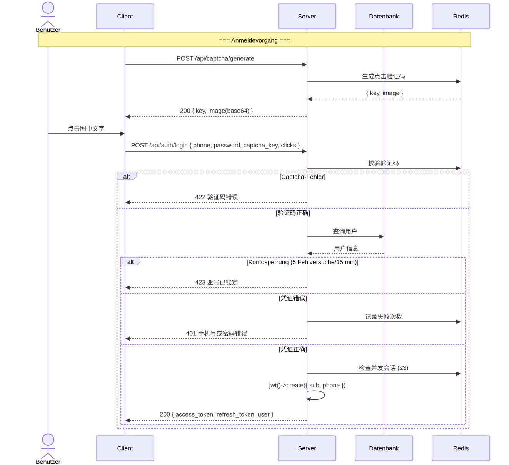
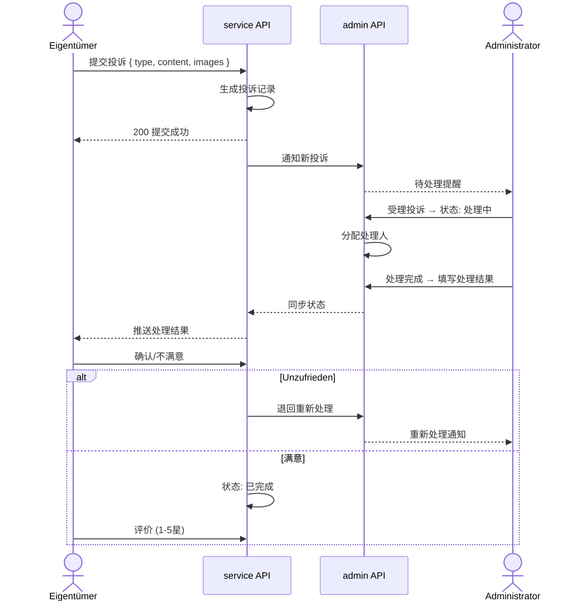

# Geschäftsprozessdiagramme (Business Flowchart)

> Copyright (c) 2026 erik <erik@erik.xyz> — https://erik.xyz

---

## 1. Benutzer-Authentifizierungsprozess

---

## 2. Kern-Geschäftsprozess — Gebührenverwaltung

---

## 3. Reparaturbearbeitungsprozess

---

## 4. Immobilienverwaltungsprozess

---

## 5. Beschwerde- und Vorschlagsbearbeitungsprozess

---

## 6. Besucher-Zutrittsprozess

