# Funktionsmoduldiagramme (Function Module Diagram)

> Copyright (c) 2026 erik <erik@erik.xyz> — https://erik.xyz

> English edition: `../../../images/design_function_en.svg`

---

## 1. Funktionsmodul-Gesamtübersicht

---

## 2. Modulabhängigkeiten

---

## 3. Admin-Panel-Funktionsbaum

---

## 4. Eigentümer-Portal-Funktionskarte

