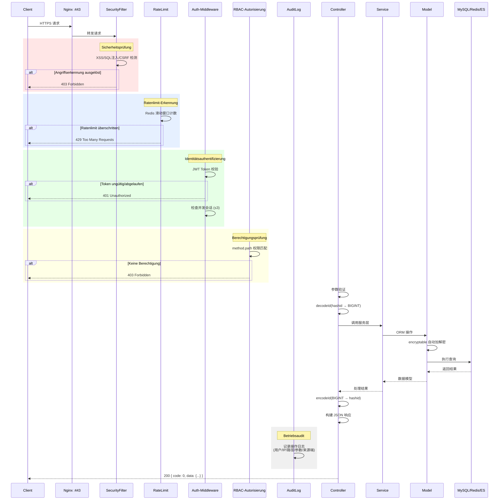
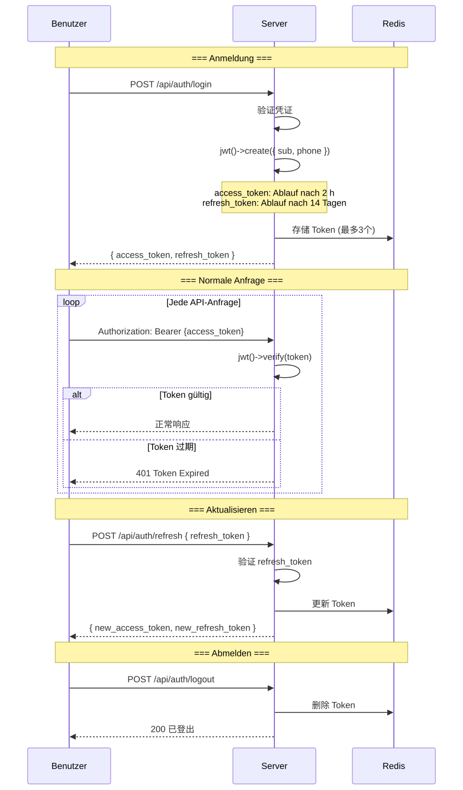

# Lebenszyklusdiagramme (Lifecycle Diagram)

> Copyright (c) 2026 erik <erik@erik.xyz> — https://erik.xyz

---

## 1. Anfragelebenszyklus

---

## 2. Datenentitäts-Lebenszyklus — Eigentümer (Owner)

---

## 3. Datenentitäts-Lebenszyklus — Gebührenrechnung (Fee Bill)

---

## 4. Datenentitäts-Lebenszyklus — Reparaturauftrag (Repair Order)

---

## 5. JWT-Token-Lebenszyklus

---

## 6. Vollständiger Lebenszyklus von Datenbankeinträgen

