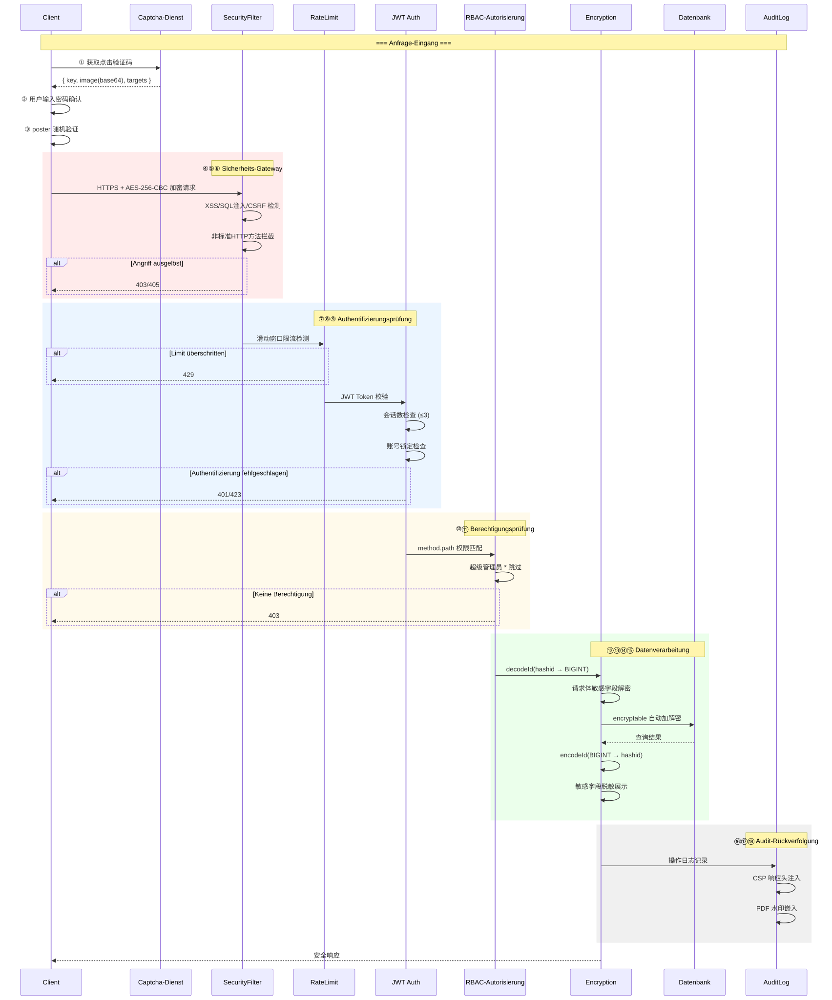

# Sicherheitsarchitekturdiagramm (Security Architecture Diagram)

> Copyright (c) 2026 erik <erik@erik.xyz> — https://erik.xyz

---

## 1. Gesamtübersicht der 18-Schichten-Verteidigung in der Tiefe

---

## 2. Anfrage-Sicherheitsverarbeitungskette

---

## 3. Vollständige Datenverschlüsselungskette

---

## 4. Authentifizierungs- und Autorisierungsmodell

---

## 5. Angriffsflächen-Schutzmatrix

---

## 6. Audit-Rückverfolgungssystem

