# Property Management Platform

[English](../en/README.md) | [中文](../../../README.md)

> Copyright (c) 2026 erik <erik@erik.xyz> — https://erik.xyz

A full-stack property management system covering 22 business modules + 12 extension features (message notifications / approval workflow / payments / voting / SLA / data dashboard / payment reminders / inspection / mall / face recognition / group management / intelligent Q&A). The admin panel (admin) and owner portal (service) are deployed separately, with frontends covering Flutter Web (PC admin style) and HarmonyOS mobile.

## Project Structure

```
property-management-platform/
├── admin/                         # Admin webman v2 project
│   ├── app/
│   │   ├── admin/controller/      # Admin controllers
│   │   ├── api/v1/controller/     # Public API controllers
│   │   ├── common/                # Shared utility classes
│   │   ├── middleware/            # Middleware (auth / authorization / rate limiting / security)
│   │   ├── model/                 # Data models (Eloquent ORM)
│   │   ├── queue/                 # Queue tasks
│   │   └── process/               # Process management
│   ├── apps/
│   │   ├── flutter/               # Admin Flutter Web (PC style)
│   │   └── harmonyos/             # Admin HarmonyOS App
│   ├── config/                    # Configuration files (with Chinese comments)
│   ├── database/
│   │   └── backup/                # Database backup scripts
│   ├── resource/
│   │   └── translations/          # i18n language files (zh_CN / en)
│   ├── docs/                      # Admin documentation
│   ├── tests/                     # Unit tests
│   └── public/                    # Web entry
├── service/                       # Owner business webman v2 project
│   ├── app/
│   │   ├── api/v1/controller/     # Owner API controllers
│   │   ├── common/                # Shared utility classes
│   │   ├── middleware/            # Middleware
│   │   ├── model/                 # Data models
│   │   └── process/               # Process management
│   ├── config/                    # Configuration files
│   ├── resource/
│   │   └── translations/          # i18n language files
├── apps/
│   ├── flutter/                   # Owner Flutter Web (PC style)
│   └── harmonyos/                 # Owner HarmonyOS App
└── docs/                          # Project documentation
    ├── ARCHITECTURE.md
    ├── ARCHITECTURE_DESIGN.md
    ├── ARCHITECTURE_DIAGRAM.md    # System architecture diagrams
    ├── FLOWCHART.md               # Business flowcharts
    ├── FUNCTION_DIAGRAM.md        # Function module diagrams
    ├── LIFECYCLE_DIAGRAM.md       # Lifecycle diagrams
    ├── SECURITY_ARCHITECTURE.md   # Security architecture diagrams
    ├── API.md
    ├── FEATURES.md
    └── FEATURE_DESIGN.md
```

## Project Scale

| Layer | Count | Details |
|----|------|------|
| Database tables | 65 | All `management_` prefixed, BIGINT non-auto-increment primary keys |
| PHP models | admin 64 / service 57 | All Eloquent models with encryptable encrypted fields; service 57 is the model file count (including the BaseModel base class) |
| admin controllers | 58 | General management + 22 property modules + 12 extension features |
| service controllers | 17 | All owner-side APIs |
| API routes | 178 | admin 125 + service 53 |
| Flutter admin panel | 42 pages | admin 42 page modules, 96 files / 6,662 lines |
| Flutter owner portal | 13 pages | charges / repairs / parking / visitors / activities / notifications / voting / mall / intelligent Q&A / face recognition, 32 files / 3,582 lines |
| HarmonyOS | 7 pages | login / home / bills / repair (2) / announcements / personal center, 11 files / 927 lines |
| Tests | 133 | admin 90 (217 assertions) + service 43 (248 assertions) |

## System Architecture & Design Diagrams

> The following are overview diagrams; see [Architecture Diagram](docs/ARCHITECTURE_DIAGRAM.md) · [Flowchart](docs/FLOWCHART.md) · [Function Diagram](docs/FUNCTION_DIAGRAM.md) · [Lifecycle Diagram](docs/LIFECYCLE_DIAGRAM.md) · [Security Architecture Diagram](docs/SECURITY_ARCHITECTURE.md) for detailed charts

### System Overview Architecture



### Core Business Flow



### Function Module Overview



### Data Entity Lifecycle



### 19-Layer Security Defense in Depth


## Function Modules (22 Major Modules + 12 Extensions)

| Batch | Modules | Status |
|------|------|------|
| Batch 1 | Community, building, unit, layout, property, owner, tenant, charges, repair, announcements (10 modules) | ✅ All complete |
| Batch 2 | Parking, equipment, complaints, visitors, contracts, finance (6 modules) + panel visualization + Excel/PDF export (platform features) | ✅ All complete |
| Batch 3 | Security patrol, cleaning, greening, community activities, energy, staff (6 modules) | ✅ All complete |
| Extensions | Message notifications, approval workflow, payment integration, owner voting, SLA auto escalation, data dashboard, smart payment reminders, mobile inspection, community mall, face recognition, multi-community group management, intelligent Q&A (12 modules) | ✅ All complete |

## Tech Stack

### Backend
- **Framework**: webman v2 (workerman/webman)
- **Language**: PHP 8.3+
- **Database**: MySQL 8.0+, table prefix `management_`, BIGINT non-auto-increment primary keys
- **Search Engine**: Elasticsearch 8.x
- **Cache**: Redis 7.x

### Core Dependencies
| Package | Purpose |
|------|------|
| `erikwang2013/snowflake-php` | Globally unique BIGINT primary key generation |
| `erikwang2013/hashids` | API-layer ID encryption/decryption |
| `erikwang2013/jwt-webman` | JWT authentication (HS256) |
| `erikwang2013/encryption` | AES-256-CBC encryption of sensitive data in API transport |
| `erikwang2013/encryptable` | Encryption/decryption of sensitive database fields |
| `erikwang2013/webman-scout` | Elasticsearch data sync and full-text search |
| `erikwang2013/season` | Country flag data |
| `erikwang2013/security-php` | Security tool detection |
| `erikwang2013/poster-php` | Random verification codes for sensitive operations |
| `phpoffice/phpspreadsheet` | Excel export |
| `barryvdh/laravel-dompdf` | PDF export |
| `hg/apidoc` | Automatic API documentation generation |

### Frontend
- **Flutter 3.x** + GetX (with i18n) + Dio + fl_chart — PC-style Web admin panel
- **HarmonyOS ArkTS** + @ohos.net.http — mobile App

### API Documentation

All API endpoints and parameter descriptions are in the standalone [docs/API.md](docs/API.md). After starting the services, you can also access the interactive documentation auto-generated by apidoc:

| End | Address | Groups |
|----|------|------|
| Admin | `http://localhost:8787/apidoc` | 10 groups (common/dashboard/system/property-core/property-aux/property-adv/extensions/export/import/upload) |
| Owner | `http://localhost:8788/apidoc` | 9 groups (public/home/charges/repairs/feedback/parking/activities/profile/extensions) |

### Internationalization

- **PHP Backend**: symfony/translation, language files in `resource/translations/{zh_CN,en}/messages.php`
- **Flutter Web**: GetX `Translations`, `apps/flutter/lib/i18n/messages.dart`
- **Default Language**: Simplified Chinese (zh_CN), switchable to English (en)
- **Request Header**: response language controllable via `Accept-Language` request header

## Security System (19-Layer Defense in Depth)

1. Click captcha → 2. Password re-confirmation → 3. poster random verification → 4. security-php security scan → 5. SecurityFilter attack blocking → 6. HTTPS + AES-256-CBC transport encryption → 7. JWT HS256 authentication → 8. Concurrent session limit (max 3) → 9. Account lockout (5 failures/15 minutes) → 10. RBAC permission authorization (method.path granularity) → 11. Redis sliding window rate limiting → 12. Redis Circuit Breaker (payment/webhook fast-fail + half-open probe) → 13. Hashids ID protection → 14. Request body sensitive field encryption → 15. DB field encrypted storage → 16. Display-layer data masking → 17. Full operation log audit (8 platform sources) → 18. CSP header protection → 19. PDF copyright watermark

## Coding Standards

- All new files begin with the copyright notice: `Copyright (c) 2026 erik <erik@erik.xyz> — https://erik.xyz`
- Global functions/classes are imported with `use`, without a leading `\`
- Configuration files contain Chinese comments explaining each config item
- Primary key IDs use BIGINT UNSIGNED NOT NULL, generated at the application layer by snowflake-php
- API-transmitted IDs use hashids encryption/decryption

## Quick Start

### Option 1: Web Installation Wizard (Recommended)

After starting the admin service, visit `http://localhost:8787/install` to complete database configuration and create the admin account through the UI.

```bash
cd admin
cp .env.example .env
composer install
php start.php start -d
# Visit http://localhost:8787/install to complete the installation
```

See the [Installation Guide](docs/INSTALL.md) for details.

### Option 2: Manual Installation

#### Environment Requirements

- PHP 8.1+
- MySQL 8.0+
- Redis 6.0+
- Composer 2.x
- Flutter SDK 3.x (frontend development)

#### 1. Initialize the Database

```bash
mysql -u root -e "CREATE DATABASE IF NOT EXISTS management DEFAULT CHARSET utf8mb4 COLLATE utf8mb4_unicode_ci;"
mysql -u root management < docs/install.sql
```

#### 2. Start the Admin Service

```bash
cd admin
cp .env.example .env
# Edit .env to change database password and other config
composer install
php start.php start -d
# Admin service runs at http://localhost:8787
```

### 3. Start the Business Service

```bash
cd service
cp .env.example .env
# Edit .env to change database password and other config
composer install
php start.php start -d
# Business service runs at http://localhost:8788
```

### 4. Start the Frontend (Development)

```bash
cd apps/flutter
flutter pub get
flutter run -d chrome
```

### 5. Run Tests

```bash
# Admin tests
cd admin && php vendor/bin/phpunit

# Business service tests
cd service && php vendor/bin/phpunit
```

| Project | Tests | Assertions | Pass Rate |
|------|--------|--------|--------|
| admin | 90 | 217 | 100% |
| service | 43 | 248 | 100% (1 skipped) |
| **Total** | **133** | **465** | — |

service tests cover: Snowflake ID, Hashids encode/decode, response format, database schema, i18n translation files

### Docker Deployment

```bash
cd admin
cp .env.docker .env
docker-compose up -d
# Includes Nginx + PHP + MySQL + Redis + Elasticsearch
```

## Deployment Topology

```
Nginx (:443) → admin webman (:8787) + service webman (:8788) → MySQL + Redis + Elasticsearch
Static files: Flutter Web build/
```

## Default Admin Account

| Username | Password | Role |
|--------|------|------|
| admin | admin123 | Super admin |

> Change the default password immediately in production.

## Documentation Index

| Document | Description |
|------|------|
| [Installation Guide](docs/INSTALL.md) | Step-by-step deployment guide, including database initialization, Docker deployment, and FAQ |
| [Merged Installation Script](docs/install.sql) | All 65 tables + RBAC permission seed data, one-click import |
| [Edition Comparison](docs/EDITIONS.md) | Feature and technical indicator comparison of Lite / Standard / Full editions |
| [Architecture Design Document](docs/ARCHITECTURE_DESIGN.md) | System layered architecture, middleware execution chain, security defense-in-depth design |
| [Architecture Document](docs/ARCHITECTURE.md) | Mermaid architecture diagrams (system topology, request lifecycle, data encryption, deployment) |
| [System Architecture Diagram](docs/ARCHITECTURE_DIAGRAM.md) | Overview architecture, layered details, deployment architecture (Mermaid visualization) |
| [Business Flowchart](docs/FLOWCHART.md) | Authentication flow, charge management, repair handling, property management, complaints, visitors |
| [Function Module Diagram](docs/FUNCTION_DIAGRAM.md) | 34-module overview, dependencies, admin function tree, owner function map |
| [Lifecycle Diagram](docs/LIFECYCLE_DIAGRAM.md) | Request lifecycle, entity lifecycle, Token lifecycle, full CRUD flow |
| [Security Architecture Diagram](docs/SECURITY_ARCHITECTURE.md) | 19-layer defense-in-depth overview, attack surface defense matrix, full encryption chain, audit trail system |
| [Feature Design Document](docs/FEATURE_DESIGN.md) | Functional specifications for the 34 modules |
| [Features Document](docs/FEATURES.md) | Feature list and module overview |
| [API Document](docs/API.md) | All API endpoints and parameter descriptions |

## Support the Project

Thank you for your support!

|  |  |
|:---:|:---:|
| WeChat Pay | Alipay |

### Global Bank Transfer Donations

Bank transfers from around the world are supported; the receiving account is ZA Bank (ZhongAn Bank) in Hong Kong:

| Item | Information |
|------|------|
| Beneficiary Name | WANG KEXUN |
| Beneficiary Account Number | 881015918251 |
| Receiving Bank | ZA Bank Limited |
| SWIFT Code | AABLHKHHXXX |
| Bank Code | 387 |
| Bank Address | Core F, Cyberport 3, 100 Cyberport Road, Hong Kong |

> **Cross-border remittance correspondent bank (intermediary bank)**: The following is the correspondent bank (intermediary bank) information, not the receiving bank information. Please check with your remitting bank whether correspondent bank information is required.
>
> - **For HKD, CNY and USD remittances** (Citibank N.A. Hong Kong): SWIFT `CITIHKXXXX`, bank code 006, branch code 391, address: Citibank Tower, Citibank Plaza, 3 Garden Road, Central, Hong Kong
> - **For other currencies** (THE BANK OF NEW YORK MELLON): SWIFT `IRVTUS3NXXX`, address: 240 GREENWICH STREET, NEW YORK, United States

Your support is welcome!

## License

MIT License. See [LICENSE](LICENSE) for details.
