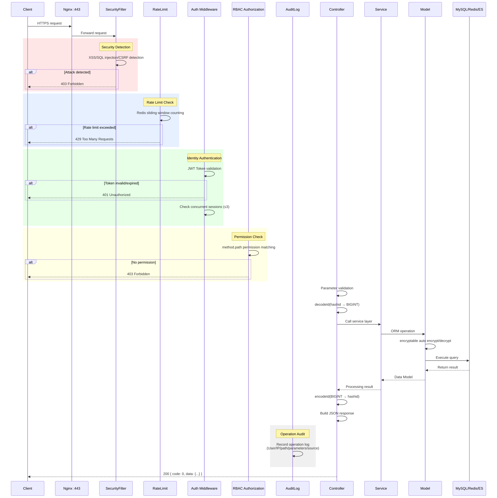
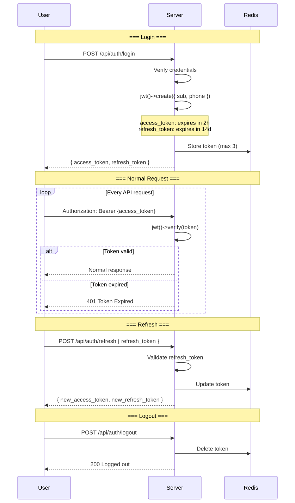

# Lifecycle Diagram

> Copyright (c) 2026 erik <erik@erik.xyz> — https://erik.xyz

---

## 1. Request Lifecycle

---

## 2. Data Entity Lifecycle — Owner

---

## 3. Data Entity Lifecycle — Fee Bill

---

## 4. Data Entity Lifecycle — Repair Order

---

## 5. JWT Token Lifecycle

---

## 6. Complete Database Record Lifecycle

