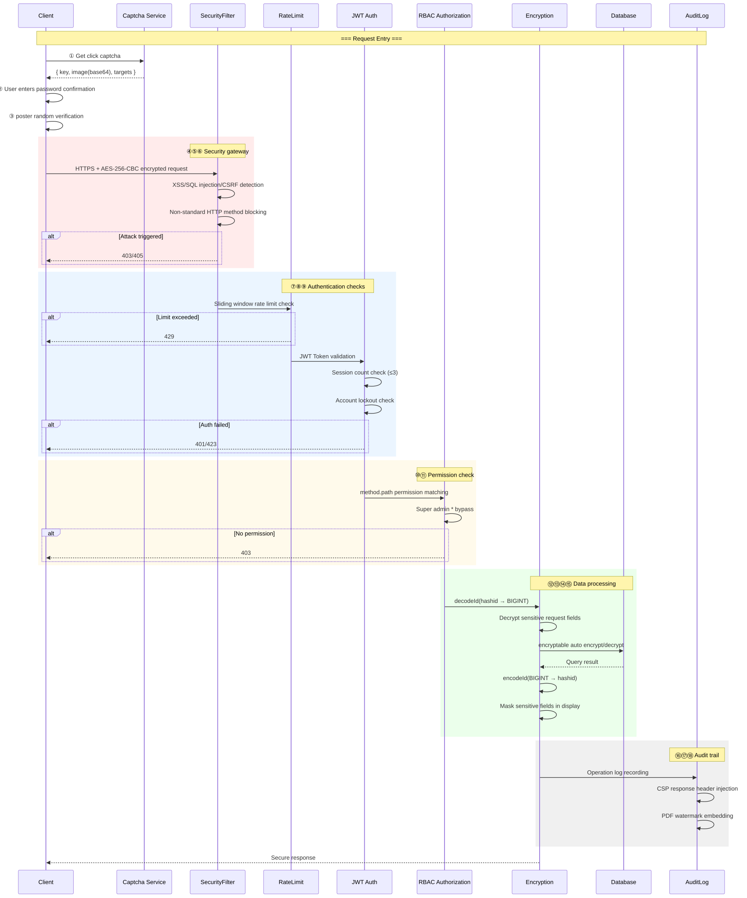

# Security Architecture Diagram

> Copyright (c) 2026 erik <erik@erik.xyz> — https://erik.xyz

---

## 1. 18-Layer Defense-in-Depth Overview

---

## 2. Request Security Processing Chain

---

## 3. Complete Data Encryption Chain

---

## 4. Authentication and Authorization Model

---

## 5. Attack Surface Defense Matrix

---

## 6. Audit Trail System

