# Sistema de Gestión de Propiedades (Property Management Platform)

[Español](../es/README.md) | [中文](../../../README.md)

> Copyright (c) 2026 erik <erik@erik.xyz> — https://erik.xyz

Sistema de gestión de propiedades full-stack que cubre 22 módulos de negocio + 12 funciones extendidas (notificaciones de mensajes / flujo de aprobación / pagos / votaciones / SLA / pantalla de datos / cobros / inspecciones / tienda / reconocimiento facial / grupo / Q&A inteligente). El panel de administración (admin) y el portal de propietarios (service) se despliegan por separado; el frontend cubre Flutter Web (estilo escritorio de panel de administración de PC) y la app móvil HarmonyOS.

## Estructura del proyecto

```
property-management-platform/
├── admin/                         # Proyecto webman v2 del panel de administración
│   ├── app/
│   │   ├── admin/controller/      # Controladores del panel de administración
│   │   ├── api/v1/controller/     # Controladores de API pública
│   │   ├── common/                # Clases de utilidades comunes
│   │   ├── middleware/            # Middleware (autenticación/autorización/límite de velocidad/seguridad)
│   │   ├── model/                 # Modelos de datos (Eloquent ORM)
│   │   ├── queue/                 # Tareas de cola
│   │   └── process/               # Gestión de procesos
│   ├── apps/
│   │   ├── flutter/               # Flutter Web del panel de administración (estilo PC)
│   │   └── harmonyos/             # App HarmonyOS del panel de administración
│   ├── config/                    # Archivos de configuración (con comentarios en chino)
│   ├── database/
│   │   └── backup/                # Scripts de respaldo de base de datos
│   ├── resource/
│   │   └── translations/          # Archivos de idioma de internacionalización (zh_CN / en)
│   ├── docs/                      # Documentación del panel de administración
│   ├── tests/                     # Pruebas unitarias
│   └── public/                    # Entrada web
├── service/                       # Proyecto webman v2 del portal de propietarios
│   ├── app/
│   │   ├── api/v1/controller/     # Controladores de API del portal de propietarios
│   │   ├── common/                # Clases de utilidades comunes
│   │   ├── middleware/            # Middleware
│   │   ├── model/                 # Modelos de datos
│   │   └── process/               # Gestión de procesos
│   ├── config/                    # Archivos de configuración
│   ├── resource/
│   │   └── translations/          # Archivos de idioma de internacionalización
├── apps/
│   ├── flutter/                   # Flutter Web del portal de propietarios (estilo PC)
│   └── harmonyos/                 # App HarmonyOS del portal de propietarios
└── docs/                          # Documentación del proyecto
    ├── ARCHITECTURE.md
    ├── ARCHITECTURE_DESIGN.md
    ├── ARCHITECTURE_DIAGRAM.md    # Diagrama de arquitectura del sistema
    ├── FLOWCHART.md               # Diagrama de flujo de negocio
    ├── FUNCTION_DIAGRAM.md        # Diagrama de módulos funcionales
    ├── LIFECYCLE_DIAGRAM.md       # Diagrama de ciclo de vida
    ├── SECURITY_ARCHITECTURE.md   # Diagrama de arquitectura de seguridad
    ├── API.md
    ├── FEATURES.md
    └── FEATURE_DESIGN.md
```

## Tamaño del proyecto

| Capa | Cantidad | Detalles |
|----|------|------|
| Tablas de base de datos | 65 | Todas con prefijo `management_`, clave primaria BIGINT no autoincremental |
| Modelos PHP | admin 64 / service 57 | Todos modelos Eloquent, con campos cifrables encryptable; en service, 57 es el número de archivos de modelo (incluye la clase base BaseModel) |
| Controladores admin | 58 | Administración general + 22 módulos de propiedades + 12 funciones extendidas |
| Controladores service | 17 | Todas las API del portal de propietarios |
| Rutas de API | 178 | admin 125 + service 53 |
| Flutter panel de administración | 42 páginas | 42 módulos de páginas admin, 96 archivos / 6,662 líneas |
| Flutter portal de propietarios | 13 páginas | Cargos/reparaciones/estacionamiento/visitantes/actividades/notificaciones/votaciones/tienda/Q&A inteligente/reconocimiento facial, 32 archivos / 3,582 líneas |
| HarmonyOS | 7 páginas | Inicio de sesión/Inicio/Facturas/Reparaciones (2)/Avisos/Centro personal, 11 archivos / 927 líneas |
| Pruebas | 133 | admin 90 (217 aserciones) + service 43 (248 aserciones) |

## Diagramas de arquitectura y diseño del sistema

> Los siguientes son diagramas de resumen; los diagramas detallados se encuentran en [Diagrama de arquitectura](docs/ARCHITECTURE_DIAGRAM.md) · [Diagrama de flujo](docs/FLOWCHART.md) · [Diagrama de funciones](docs/FUNCTION_DIAGRAM.md) · [Diagrama de ciclo de vida](docs/LIFECYCLE_DIAGRAM.md) · [Diagrama de arquitectura de seguridad](docs/SECURITY_ARCHITECTURE.md)

### Arquitectura panorámica del sistema



### Flujo de negocio principal



### Resumen de módulos funcionales



### Ciclo de vida de entidades de datos



### Defensa en profundidad de 18 capas



## Módulos funcionales (22 módulos + 12 extensiones)

| Lote | Módulo | Estado |
|------|------|------|
| Lote 1 | Comunidad, edificio, unidad, tipo de vivienda, propiedad, propietario, inquilino, cargos, reparación, aviso (10 módulos) | ✅ Todo completado |
| Lote 2 | Estacionamiento, equipos, quejas, visitantes, contratos, finanzas (6 módulos) + visualización de panel + exportación Excel/PDF (funciones de plataforma) | ✅ Todo completado |
| Lote 3 | Patrullaje de seguridad, limpieza, jardinería, actividades comunitarias, energía, empleados (6 módulos) | ✅ Todo completado |
| Extensiones | Notificaciones de mensajes, flujo de aprobación, integración de pagos, votaciones de propietarios, escalado automático SLA, pantalla de datos, cobros inteligentes, inspección móvil, tienda comunitaria, reconocimiento facial, gestión de grupo multicomunidad, Q&A inteligente (12 módulos) | ✅ Todo completado |
| Funciones de plataforma | Centro de informes (tendencias de ingresos/gastos, tasa de recaudación, distribución, morosidad, exportación PDF) + estadísticas de inicio (reclamaciones/actividades/votaciones/no leídos) | ✅ Todo completado |

## Pila tecnológica

### Backend
- **Framework**: webman v2 (workerman/webman)
- **Lenguaje**: PHP 8.3+
- **Base de datos**: MySQL 8.0+, prefijo de tablas `management_`, clave primaria BIGINT no autoincremental
- **Motor de búsqueda**: Elasticsearch 8.x
- **Caché**: Redis 7.x

### Dependencias principales
| Paquete | Uso |
|------|------|
| `erikwang2013/snowflake-php` | Generación de claves primarias BIGINT únicas globales |
| `erikwang2013/hashids` | Cifrado/descifrado de ID en la capa de API |
| `erikwang2013/jwt-webman` | Autenticación JWT (HS256) |
| `erikwang2013/encryption` | Cifrado AES-256-CBC de datos sensibles en la transmisión de API |
| `erikwang2013/encryptable` | Cifrado/descifrado de campos sensibles de base de datos |
| `erikwang2013/webman-scout` | Sincronización de datos Elasticsearch y búsqueda de texto completo |
| `erikwang2013/season` | Datos de banderas de países |
| `erikwang2013/security-php` | Detección de herramientas de seguridad |
| `erikwang2013/poster-php` | Código de verificación aleatorio para operaciones sensibles |
| `phpoffice/phpspreadsheet` | Exportación Excel |
| `barryvdh/laravel-dompdf` | Exportación PDF |
| `hg/apidoc` | Generación automática de documentación de API |

### Frontend
- **Flutter 3.x** + GetX (con i18n) + Dio + fl_chart — panel de administración Web estilo PC
- **HarmonyOS ArkTS** + @ohos.net.http — App móvil

### Documentación de API

Todos los endpoints de API y descripciones de parámetros se encuentran en el documento independiente [docs/API.md](docs/API.md). Tras iniciar el servicio también se puede acceder a la documentación interactiva generada automáticamente por apidoc:

| Extremo | Dirección | Grupos |
|----|------|------|
| Panel de administración | `http://localhost:8787/apidoc` | 10 grupos (common/dashboard/system/property-core/property-aux/property-adv/extensions/export/import/upload) |
| Portal de propietarios | `http://localhost:8788/apidoc` | 9 grupos (interfaces públicas/inicio/cargos/reparaciones/comentarios/estacionamiento/actividades/personal/extensiones) |

### Internacionalización

- **Backend PHP**: symfony/translation, archivos de idioma en `resource/translations/{zh_CN,en}/messages.php`
- **Flutter Web**: GetX `Translations`, `apps/flutter/lib/i18n/messages.dart`
- **Idioma predeterminado**: chino simplificado (zh_CN), con soporte para cambiar a inglés (en)
- **Encabezado de solicitud**: admite controlar el idioma de respuesta mediante el encabezado `Accept-Language`

## Sistema de seguridad (defensa en profundidad de 18 capas)

1. Código de verificación de clic → 2. Confirmación secundaria de contraseña → 3. Verificación aleatoria poster → 4. Escaneo de seguridad security-php → 5. Intercepción de ataques SecurityFilter → 6. Cifrado de transmisión HTTPS + AES-256-CBC → 7. Autenticación JWT HS256 → 8. Límite de sesiones concurrentes (máximo 3) → 9. Bloqueo de cuenta (5 fallos/15 minutos) → 10. Autorización RBAC (granularidad method.path) → 11. Límite de velocidad de ventana deslizante Redis → 12. Protección de ID Hashids → 13. Cifrado de campos sensibles del cuerpo de la solicitud → 14. Almacenamiento cifrado de campos de BD → 15. Enmascaramiento de datos en la capa de presentación → 16. Auditoría completa de registros de operaciones (8 orígenes de plataforma) → 17. Protección de cabecera CSP → 18. Marca de agua de copyright en PDF

## Estándares de código

- Todos los archivos nuevos incluyen declaración de copyright al inicio: `Copyright (c) 2026 erik <erik@erik.xyz> — https://erik.xyz`
- Las funciones/clases globales se importan con `use`, sin `\` inicial
- Los archivos de configuración incluyen comentarios en chino que explican cada elemento de configuración
- La clave primaria ID usa BIGINT UNSIGNED NOT NULL, generada en la capa de aplicación por snowflake-php
- Los ID de transmisión de API usan cifrado/descifrado hashids

## Inicio rápido
### ⚡ Instalación con un clic (la más rápida)

```bash
bash scripts/deploy.sh
# Automáticamente: git pull → generar .env + claves → iniciar Docker Compose → inicializar BD (idempotente) → prueba de monitorización
# Admin http://localhost:8787 · Servicio http://localhost:8788
```

> Requiere Docker + Docker Compose. Idempotente y repetible; ver [scripts/deploy.sh](scripts/deploy.sh).


### Método 1: Asistente de instalación Web (recomendado)

Tras iniciar el panel de administración, acceda a `http://localhost:8787/install` y complete la configuración de la base de datos y la creación de la cuenta de administrador a través de la interfaz.

```bash
cd admin
cp .env.example .env
composer install
php start.php start -d
# Acceda a http://localhost:8787/install para completar la instalación
```

Consulte [Guía de instalación](docs/INSTALL.md).

### Método 2: Instalación manual

#### Requisitos del entorno

- PHP 8.1+
- MySQL 8.0+
- Redis 6.0+
- Composer 2.x
- Flutter SDK 3.x (desarrollo frontend)

#### 1. Inicializar la base de datos

```bash
mysql -u root -e "CREATE DATABASE IF NOT EXISTS management DEFAULT CHARSET utf8mb4 COLLATE utf8mb4_unicode_ci;"
mysql -u root management < docs/install.sql
```

#### 2. Iniciar el panel de administración

```bash
cd admin
cp .env.example .env
# Edite .env para modificar la contraseña de la base de datos y otras configuraciones
composer install
php start.php start -d
# El panel de administración se ejecuta en http://localhost:8787
```

### 3. Iniciar el portal de propietarios

```bash
cd service
cp .env.example .env
# Edite .env para modificar la contraseña de la base de datos y otras configuraciones
composer install
php start.php start -d
# El portal de propietarios se ejecuta en http://localhost:8788
```

### 4. Iniciar el frontend (desarrollo)

```bash
cd apps/flutter
flutter pub get
flutter run -d chrome
```

### 5. Ejecutar las pruebas

```bash
# Pruebas del panel de administración
cd admin && php vendor/bin/phpunit

# Pruebas del portal de propietarios
cd service && php vendor/bin/phpunit
```

| Proyecto | Pruebas | Aserciones | Tasa de aprobación |
|------|--------|--------|--------|
| admin | 90 | 217 | 100% |
| service | 43 | 248 | 100% (1 omitida) |
| **Total** | **133** | **465** | — |

La cobertura de pruebas de service incluye: ID Snowflake, codificación/decodificación Hashids, formato de respuesta, esquema de base de datos, archivos de traducción i18n

### Despliegue Docker

```bash
cd admin
cp .env.docker .env
docker-compose up -d
# Incluye Nginx + PHP + MySQL + Redis + Elasticsearch
```

## Topología de despliegue

```
Nginx (:443) → admin webman (:8787) + service webman (:8788) → MySQL + Redis + Elasticsearch
Archivos estáticos: Flutter Web build/
```

## Guía de uso

### Panel de administración
1. Abra `http://localhost:8787` e inicie sesión con la cuenta de administrador predeterminada.
2. Datos base: Comunidad → Edificio → Unidad → Tipo de vivienda → Propiedad → vincular propietarios.
3. Operaciones diarias: configurar tarifas, generar facturas, cobrar; reparaciones (asignar/progreso); reclamaciones (gestionar/visitar); Centro de informes para ingresos y recaudación.
4. Sistema: añadir administradores, RBAC, configuración, registros de auditoría.

### Portal del propietario
Abra `http://localhost:8788` (o Flutter Web / HarmonyOS): la página de inicio muestra propiedades, pagos pendientes, reparaciones, reclamaciones, actividades, votaciones y mensajes no leídos.

## Administrador predeterminado

| Usuario | Contraseña | Rol |
|--------|------|------|
| admin | admin123 | Superadministrador |

> Cambie inmediatamente la contraseña predeterminada en el entorno de producción.

## Índice de documentación

| Documento | Descripción |
|------|------|
| [Guía de instalación](docs/INSTALL.md) | Guía de despliegue desde cero, incluye inicialización de base de datos, despliegue Docker, preguntas frecuentes |
| [Script de instalación combinado](docs/install.sql) | Las 65 tablas + datos semilla de permisos RBAC, importación en un clic |
| [Comparación de versiones](docs/EDITIONS.md) | Comparación de funciones e indicadores técnicos entre Edición Básica (Lite) / Estándar (Standard) / Completa (Full) |
| [Documento de diseño de arquitectura](docs/ARCHITECTURE_DESIGN.md) | Arquitectura por capas del sistema, cadena de ejecución de middleware, diseño de defensa en profundidad |
| [Documento de arquitectura](docs/ARCHITECTURE.md) | Diagramas de arquitectura Mermaid (topología del sistema, ciclo de vida de solicitudes, cifrado de datos, despliegue) |
| [Diagrama de arquitectura del sistema](docs/ARCHITECTURE_DIAGRAM.md) | Arquitectura panorámica, diagramas detallados por capas, arquitectura de despliegue (visualización Mermaid) |
| [Diagramas de flujo de negocio](docs/FLOWCHART.md) | Flujo de autenticación, gestión de cargos, procesamiento de reparaciones, gestión de propiedades, quejas, visitantes |
| [Diagrama de módulos funcionales](docs/FUNCTION_DIAGRAM.md) | Panorama de 34 módulos, relaciones de dependencia, árbol de funciones del panel de administración, mapa de funciones del portal de propietarios |
| [Diagrama de ciclo de vida](docs/LIFECYCLE_DIAGRAM.md) | Ciclo de vida de solicitudes, ciclo de vida de entidades, ciclo de vida de Token, flujo completo CRUD |
| [Diagrama de arquitectura de seguridad](docs/SECURITY_ARCHITECTURE.md) | Panorama de defensa en profundidad de 18 capas, matriz de protección de superficie de ataque, cadena completa de cifrado, sistema de trazabilidad de auditoría |
| [Documento de diseño de funciones](docs/FEATURE_DESIGN.md) | Especificaciones funcionales de 34 módulos |
| [Documento de funciones](docs/FEATURES.md) | Lista de funciones y resumen de módulos |
| [Documentación de API](docs/API.md) | Todos los endpoints de API y descripciones de parámetros |

## Apoyo al proyecto

¡Gracias por su apoyo!

|  |  |
|:---:|:---:|
| WeChat Pay | Alipay |

### Donaciones por transferencia global

Se admiten transferencias bancarias desde todo el mundo; la cuenta receptora es ZA Bank (ZhongAn Bank) de Hong Kong:

| Elemento | Información |
|------|------|
| Nombre del beneficiario | WANG KEXUN |
| Número de cuenta del beneficiario | 881015918251 |
| Banco beneficiario | ZA Bank Limited |
| Código SWIFT | AABLHKHHXXX |
| Número de banco | 387 |
| Dirección del banco | Core F, Cyberport 3, 100 Cyberport Road, Hong Kong |

> **Banco intermediario de remesas transfronterizas**: lo siguiente es la información del banco agente (intermediario), no del banco beneficiario. Consulte con su banco remitente si necesita proporcionar la información del banco intermediario.
>
> - **Para HKD, CNY y USD** (Citibank N.A. Hong Kong): SWIFT `CITIHKXXXX`, número de banco 006, número de sucursal 391, dirección: Citibank Tower, Citibank Plaza, 3 Garden Road, Central, Hong Kong
> - **Para otras monedas** (THE BANK OF NEW YORK MELLON): SWIFT `IRVTUS3NXXX`, dirección: 240 GREENWICH STREET, NEW YORK, United States

### Donación en criptomonedas (Crypto Donation)

Si este proyecto te resulta útil, escanea el código QR para donar, ¡gracias!

| <br>**BNB Smart Chain (BEP20)**<br>`0x355d429f97511897ccb4e271ec888205f9ab6629` | <br>**Tron (TRC20)**<br>`TEdDHWLajt1XvqtPDWmQctdrJaC3pzZZzz` |
| <br>**Ethereum (ERC20)**<br>`0x355d429f97511897ccb4e271ec888205f9ab6629` | <br>**Aptos**<br>`0x836e3780edfc3f7b2372b39e2a1a3a5d7adfaccd96c726f21cfde1b50dd68030` |
| <br>**Plasma**<br>`0x355d429f97511897ccb4e271ec888205f9ab6629` | <br>**Polygon POS**<br>`0x355d429f97511897ccb4e271ec888205f9ab6629` |
| <br>**Solana**<br>`2hfhboHdmdrYsY25XfQSsEWxq5ip4EQsR7f4AzSRMUyr` | <br>**The Open Network (TON)**<br>`UQB9kFQohzmXUir9QSSZq01iwl9aQZIDdBpNmDklljRtCoGK` |
| <br>**Arbitrum One**<br>`0x355d429f97511897ccb4e271ec888205f9ab6629` | <br>**AVAX C-Chain**<br>`0x355d429f97511897ccb4e271ec888205f9ab6629` |

¡Bienvenido a apoyar este proyecto!

## Licencia

Licencia MIT. Consulte [LICENSE](LICENSE) para más detalles.
