# Diagrama de Arquitectura del Sistema (System Architecture Diagram)

> Copyright (c) 2026 erik <erik@erik.xyz> — https://erik.xyz

---

## 1. Arquitectura panorámica del sistema

---

## 2. Diagrama detallado de arquitectura por capas

---

## 3. Arquitectura de despliegue

