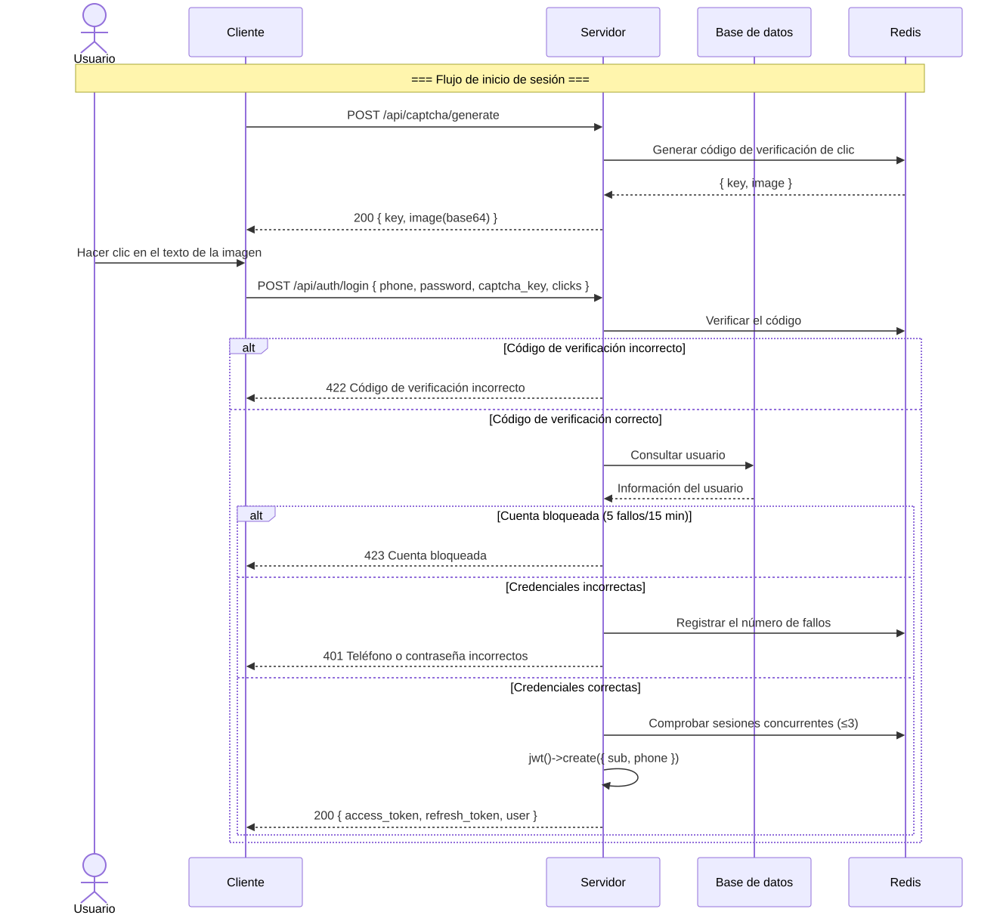
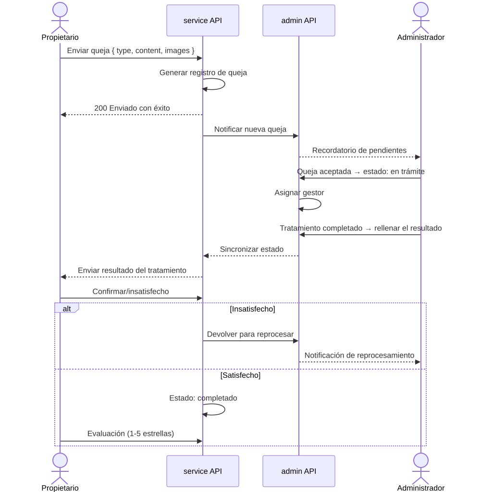

# Diagrama de Flujo de Negocio (Business Flowchart)

> Copyright (c) 2026 erik <erik@erik.xyz> — https://erik.xyz

---

## 1. Flujo de autenticación de usuarios

---

## 2. Flujo de negocio principal — Gestión de cargos

---

## 3. Flujo de procesamiento de reparaciones

---

## 4. Flujo de gestión de propiedades

---

## 5. Flujo de procesamiento de quejas y sugerencias

---

## 6. Flujo de paso de visitantes

