# Diagrama de Módulos Funcionales (Function Module Diagram)

> Copyright (c) 2026 erik <erik@erik.xyz> — https://erik.xyz

---

## 1. Panorama de módulos funcionales

---

## 2. Relaciones de dependencia entre módulos

---

## 3. Árbol de funciones del panel de administración

---

## 4. Mapa de funciones del portal de propietarios

