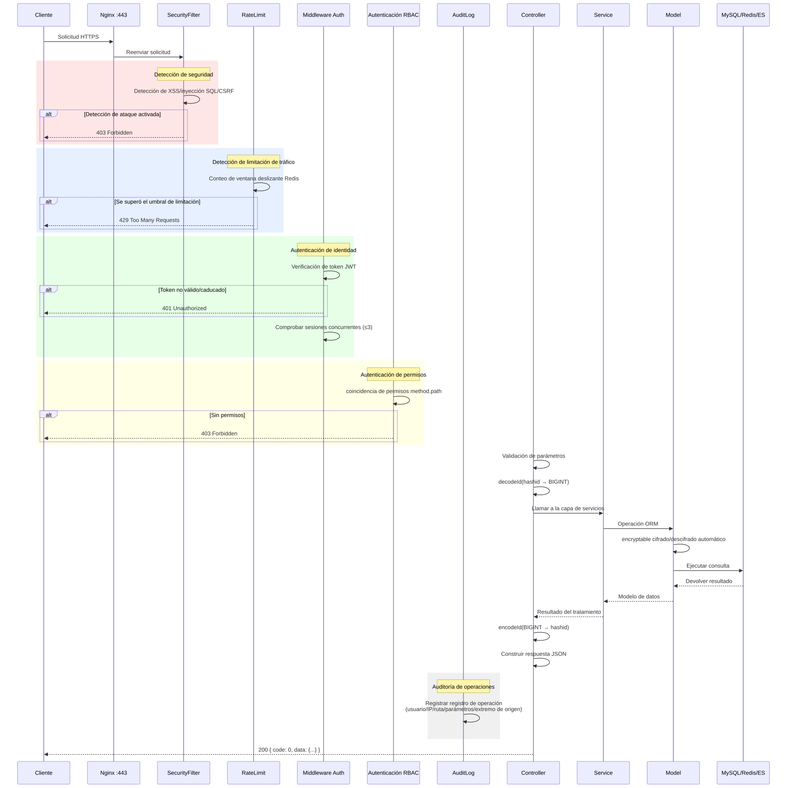
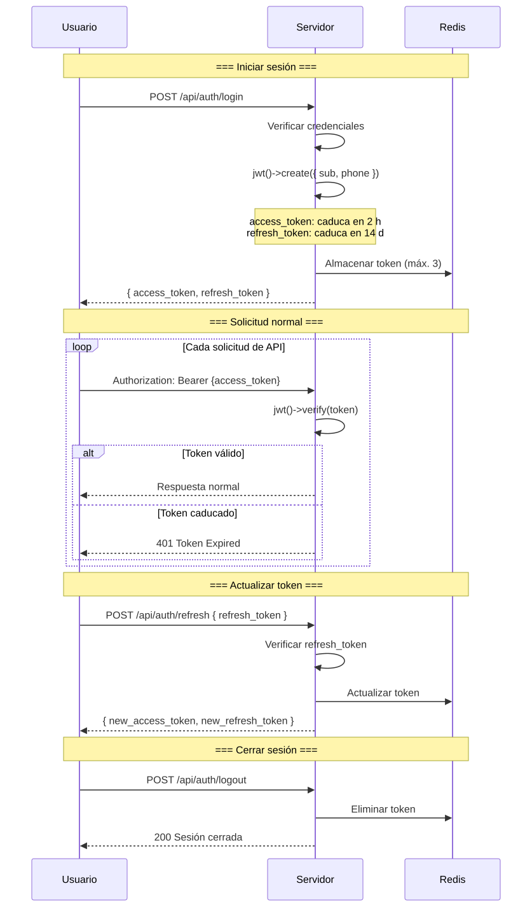

# Diagrama de Ciclo de Vida (Lifecycle Diagram)

> Copyright (c) 2026 erik <erik@erik.xyz> — https://erik.xyz

---

## 1. Ciclo de vida de la solicitud

---

## 2. Ciclo de vida de entidad de datos — Propietario (Owner)

---

## 3. Ciclo de vida de entidad de datos — Factura de cargos (Fee Bill)

---

## 4. Ciclo de vida de entidad de datos — Orden de reparación (Repair Order)

---

## 5. Ciclo de vida del Token JWT

---

## 6. Ciclo de vida completo de registros de base de datos

