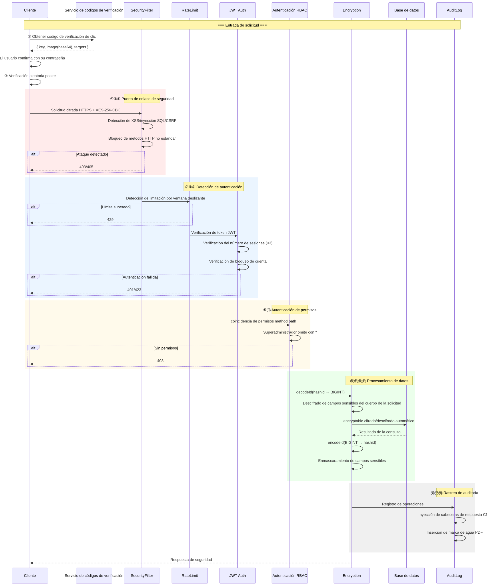

# Diagrama de Arquitectura de Seguridad (Security Architecture Diagram)

> Copyright (c) 2026 erik <erik@erik.xyz> — https://erik.xyz

---

## 1. Panorama de defensa en profundidad de 18 capas

---

## 2. Cadena de procesamiento de seguridad de solicitudes

---

## 3. Cadena completa de cifrado de datos

---

## 4. Modelo de autenticación y autorización

---

## 5. Matriz de protección de superficie de ataque

---

## 6. Sistema de trazabilidad de auditoría

