# Système de gestion immobilière (Property Management Platform)

[Français](../fr/README.md) | [中文](../../../README.md)

> Copyright (c) 2026 erik <erik@erik.xyz> — https://erik.xyz

Système de gestion immobilière full-stack couvrant 22 modules métier + 12 fonctions étendues (notifications/approbation/paiement/vote/SLA/écran de données/relance/inspection/boutique/visage/groupe/Q&A intelligent). Le panneau d'administration (admin) et le portail des propriétaires (service) sont déployés séparément ; le front-end couvre Flutter Web (style panneau d'administration PC) et le client mobile HarmonyOS.

## Structure du projet

```
property-management-platform/
├── admin/                         # 管理员端 webman v2 项目
│   ├── app/
│   │   ├── admin/controller/      # 管理端控制器
│   │   ├── api/v1/controller/     # 公开 API 控制器
│   │   ├── common/                # 公共工具类
│   │   ├── middleware/            # 中间件（认证/鉴权/限流/安全）
│   │   ├── model/                 # 数据模型（Eloquent ORM）
│   │   ├── queue/                 # 队列任务
│   │   └── process/               # 进程管理
│   ├── apps/
│   │   ├── flutter/               # 管理后台 Flutter Web（PC 风格）
│   │   └── harmonyos/             # 管理后台 HarmonyOS App
│   ├── config/                    # 配置文件（含中文注释）
│   ├── database/
│   │   └── backup/                # 数据库备份脚本
│   ├── resource/
│   │   └── translations/          # 国际化语言文件（zh_CN / en）
│   ├── docs/                      # 管理端文档
│   ├── tests/                     # 单元测试
│   └── public/                    # Web 入口
├── service/                       # 业主业务端 webman v2 项目
│   ├── app/
│   │   ├── api/v1/controller/     # 业主端 API 控制器
│   │   ├── common/                # 公共工具类
│   │   ├── middleware/            # 中间件
│   │   ├── model/                 # 数据模型
│   │   └── process/               # 进程管理
│   ├── config/                    # 配置文件
│   ├── resource/
│   │   └── translations/          # 国际化语言文件
├── apps/
│   ├── flutter/                   # 业主端 Flutter Web（PC 风格）
│   └── harmonyos/                 # 业主端 HarmonyOS App
└── docs/                          # 项目文档
    ├── ARCHITECTURE.md
    ├── ARCHITECTURE_DESIGN.md
    ├── ARCHITECTURE_DIAGRAM.md    # 系统架构图
    ├── FLOWCHART.md               # 业务流程图
    ├── FUNCTION_DIAGRAM.md        # 功能模块图
    ├── LIFECYCLE_DIAGRAM.md       # 生命周期图
    ├── SECURITY_ARCHITECTURE.md   # 安全架构图
    ├── API.md
    ├── FEATURES.md
    └── FEATURE_DESIGN.md
```

## Taille du projet

| Couche | Quantité | Détails |
|----|------|------|
| Tables de base de données | 65 | Toutes préfixées `management_`, clé primaire BIGINT non auto-incrémentée |
| Modèles PHP | admin 64 / service 57 | Tous des modèles Eloquent, avec champs chiffrés encryptable ; 57 côté service = nombre de fichiers de modèles (dont la classe de base BaseModel) |
| Contrôleurs admin | 58 | Gestion générale + 22 modules immobiliers + 12 fonctions étendues |
| Contrôleurs service | 17 | Toutes les API du portail des propriétaires |
| Routes API | 178 | admin 125 + service 53 |
| Flutter panneau d'administration | 42 pages | 42 modules de pages admin, 96 fichiers/6 662 lignes |
| Flutter portail propriétaires | 13 pages | Frais/réparation/stationnement/visiteur/activité/notification/vote/boutique/Q&A intelligent/visage, 32 fichiers/3 582 lignes |
| HarmonyOS | 7 pages | Connexion/accueil/factures/réparation(2)/annonces/espace personnel, 11 fichiers/927 lignes |
| Tests | 133 | admin 90 (217 assertions) + service 43 (248 assertions) |

## Schémas d'architecture et de conception du système

> Diagrammes ci-dessous récapitulatifs ; pour les schémas détaillés voir [Architecture](docs/ARCHITECTURE_DIAGRAM.md) · [Processus](docs/FLOWCHART.md) · [Fonctions](docs/FUNCTION_DIAGRAM.md) · [Cycle de vie](docs/LIFECYCLE_DIAGRAM.md) · [Architecture de sécurité](docs/SECURITY_ARCHITECTURE.md)

### Architecture panoramique du système



### Processus métier principaux



### Vue d'ensemble des modules fonctionnels



### Cycle de vie des entités de données



### Défense en profondeur sur 19 couches



## Modules fonctionnels (22 grands modules + 12 extensions)

| Lot | Modules | Statut |
|------|------|------|
| Lot 1 | Résidences, bâtiments, unités, types de logement, biens, propriétaires, locataires, frais, réparations, annonces (10 modules) | ✅ Tous terminés |
| Lot 2 | Stationnement, équipements, réclamations, visiteurs, contrats, finances (6 modules) + panneaux de visualisation + export Excel/PDF (fonctionnalités plateforme) | ✅ Tous terminés |
| Lot 3 | Patrouilles de sécurité, nettoyage, espaces verts, activités communautaires, énergie, employés (6 modules) | ✅ Tous terminés |
| Extensions | Notifications, workflow d'approbation, intégration des paiements, vote des propriétaires, escalade SLA automatique, écran de données, relance intelligente, inspection mobile, boutique communautaire, reconnaissance faciale, gestion multi-résidences, Q&A intelligent (12 modules) | ✅ Tous terminés |

## Pile technique

### Backend
- **Framework** : webman v2 (workerman/webman)
- **Langage** : PHP 8.3+
- **Base de données** : MySQL 8.0+, préfixe de tables `management_`, clé primaire BIGINT non auto-incrémentée
- **Moteur de recherche** : Elasticsearch 8.x
- **Cache** : Redis 7.x

### Dépendances principales
| Paquet | Usage |
|------|------|
| `erikwang2013/snowflake-php` | Génération de clés primaires BIGINT globalement uniques |
| `erikwang2013/hashids` | Chiffrement/déchiffrement des ID au niveau API |
| `erikwang2013/jwt-webman` | Authentification JWT (HS256) |
| `erikwang2013/encryption` | Chiffrement AES-256-CBC des données sensibles en transmission API |
| `erikwang2013/encryptable` | Chiffrement/déchiffrement des champs sensibles en base |
| `erikwang2013/webman-scout` | Synchronisation Elasticsearch et recherche plein texte |
| `erikwang2013/season` | Données de drapeaux nationaux |
| `erikwang2013/security-php` | Détection par outils de sécurité |
| `erikwang2013/poster-php` | Captcha aléatoire pour opérations sensibles |
| `phpoffice/phpspreadsheet` | Export Excel |
| `barryvdh/laravel-dompdf` | Export PDF |
| `hg/apidoc` | Génération automatique de la documentation API |

### Front-end
- **Flutter 3.x** + GetX (avec i18n) + Dio + fl_chart — panneau d'administration Web style PC
- **HarmonyOS ArkTS** + @ohos.net.http — application mobile

### Documentation API

Tous les points de terminaison API et les descriptions de paramètres figurent dans le document dédié [docs/API.md](docs/API.md). Après démarrage du service, la documentation interactive générée automatiquement par apidoc est aussi accessible :

| Extrémité | Adresse | Groupes |
|----|------|------|
| Panneau d'administration | `http://localhost:8787/apidoc` | 10 groupes (common/dashboard/system/property-core/property-aux/property-adv/extensions/export/import/upload) |
| Portail des propriétaires | `http://localhost:8788/apidoc` | 9 groupes (interfaces publiques/accueil/frais/réparation/retour/stationnement/activité/personnel/extensions) |

### Internationalisation

- **Backend PHP** : symfony/translation, fichiers de langue dans `resource/translations/{zh_CN,en}/messages.php`
- **Flutter Web** : GetX `Translations`, `apps/flutter/lib/i18n/messages.dart`
- **Langue par défaut** : chinois simplifié (zh_CN), bascule vers l'anglais (en) prise en charge
- **En-tête de requête** : la langue de réponse peut être contrôlée via l'en-tête `Accept-Language`

## Système de sécurité (défense en profondeur sur 19 couches)

1. Captcha cliquable → 2. Double confirmation du mot de passe → 3. Vérification aléatoire poster → 4. Analyse de sécurité security-php → 5. Interception des attaques SecurityFilter → 6. Chiffrement de transmission HTTPS + AES-256-CBC → 7. Authentification JWT HS256 → 8. Limite de sessions concurrentes (3 maximum) → 9. Verrouillage du compte (5 échecs/15 minutes) → 10. Autorisation RBAC (granularité method.path) → 11. Limitation de débit à fenêtre glissante Redis → 12. Disjoncteur Redis (échec rapide + sonde semi-ouverte) → 13. Protection des ID Hashids → 14. Chiffrement des champs sensibles du corps de requête → 15. Chiffrement des champs DB → 16. Masquage des données au niveau affichage → 17. Audit complet par journaux d'opérations (8 sources de plateforme) → 18. Protection des en-têtes CSP → 19. Filigrane de copyright PDF

## Normes de code

- Tous les nouveaux fichiers portent l'en-tête de copyright : `Copyright (c) 2026 erik <erik@erik.xyz> — https://erik.xyz`
- Références des fonctions/classes globales via `use`, sans préfixe `\`
- Les fichiers de configuration contiennent des commentaires chinois décrivant chaque élément de configuration
- Les clés primaires utilisent BIGINT UNSIGNED NOT NULL, générées au niveau application par snowflake-php
- Les ID de transmission API utilisent le chiffrement/déchiffrement hashids

## Démarrage rapide

### Méthode 1 : assistant d'installation Web (recommandé)

Après démarrage du panneau d'administration, accéder à `http://localhost:8787/install` pour configurer la base de données et créer le compte administrateur via l'interface.

```bash
cd admin
cp .env.example .env
composer install
php start.php start -d
# 访问 http://localhost:8787/install 完成安装
```

Voir [Guide d'installation](docs/INSTALL.md) pour plus de détails.

### Méthode 2 : installation manuelle

#### Exigences d'environnement

- PHP 8.1+
- MySQL 8.0+
- Redis 6.0+
- Composer 2.x
- Flutter SDK 3.x (développement front-end)

#### 1. Initialiser la base de données

```bash
mysql -u root -e "CREATE DATABASE IF NOT EXISTS management DEFAULT CHARSET utf8mb4 COLLATE utf8mb4_unicode_ci;"
mysql -u root management < docs/install.sql
```

#### 2. Démarrer le panneau d'administration

```bash
cd admin
cp .env.example .env
# 编辑 .env 修改数据库密码等配置
composer install
php start.php start -d
# 管理端运行在 http://localhost:8787
```

### 3. Démarrer le portail des propriétaires

```bash
cd service
cp .env.example .env
# 编辑 .env 修改数据库密码等配置
composer install
php start.php start -d
# 业务端运行在 http://localhost:8788
```

### 4. Démarrer le front-end (développement)

```bash
cd apps/flutter
flutter pub get
flutter run -d chrome
```

### 5. Exécuter les tests

```bash
# 管理端测试
cd admin && php vendor/bin/phpunit

# 业务端测试
cd service && php vendor/bin/phpunit
```

| Projet | Nombre de tests | Nombre d'assertions | Taux de réussite |
|------|--------|--------|--------|
| admin | 90 | 217 | 100 % |
| service | 43 | 248 | 100 % (1 ignoré) |
| **Total** | **133** | **465** | — |

Couverture des tests service : ID Snowflake, encodage/décodage Hashids, format de réponse, schéma de base de données, fichiers de traduction i18n

### Déploiement Docker

```bash
cd admin
cp .env.docker .env
docker-compose up -d
# 包含 Nginx + PHP + MySQL + Redis + Elasticsearch
```

## Topologie de déploiement

```
Nginx (:443) → admin webman (:8787) + service webman (:8788) → MySQL + Redis + Elasticsearch
静态文件: Flutter Web build/
```

## Administrateur par défaut

| Nom d'utilisateur | Mot de passe | Rôle |
|--------|------|------|
| admin | admin123 | Super administrateur |

> En production, modifier immédiatement le mot de passe par défaut.

## Index de la documentation

| Document | Description |
|------|------|
| [Guide d'installation](docs/INSTALL.md) | Guide de déploiement de zéro, incluant initialisation de la base, déploiement Docker, questions fréquentes |
| [Script d'installation fusionné](docs/install.sql) | Les 65 tables + données de seeds des permissions RBAC, import en une commande |
| [Comparaison des versions](docs/EDITIONS.md) | Comparaison fonctionnelle et technique des versions Basique(Lite)/Standard/Complète(Full) |
| [Document de conception d'architecture](docs/ARCHITECTURE_DESIGN.md) | Architecture en couches du système, chaîne d'exécution des middlewares, conception de la défense en profondeur |
| [Document d'architecture](docs/ARCHITECTURE.md) | Schémas Mermaid (topologie système, cycle de vie des requêtes, chiffrement des données, déploiement) |
| [Schéma d'architecture système](docs/ARCHITECTURE_DIAGRAM.md) | Architecture panoramique, schémas détaillés des couches, architecture de déploiement (visualisation Mermaid) |
| [Schémas des processus métier](docs/FLOWCHART.md) | Processus d'authentification, gestion des frais, traitement des réparations, gestion des biens, réclamations, visiteurs |
| [Schéma des modules fonctionnels](docs/FUNCTION_DIAGRAM.md) | Panorama des 34 modules, relations de dépendance, arbre fonctionnel du panneau d'administration, carte fonctionnelle du portail des propriétaires |
| [Schémas du cycle de vie](docs/LIFECYCLE_DIAGRAM.md) | Cycle de vie des requêtes, cycle de vie des entités, cycle de vie des Tokens, flux complet CRUD |
| [Schéma de l'architecture de sécurité](docs/SECURITY_ARCHITECTURE.md) | Panorama de la défense en profondeur sur 19 couches, matrice de protection de la surface d'attaque, chaîne complète du chiffrement, système d'audit |
| [Document de conception fonctionnelle](docs/FEATURE_DESIGN.md) | Spécifications fonctionnelles des 34 modules |
| [Document fonctionnel](docs/FEATURES.md) | Liste des fonctionnalités et vue d'ensemble des modules |
| [Documentation des interfaces](docs/API.md) | Tous les points de terminaison API et les descriptions de paramètres |

## Soutenir le projet

Merci pour votre soutien !

|  |  |
|:---:|:---:|
| 微信支付 | 支付宝 |

### Dons par virement international

Virements bancaires acceptés depuis le monde entier, compte bénéficiaire à la ZA Bank de Hong Kong (ZhongAn Bank) :

| Élément | Information |
|------|------|
| Nom du bénéficiaire | WANG KEXUN |
| Numéro de compte | 881015918251 |
| Banque bénéficiaire | ZA Bank Limited |
| Code SWIFT | AABLHKHHXXX |
| Code bancaire | 387 |
| Adresse de la banque | Core F, Cyberport 3, 100 Cyberport Road, Hong Kong |

> **Banque correspondante du virement transfrontalier (banque intermédiaire)** : les informations suivantes concernent la banque correspondante (banque intermédiaire), et non la banque bénéficiaire. Veuillez demander à votre banque émettrice si les informations de la banque intermédiaire sont requises.
>
> - **Virements en HKD, CNY et USD** (Citibank N.A. Hong Kong) : SWIFT `CITIHKXXXX`, code bancaire 006, numéro de succursale 391, adresse : Citibank Tower, Citibank Plaza, 3 Garden Road, Central, Hong Kong
> - **Virements dans les autres devises** (THE BANK OF NEW YORK MELLON) : SWIFT `IRVTUS3NXXX`, adresse : 240 GREENWICH STREET, NEW YORK, United States

Bienvenue pour soutenir ce projet !

## License

Licence MIT. Voir [LICENSE](LICENSE) pour plus de détails.
