# Diagramme d'architecture système (System Architecture Diagram)

> Copyright (c) 2026 erik <erik@erik.xyz> — https://erik.xyz

---

## 1. Architecture globale du système

---

## 2. Vue détaillée de l'architecture en couches

---

## 3. Architecture de déploiement

