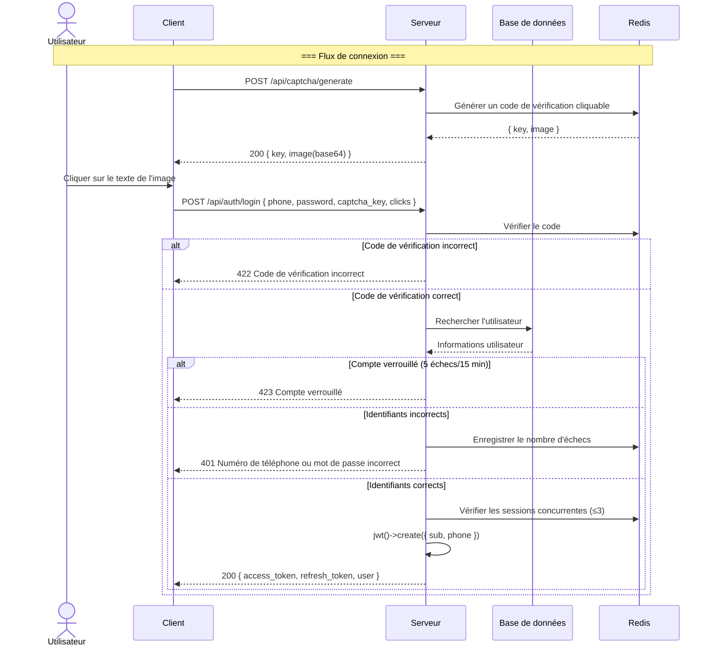
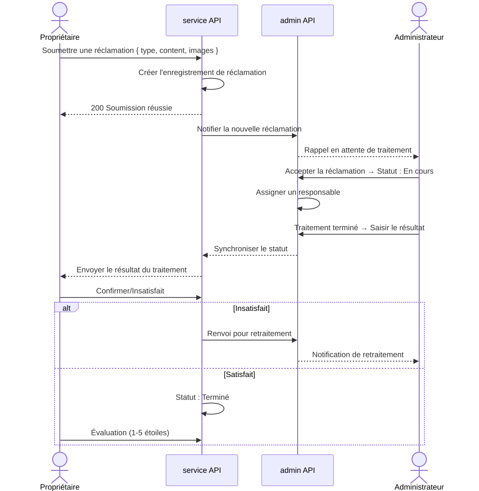

# Organigramme métier (Business Flowchart)

> Copyright (c) 2026 erik <erik@erik.xyz> — https://erik.xyz

---

## 1. Processus d'authentification utilisateur

---

## 2. Processus métier principal — Gestion des frais

---

## 3. Processus de traitement des demandes de réparation

---

## 4. Processus de gestion des biens immobiliers

---

## 5. Processus de traitement des réclamations et suggestions

---

## 6. Processus de passage des visiteurs

