# Diagramme des modules fonctionnels (Function Module Diagram)

> Copyright (c) 2026 erik <erik@erik.xyz> — https://erik.xyz

> English edition: `../../../images/design_function_en.svg`

---

## 1. Vue d'ensemble des modules fonctionnels

---

## 2. Dépendances entre modules

---

## 3. Arborescence fonctionnelle du panneau d'administration

---

## 4. Carte fonctionnelle du portail des propriétaires

