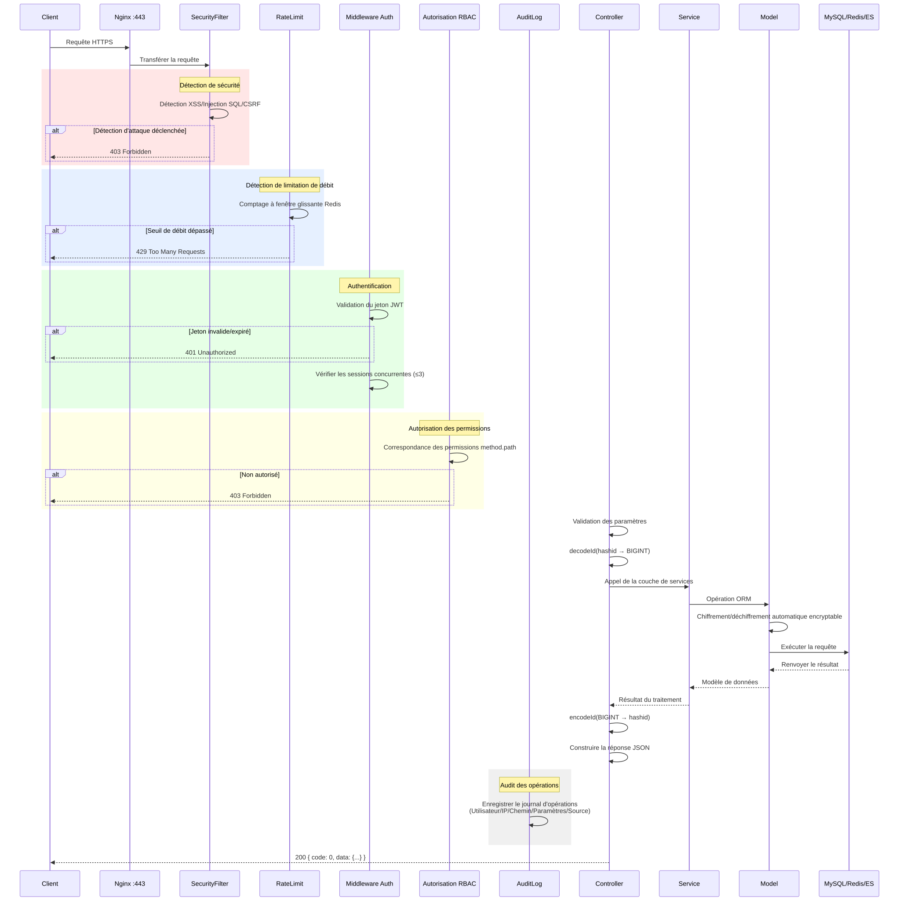
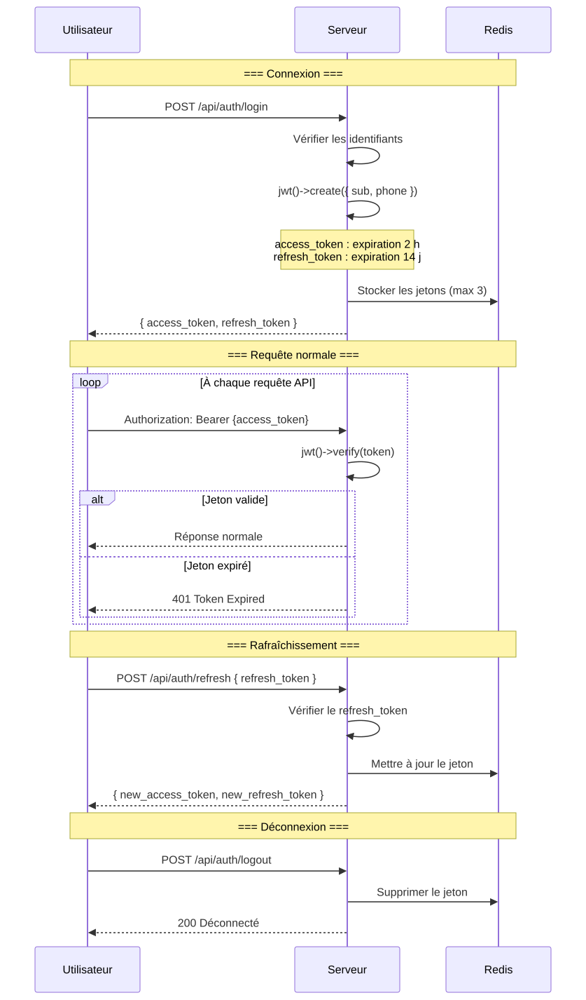

# Diagramme de cycle de vie (Lifecycle Diagram)

> Copyright (c) 2026 erik <erik@erik.xyz> — https://erik.xyz

> English edition: `../../../images/design_lifecycle_en.svg`

---

## 1. Cycle de vie d'une requête

---

## 2. Cycle de vie d'une entité de données — Propriétaire (Owner)

---

## 3. Cycle de vie d'une entité de données — Facture de frais (Fee Bill)

---

## 4. Cycle de vie d'une entité de données — Demande de réparation (Repair Order)

---

## 5. Cycle de vie du jeton JWT

---

## 6. Cycle de vie complet des enregistrements en base de données

