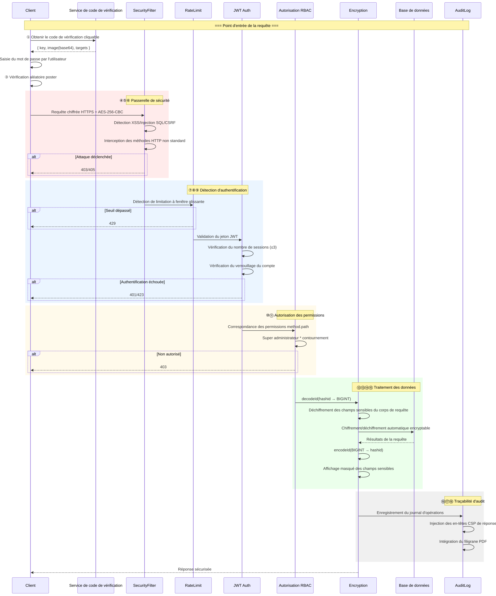

# Diagramme d'architecture de sécurité (Security Architecture Diagram)

> Copyright (c) 2026 erik <erik@erik.xyz> — https://erik.xyz

---

## 1. Vue d'ensemble des 18 couches de défense en profondeur

---

## 2. Chaîne de traitement sécurisé des requêtes

---

## 3. Chaîne complète de chiffrement des données

---

## 4. Modèle d'authentification et d'autorisation

---

## 5. Matrice de protection de la surface d'attaque

---

## 6. Système de traçabilité d'audit

