# संपत्ति प्रबंधन प्रणाली (Property Management Platform)

[हिन्दी](../hi/README.md) | [中文](../../../README.md)

> Copyright (c) 2026 erik <erik@erik.xyz> — https://erik.xyz

फुल-स्टैक संपत्ति प्रबंधन प्रणाली, जिसमें 22 व्यावसायिक मॉड्यूल + 12 विस्तारित सुविधाएँ शामिल हैं (संदेश सूचना/अनुमोदन वर्कफ़्लो/भुगतान/मतदान/SLA/डेटा स्क्रीन/वसूली/निरीक्षण/मॉल/चेहरा पहचान/समूह/स्मार्ट प्रश्नोत्तर)। एडमिन पैनल (admin) और मालिक पोर्टल (service) अलग-अलग तैनात किए जाते हैं; फ्रंटएंड में Flutter Web (PC प्रबंधन बैकएंड शैली) और HarmonyOS मोबाइल एप्लिकेशन शामिल हैं।

## परियोजना संरचना

```
property-management-platform/
├── admin/                         # एडमिन पैनल webman v2 परियोजना
│   ├── app/
│   │   ├── admin/controller/      # एडमिन पैनल कंट्रोलर
│   │   ├── api/v1/controller/     # सार्वजनिक API कंट्रोलर
│   │   ├── common/                # सामान्य उपयोगिता कक्षाएँ
│   │   ├── middleware/            # मिडलवेयर (प्रमाणीकरण/प्राधिकरण/रेट लिमिट/सुरक्षा)
│   │   ├── model/                 # डेटा मॉडल (Eloquent ORM)
│   │   ├── queue/                 # कतार कार्य
│   │   └── process/               # प्रक्रिया प्रबंधन
│   ├── apps/
│   │   ├── flutter/               # एडमिन बैकएंड Flutter Web (PC शैली)
│   │   └── harmonyos/             # एडमिन बैकएंड HarmonyOS App
│   ├── config/                    # कॉन्फ़िगरेशन फ़ाइलें (चीनी टिप्पणियों सहित)
│   ├── database/
│   │   └── backup/                # डेटाबेस बैकअप स्क्रिप्ट
│   ├── resource/
│   │   └── translations/          # अंतर्राष्ट्रीयकरण भाषा फ़ाइलें (zh_CN / en)
│   ├── docs/                      # एडमिन पैनल दस्तावेज़
│   ├── tests/                     # यूनिट टेस्ट
│   └── public/                    # Web प्रवेश
├── service/                       # मालिक व्यवसाय पोर्टल webman v2 परियोजना
│   ├── app/
│   │   ├── api/v1/controller/     # मालिक पोर्टल API कंट्रोलर
│   │   ├── common/                # सामान्य उपयोगिता कक्षाएँ
│   │   ├── middleware/            # मिडलवेयर
│   │   ├── model/                 # डेटा मॉडल
│   │   └── process/               # प्रक्रिया प्रबंधन
│   ├── config/                    # कॉन्फ़िगरेशन फ़ाइलें
│   ├── resource/
│   │   └── translations/          # अंतर्राष्ट्रीयकरण भाषा फ़ाइलें
├── apps/
│   ├── flutter/                   # मालिक पोर्टल Flutter Web (PC शैली)
│   └── harmonyos/                 # मालिक पोर्टल HarmonyOS App
└── docs/                          # परियोजना दस्तावेज़
    ├── ARCHITECTURE.md
    ├── ARCHITECTURE_DESIGN.md
    ├── ARCHITECTURE_DIAGRAM.md    # सिस्टम आर्किटेक्चर आरेख
    ├── FLOWCHART.md               # व्यावसायिक प्रवाह आरेख
    ├── FUNCTION_DIAGRAM.md        # कार्यात्मक मॉड्यूल आरेख
    ├── LIFECYCLE_DIAGRAM.md       # जीवनचक्र आरेख
    ├── SECURITY_ARCHITECTURE.md   # सुरक्षा आर्किटेक्चर आरेख
    ├── API.md
    ├── FEATURES.md
    └── FEATURE_DESIGN.md
```

## परियोजना आकार

| परत | मात्रा | विवरण |
|----|------|------|
| डेटाबेस टेबल | 65 | सभी `management_` उपसर्ग के साथ, BIGINT गैर-ऑटोइंक्रीमेंट प्राथमिक कुंजी |
| PHP मॉडल | admin 64 / service 57 | सभी Eloquent मॉडल, encryptable एन्क्रिप्शन फ़ील्ड सहित; service 57 मॉडल फ़ाइलों की संख्या है (BaseModel आधार कक्षा सहित) |
| admin कंट्रोलर | 58 | सामान्य प्रबंधन + 22 संपत्ति मॉड्यूल + 12 विस्तारित सुविधाएँ |
| service कंट्रोलर | 17 | मालिक पोर्टल के सभी API |
| API रूट | 178 | admin 125 + service 53 |
| Flutter एडमिन बैकएंड | 42 पेज | admin 42 पेज मॉड्यूल, 96 फ़ाइलें/6,662 पंक्तियाँ |
| Flutter मालिक पोर्टल | 13 पेज | शुल्क/मरम्मत/पार्किंग/अतिथि/गतिविधि/सूचना/मतदान/मॉल/स्मार्ट प्रश्नोत्तर/चेहरा, 32 फ़ाइलें/3,582 पंक्तियाँ |
| HarmonyOS | 7 पेज | लॉगिन/होम/बिल/मरम्मत(2)/घोषणा/व्यक्तिगत केंद्र, 11 फ़ाइलें/927 पंक्तियाँ |
| टेस्ट | 133 | admin 90 (217 एसर्शन) + service 43 (248 एसर्शन) |

## सिस्टम आर्किटेक्चर और डिज़ाइन आरेख

> नीचे सारांश आरेख हैं; विस्तृत आरेख देखें: [आर्किटेक्चर आरेख](docs/ARCHITECTURE_DIAGRAM.md) · [प्रवाह आरेख](docs/FLOWCHART.md) · [फ़ंक्शन आरेख](docs/FUNCTION_DIAGRAM.md) · [जीवनचक्र आरेख](docs/LIFECYCLE_DIAGRAM.md) · [सुरक्षा आर्किटेक्चर आरेख](docs/SECURITY_ARCHITECTURE.md)

### सिस्टम पैनोरमा आर्किटेक्चर



### मुख्य व्यावसायिक प्रवाह



### फ़ंक्शन मॉड्यूल अवलोकन



### डेटा इकाई जीवनचक्र



### 18-परत सुरक्षा गहराई रक्षा



## फ़ंक्शन मॉड्यूल (22 मुख्य मॉड्यूल + 12 विस्तार)

| बैच | मॉड्यूल | स्थिति |
|------|------|------|
| बैच 1 | समुदाय, भवन, इकाई, रूम प्रकार, संपत्ति, मालिक, किरायेदार, शुल्क, मरम्मत अनुरोध, घोषणा (10 मॉड्यूल) | ✅ सभी पूर्ण |
| बैच 2 | पार्किंग, उपकरण, शिकायत, अतिथि, अनुबंध, वित्त (6 मॉड्यूल) + पैनल विज़ुअलाइज़ेशन + Excel/PDF निर्यात (प्लेटफ़ॉर्म सुविधाएँ) | ✅ सभी पूर्ण |
| बैच 3 | सुरक्षा गश्त, सफाई, हरियाली, सामुदायिक गतिविधि, ऊर्जा, कर्मचारी (6 मॉड्यूल) | ✅ सभी पूर्ण |
| विस्तार | संदेश सूचना, अनुमोदन वर्कफ़्लो, भुगतान एकीकरण, मालिक मतदान, SLA स्वतः अपग्रेड, डेटा स्क्रीन, स्मार्ट वसूली, मोबाइल निरीक्षण, सामुदायिक मॉल, चेहरा पहचान, बहु-समुदाय समूह प्रबंधन, स्मार्ट प्रश्नोत्तर (12 मॉड्यूल) | ✅ सभी पूर्ण |

## तकनीकी स्टैक

### बैकएंड
- **फ्रेमवर्क**: webman v2 (workerman/webman)
- **भाषा**: PHP 8.3+
- **डेटाबेस**: MySQL 8.0+, टेबल उपसर्ग `management_`, प्राथमिक कुंजी BIGINT गैर-ऑटोइंक्रीमेंट
- **सर्च इंजन**: Elasticsearch 8.x
- **कैश**: Redis 7.x

### मुख्य निर्भरताएँ
| पैकेज नाम | उपयोग |
|------|------|
| `erikwang2013/snowflake-php` | वैश्विक अद्वितीय BIGINT प्राथमिक कुंजी जनरेशन |
| `erikwang2013/hashids` | API परत ID एन्क्रिप्शन/डिक्रिप्शन |
| `erikwang2013/jwt-webman` | JWT प्रमाणीकरण (HS256) |
| `erikwang2013/encryption` | API संवेदनशील डेटा AES-256-CBC एन्क्रिप्शन ट्रांसमिशन |
| `erikwang2013/encryptable` | डेटाबेस संवेदनशील फ़ील्ड एन्क्रिप्शन/डिक्रिप्शन |
| `erikwang2013/webman-scout` | Elasticsearch डेटा सिंक और फुल-टेक्स्ट खोज |
| `erikwang2013/season` | देश ध्वज डेटा |
| `erikwang2013/security-php` | सुरक्षा उपकरण जांच |
| `erikwang2013/poster-php` | संवेदनशील संचालन के लिए यादृच्छिक कैप्चा |
| `phpoffice/phpspreadsheet` | Excel निर्यात |
| `barryvdh/laravel-dompdf` | PDF निर्यात |
| `hg/apidoc` | API इंटरफ़ेस दस्तावेज़ स्वतः जनरेशन |

### फ्रंटएंड
- **Flutter 3.x** + GetX (i18n सहित) + Dio + fl_chart — PC शैली Web एडमिन बैकएंड
- **HarmonyOS ArkTS** + @ohos.net.http — मोबाइल App

### API दस्तावेज़

सभी API एंडपॉइंट और पैरामीटर विवरण स्वतंत्र दस्तावेज़ [docs/API.md](docs/API.md) में देखें। सेवा प्रारंभ करने के बाद apidoc द्वारा स्वतः जनरेट किए गए इंटरैक्टिव दस्तावेज़ भी देखे जा सकते हैं:

| पोर्टल | पता | समूह |
|----|------|------|
| एडमिन पैनल | `http://localhost:8787/apidoc` | 10 समूह (common/dashboard/system/property-core/property-aux/property-adv/extensions/export/import/upload) |
| मालिक पोर्टल | `http://localhost:8788/apidoc` | 9 समूह (सार्वजनिक इंटरफ़ेस/होम/शुल्क/मरम्मत/फीडबैक/पार्किंग/गतिविधि/व्यक्तिगत/विस्तार) |

### अंतर्राष्ट्रीयकरण

- **PHP बैकएंड**: symfony/translation, भाषा फ़ाइलें `resource/translations/{zh_CN,en}/messages.php` में
- **Flutter Web**: GetX `Translations`, `apps/flutter/lib/i18n/messages.dart`
- **डिफ़ॉल्ट भाषा**: सरलीकृत चीनी (zh_CN), अंग्रेज़ी (en) स्विचिंग समर्थित
- **अनुरोध हेडर**: `Accept-Language` अनुरोध हेडर के माध्यम से प्रतिक्रिया भाषा नियंत्रण समर्थित

## सुरक्षा प्रणाली (18-परत गहराई रक्षा)

1. क्लिक कैप्चा → 2. पासवर्ड दोबारा पुष्टि → 3. poster यादृच्छिक सत्यापन → 4. security-php सुरक्षा स्कैन → 5. SecurityFilter हमला अवरोधन → 6. HTTPS + AES-256-CBC ट्रांसमिशन एन्क्रिप्शन → 7. JWT HS256 प्रमाणीकरण → 8. समवर्ती सत्र सीमा (अधिकतम 3) → 9. खाता लॉक (5 विफलता/15 मिनट) → 10. RBAC अनुमति प्राधिकरण (method.path स्तर) → 11. Redis स्लाइडिंग विंडो रेट लिमिट → 12. Hashids ID सुरक्षा → 13. अनुरोध बॉडी संवेदनशील फ़ील्ड एन्क्रिप्शन → 14. DB फ़ील्ड एन्क्रिप्टेड स्टोरेज → 15. प्रदर्शन परत डेटा मास्किंग → 16. ऑपरेशन लॉग पूर्ण ऑडिट (8 प्लेटफ़ॉर्म स्रोत) → 17. CSP हेडर सुरक्षा → 18. PDF कॉपीराइट वॉटरमार्क

## कोड मानक

- सभी नई फ़ाइलों के शीर्ष पर कॉपीराइट घोषणा: `Copyright (c) 2026 erik <erik@erik.xyz> — https://erik.xyz`
- वैश्विक फ़ंक्शन/कक्षा संदर्भ `use` इम्पोर्ट से, अग्रणी `\` के बिना
- कॉन्फ़िगरेशन फ़ाइलों में प्रत्येक कॉन्फ़िग आइटम की व्याख्या करने वाली चीनी टिप्पणियाँ होती हैं
- प्राथमिक कुंजी ID BIGINT UNSIGNED NOT NULL होती है, जो snowflake-php द्वारा एप्लिकेशन परत पर जनरेट होती है
- API ट्रांसमिशन ID hashids से एन्क्रिप्ट/डिक्रिप्ट होती हैं

## त्वरित प्रारंभ

### विधि 1: Web इंस्टॉल विज़ार्ड (अनुशंसित)

एडमिन पैनल प्रारंभ करने के बाद `http://localhost:8787/install` पर जाएँ, इंटरफ़ेस के माध्यम से डेटाबेस कॉन्फ़िगरेशन और बैकएंड एडमिन खाता निर्माण पूरा करें।

```bash
cd admin
cp .env.example .env
composer install
php start.php start -d
# इंस्टॉलेशन पूरा करने के लिए http://localhost:8787/install पर जाएँ
```

विवरण के लिए [इंस्टॉल गाइड](docs/INSTALL.md) देखें।

### विधि 2: मैन्युअल इंस्टॉलेशन

#### पर्यावरण आवश्यकताएँ

- PHP 8.1+
- MySQL 8.0+
- Redis 6.0+
- Composer 2.x
- Flutter SDK 3.x (फ्रंटएंड विकास)

#### 1. डेटाबेस आरंभ करें

```bash
mysql -u root -e "CREATE DATABASE IF NOT EXISTS management DEFAULT CHARSET utf8mb4 COLLATE utf8mb4_unicode_ci;"
mysql -u root management < docs/install.sql
```

#### 2. एडमिन पैनल प्रारंभ करें

```bash
cd admin
cp .env.example .env
# डेटाबेस पासवर्ड आदि बदलने के लिए .env संपादित करें
composer install
php start.php start -d
# एडमिन पैनल http://localhost:8787 पर चलता है
```

### 3. व्यवसाय पोर्टल प्रारंभ करें

```bash
cd service
cp .env.example .env
# डेटाबेस पासवर्ड आदि बदलने के लिए .env संपादित करें
composer install
php start.php start -d
# व्यवसाय पोर्टल http://localhost:8788 पर चलता है
```

### 4. फ्रंटएंड प्रारंभ करें (विकास)

```bash
cd apps/flutter
flutter pub get
flutter run -d chrome
```

### 5. टेस्ट चलाएँ

```bash
# एडमिन पैनल टेस्ट
cd admin && php vendor/bin/phpunit

# व्यवसाय पोर्टल टेस्ट
cd service && php vendor/bin/phpunit
```

| परियोजना | टेस्ट संख्या | एसर्शन संख्या | पास दर |
|------|--------|--------|--------|
| admin | 90 | 217 | 100% |
| service | 43 | 248 | 100% (1 स्किप) |
| **कुल** | **133** | **465** | — |

service टेस्ट कवरेज: Snowflake ID, Hashids एन्कोड/डिकोड, प्रतिक्रिया प्रारूप, डेटाबेस Schema, i18n अनुवाद फ़ाइलें

### Docker तैनाती

```bash
cd admin
cp .env.docker .env
docker-compose up -d
# इसमें Nginx + PHP + MySQL + Redis + Elasticsearch शामिल हैं
```

## तैनाती टोपोलॉजी

```
Nginx (:443) → admin webman (:8787) + service webman (:8788) → MySQL + Redis + Elasticsearch
स्थिर फ़ाइलें: Flutter Web build/
```

## डिफ़ॉल्ट एडमिन

| उपयोगकर्ता नाम | पासवर्ड | भूमिका |
|--------|------|------|
| admin | admin123 | सुपर एडमिन |

> प्रोडक्शन में कृपया तुरंत डिफ़ॉल्ट पासवर्ड बदलें।

## दस्तावेज़ सूचकांक

| दस्तावेज़ | विवरण |
|------|------|
| [इंस्टॉल गाइड](docs/INSTALL.md) | शून्य से तैनाती गाइड, डेटाबेस आरंभीकरण, Docker तैनाती, सामान्य समस्याएँ सहित |
| [मर्ज किया गया इंस्टॉल स्क्रिप्ट](docs/install.sql) | सभी 65 टेबल + RBAC अनुमति सीड डेटा, एक-क्लिक इम्पोर्ट |
| [संस्करण तुलना](docs/EDITIONS.md) | आधार (Lite) / मानक (Standard) / पूर्ण (Full) संस्करण की सुविधाओं और तकनीकी मेट्रिक्स की तुलना |
| [आर्किटेक्चर डिज़ाइन दस्तावेज़](docs/ARCHITECTURE_DESIGN.md) | सिस्टम स्तरीय आर्किटेक्चर, मिडलवेयर निष्पादन श्रृंखला, सुरक्षा गहराई रक्षा डिज़ाइन |
| [आर्किटेक्चर दस्तावेज़](docs/ARCHITECTURE.md) | Mermaid आर्किटेक्चर आरेख (सिस्टम टोपोलॉजी, अनुरोध जीवनचक्र, डेटा एन्क्रिप्शन, तैनाती) |
| [सिस्टम आर्किटेक्चर आरेख](docs/ARCHITECTURE_DIAGRAM.md) | पैनोरमा आर्किटेक्चर, स्तरित विवरण, तैनाती आर्किटेक्चर (Mermaid विज़ुअलाइज़ेशन) |
| [व्यावसायिक प्रवाह आरेख](docs/FLOWCHART.md) | प्रमाणीकरण प्रवाह, शुल्क प्रबंधन, मरम्मत प्रसंस्करण, संपत्ति प्रबंधन, शिकायत, अतिथि |
| [फ़ंक्शन मॉड्यूल आरेख](docs/FUNCTION_DIAGRAM.md) | 34 मॉड्यूल पैनोरमा, निर्भरता संबंध, एडमिन बैकएंड फ़ंक्शन ट्री, मालिक पोर्टल फ़ंक्शन मैप |
| [जीवनचक्र आरेख](docs/LIFECYCLE_DIAGRAM.md) | अनुरोध जीवनचक्र, इकाई जीवनचक्र, Token जीवनचक्र, CRUD पूर्ण प्रवाह |
| [सुरक्षा आर्किटेक्चर आरेख](docs/SECURITY_ARCHITECTURE.md) | 18-परत गहराई रक्षा पैनोरमा, हमले की सतह सुरक्षा मैट्रिक्स, एन्क्रिप्शन पूर्ण श्रृंखला, ऑडिट ट्रेसिंग प्रणाली |
| [फ़ंक्शन डिज़ाइन दस्तावेज़](docs/FEATURE_DESIGN.md) | 34 मॉड्यूल की कार्यात्मक विनिर्देश |
| [फ़ंक्शन दस्तावेज़](docs/FEATURES.md) | फ़ंक्शन सूची और मॉड्यूल अवलोकन |
| [इंटरफ़ेस दस्तावेज़](docs/API.md) | सभी API एंडपॉइंट और पैरामीटर विवरण |

## परियोजना समर्थन

आपके समर्थन के लिए धन्यवाद!

|  |  |
|:---:|:---:|
| WeChat भुगतान | Alipay |

### वैश्विक बैंक ट्रांसफर दान

दुनिया भर से बैंक ट्रांसफर समर्थित है, प्राप्तकर्ता खाता हांगकांग ZA Bank (झोंगआन बैंक) है:

| आइटम | जानकारी |
|------|------|
| प्राप्तकर्ता का नाम | WANG KEXUN |
| प्राप्तकर्ता खाता संख्या | 881015918251 |
| प्राप्तकर्ता बैंक | ZA Bank Limited |
| SWIFT कोड | AABLHKHHXXX |
| बैंक नंबर | 387 |
| बैंक पता | Core F, Cyberport 3, 100 Cyberport Road, Hong Kong |

> **क्रॉस-बॉर्डर रेमिटेंस एजेंट बैंक (मध्यस्थ बैंक)**: निम्नलिखित एजेंट बैंक (मध्यस्थ बैंक) की जानकारी है, प्राप्तकर्ता बैंक की नहीं। कृपया रेमिटेंस बैंक से पूछें कि एजेंट बैंक जानकारी प्रदान करना आवश्यक है या नहीं।
>
> - **हांगकांग डॉलर, चीनी युआन और अमेरिकी डॉलर** (Citibank N.A. Hong Kong): SWIFT `CITIHKXXXX`, बैंक नंबर 006, शाखा नंबर 391, पता: Citibank Tower, Citibank Plaza, 3 Garden Road, Central, Hong Kong
> - **अन्य मुद्राएँ** (THE BANK OF NEW YORK MELLON): SWIFT `IRVTUS3NXXX`, पता: 240 GREENWICH STREET, NEW YORK, United States

इस परियोजना का समर्थन करने के लिए आपका स्वागत है!

## License

MIT License. विवरण के लिए [LICENSE](LICENSE) देखें।
