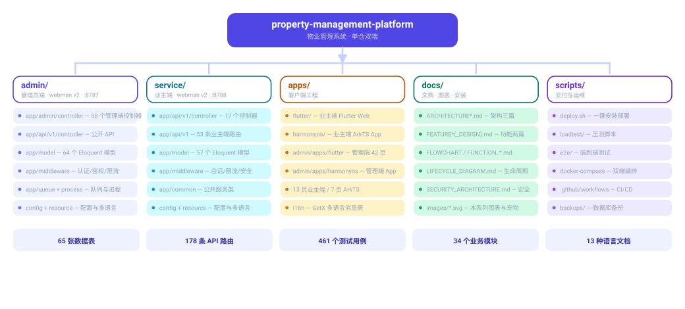

# आर्किटेक्चर डिज़ाइन दस्तावेज़ (Architecture Design)

> Copyright (c) 2026 erik <erik@erik.xyz> — https://erik.xyz




> English edition: `../../../images/design_structure_en.svg`


> English edition: `../../../images/design_architecture_en.svg`


## 1. सिस्टम आर्किटेक्चर अवलोकन

संपत्ति प्रबंधन प्रणाली «दो बैकएंड + मल्टी-फ्रंटएंड» लेयर्ड आर्किटेक्चर अपनाती है। एडमिन पैनल (admin) और मालिक व्यवसाय पोर्टल (service) दो स्वतंत्र webman v2 प्रोजेक्ट हैं, जो साझा MySQL डेटाबेस के माध्यम से समन्वित रूप से काम करते हैं। फ्रंटएंड Flutter Web (PC एडमिन कंसोल शैली) और HarmonyOS मोबाइल एंड को कवर करता है।

### डिज़ाइन लक्ष्य

- **स्वतंत्र तैनाती**: admin और service अपने-अपने रूप से प्रारंभ/बंद, अलग-अलग स्केल, अलग-अलग कुंजी प्रबंधन
- **साझा डेटा**: समान MySQL डेटाबेस साझा करते हैं, डेटा सिंक समस्याओं से बचते हैं
- **एकीकृत मानक**: दोनों प्रोजेक्ट समान कोड मानक, कॉन्फ़िग शैली, सुरक्षा नीति का पालन करते हैं
- **PC-प्राथमिकता Web एंड**: Flutter Web डेस्कटॉप एडमिन कंसोल शैली में डिज़ाइन किया गया (साइडबार + टॉपबार + कंटेंट एरिया)

## 2. लेयर्ड आर्किटेक्चर

```
┌─────────────────────────────────────────────────────────────┐
│                        路由层 (Route Layer)                   │
│   config/route.php — URL → Controller 映射 + 中间件绑定       │
├─────────────────────────────────────────────────────────────┤
│                       中间件层 (Middleware Layer)              │
│   SecurityFilter → RateLimit → Auth → Permission               │
├─────────────────────────────────────────────────────────────┤
│                      控制器层 (Controller Layer)               │
│   BaseController → 请求验证 → ID编解码 → 业务逻辑 → 响应格式化  │
├─────────────────────────────────────────────────────────────┤
│                        服务层 (Service Layer)                  │
│   HashidsService | SnowflakeService | EncryptionService       │
├─────────────────────────────────────────────────────────────┤
│                        模型层 (Model Layer)                    │
│   Eloquent ORM + encryptable 自动加解密 + scout ES 同步        │
├─────────────────────────────────────────────────────────────┤
│                        驱动层 (Driver Layer)                   │
│   MySQL PDO | Elasticsearch HTTP | Redis                      │
└─────────────────────────────────────────────────────────────┘
```

## 3. मिडलवेयर निष्पादन श्रृंखला

### एडमिन पैनल (admin)
```
Cors → SecurityFilter(方法检查→405) → RateLimit(限流) 
  → AdminAuth(JWT验证) → AdminPermission(RBAC鉴权)
    → OperationLog(操作记录) → Controller
```

### व्यवसाय पोर्टल (service)
```
Cors → SecurityFilter(方法检查→405) → RateLimit(限流)
  → Controller（URL 版本路由）           # /api/v1/* 公开接口
  → ServiceAuth(JWT业主认证) → Controller       # /service/v1/* 认证接口
```

### वैश्विक मिडलवेयर विवरण

| मिडलवेयर | स्थान | ज़िम्मेदारी |
|--------|------|------|
| Cors | वैश्विक प्रथम | क्रॉस-ओरिजिन संसाधन साझाकरण हेडर प्रसंस्करण |
| SecurityFilter | वैश्विक | HTTP विधि श्वेतसूची, XSS/SQL इंजेक्शन/पाथ ट्रैवर्सल/कमांड इंजेक्शन/CSRF हमला अवरोधन, IP ब्लैकलिस्ट |
| RateLimit | वैश्विक | Redis स्लाइडिंग विंडो रेट लिमिट (Lua परमाणु), डिफ़ॉल्ट 60 बार/मिनट |
| AdminAuth | /admin रूट | JWT Token सत्यापन, adminId इंजेक्ट |
| AdminPermission | /admin रूट | RBAC method.path अनुमति सत्यापन (Redis 60s कैश) |
| OperationLog | /admin रूट | POST/PUT/DELETE ऑपरेशन स्वतः रिकॉर्ड (स्रोत एंड पहचान सहित) |
| ServiceAuth | /service रूट | JWT Token सत्यापन, ownerId इंजेक्ट |

## 4. ID पूर्ण जीवनचक्र

```
生成: SnowflakeService::generate()
      datacenter_id(5bit) + worker_id(5bit) + timestamp(41bit) + sequence(12bit)
      → BIGINT(18) 例: 1750123456789

存储: MySQL management_* 表
      id BIGINT UNSIGNED NOT NULL（非自增）
      敏感字段 encryptable cast → AES-256-CBC 加密存储

传输: HashidsService::encode(bigint) → hashid 字符串 例: aB3xK9mW2pQ7rT5v
      API 请求/响应中的所有 ID 字段统一使用 hashid

解码: HashidsService::decode(hashid) → BIGINT
      无效 hashid 抛出 InvalidArgumentException
```

## 5. डेटा एन्क्रिप्शन लेयर्स

### ट्रांसमिशन लेयर (encryption)
- AES-256-CBC एन्क्रिप्शन
- क्लाइंट संवेदनशील डेटा भेजने से पहले एन्क्रिप्ट करता है, सर्वर प्राप्त करने के बाद डिक्रिप्ट करता है
- स्वतंत्र कुंजी `ENCRYPTION_KEY`

### स्टोरेज लेयर (encryptable)
- Model `$casts` तंत्र स्वतः एन्क्रिप्ट/डिक्रिप्ट
- संवेदनशील फ़ील्ड: phone, email, id_card, emergency_contact, emergency_phone
- स्वतंत्र कुंजी `ENCRYPTABLE_KEY`
- लिखते समय स्वतः सिफरटेक्स्ट में एन्क्रिप्ट, पढ़ते समय स्वतः प्लेनटेक्स्ट में डिक्रिप्ट

### डिस्प्ले लेयर (डी-सेंसिटाइज़ेशन)
- मोबाइल नंबर: `138****1234`
- ईमेल: `a***@example.com`
- आईडी कार्ड: `********`
- Excel/PDF निर्यात स्वतः डी-सेंसिटाइज़

## 6. प्रमाणीकरण और अनुमति

### JWT प्रमाणीकरण
- एल्गोरिदम: HS256
- access_token: 2 घंटे वैधता
- refresh_token: 14 दिन वैधता
- समवर्ती सीमा: एक ही उपयोगकर्ता के अधिकतम 3 वैध Token, सीमा से अधिक होने पर सबसे पुराना Token ब्लैकलिस्ट में
- खाता लॉक: लगातार 5 बार लॉगिन विफल होने पर 15 मिनट लॉक

### RBAC अनुमति मॉडल
- उपयोगकर्ता → भूमिका → अनुमति (कई-से-कई)
- अनुमति प्रकार: type=1 (मेनू) / type=2 (बटन) / type=3 (API)
- अनुमति पहचान प्रारूप: `{method}.{path}` उदा. `get.admin/user`
- सुपर एडमिन पहचान: `*` (सभी अनुमति जांच छोड़ें)
- अनुमति ट्री: सेल्फ-रेफरेंस parent_id असीमित लेवल समर्थित

## 7. सुरक्षा गहराई रक्षा (18 लेयर)

```
第1层  点击验证码      → 登录/注册强制人机验证
第2层  密码二次确认    → 敏感操作（删除/缴费/合同终止）必须输入密码
第3层  poster随机验证  → 高频敏感操作随机弹出验证码
第4层  security-php    → 请求周期内自动安全扫描
第5层  SecurityFilter  → XSS/SQL注入/路径遍历/命令注入/CSRF 攻击拦截
第6层  传输安全        → HTTPS + AES-256-CBC
第7层  JWT 认证        → HS256，2h过期 + refresh token
第8层  并发控制        → 同一用户最多3个Token，超出黑名单
第9层  账号锁定        → 连续5次失败锁定15分钟
第10层 RBAC 鉴权       → method.path 粒度权限控制
第11层 限流保护        → Redis 滑动窗口 Lua原子化
第12层 熔断保护        → Redis 熔断器（支付/回调快速失败+半开探测）
第13层 ID 保护         → Hashids 编码，不可逆推真实ID
第14层 请求体加密      → AES-256-CBC 敏感字段
第15层 存储加密        → encryptable DB字段加密
第16层 展示脱敏        → 手机号/邮箱/身份证脱敏
第17层 审计追溯        → OperationLog 全量记录（含来源端 source 自动检测）
第18层 HTTP 头防护     → CSP + X-Permitted-Cross-Domain-Policies
第19层 出口保护        → PDF 版权水印（不可移除）+ Excel 敏感数据脱敏
```

## 8. रेट लिमिट रणनीति

Redis Sorted Set स्लाइडिंग विंडो एल्गोरिदम पर आधारित, Lua स्क्रिप्ट परमाणु निष्पादन:

| इंटरफ़ेस | सीमा |
|------|------|
| डिफ़ॉल्ट | 60 बार/मिनट/IP/रूट |
| POST /api/v1/auth/login | 10 बार/मिनट |
| POST /api/v1/auth/register | 5 बार/मिनट |

सीमा से अधिक होने पर 429 + `X-RateLimit-Limit/Remaining/Reset/Retry-After` प्रतिक्रिया हेडर लौटता है।

## 9. API संस्करण रणनीति

- संस्करण API रूट में ही होता है (जैसे `/api/v1/*`, `/service/v1/*`), रिक्वेस्ट हेडर में नहीं
- अज्ञात संस्करण पथ राउटर से सीधे 404 लौटाते हैं (कोई मिडलवेयर नहीं)
- कंट्रोलर संस्करण के अनुसार संगठित: `app/api/{version}/controller/`
- नया संस्करण जोड़ने का अर्थ है नया `/{namespace}/v{version}` रूट ग्रुप पंजीकृत करना (कंट्रोलर `app/api/v1/controller/` में); अज्ञात संस्करण पथ FastRoute से 404 लौटाते हैं

## 10. तैनाती आर्किटेक्चर

```
┌─────────────────────────────────────┐
│            CloudFlare DNS + CDN      │
└────────────────┬────────────────────┘
                 │
┌────────────────▼────────────────────┐
│          Nginx (:443)                │
│   反向代理 + Gzip + SSL 终结         │
│   静态文件: Flutter Web build/       │
└──────┬──────────────────┬───────────┘
       │                  │
┌──────▼──────┐    ┌──────▼──────┐
│ admin webman│    │service webman│
│ :8787       │    │ :8788       │
│ 管理后台API │    │ 业主端API    │
└──────┬──────┘    └──────┬──────┘
       │                  │
       └────────┬─────────┘
                │
┌───────────────┼───────────────────┐
│               │                   │
┌▼──────┐  ┌────▼───┐  ┌──────────▼┐
│MySQL  │  │ Redis  │  │Elasticsearch│
│:3306  │  │ :6379  │  │ :9200      │
└───────┘  └────────┘  └────────────┘
```

### Docker Compose सेवाएँ

| सेवा | इमेज | विवरण |
|------|------|------|
| nginx | nginx:alpine | रिवर्स प्रॉक्सी + स्टैटिक फ़ाइलें |
| admin | Dockerfile निर्माण | PHP 8.3 + OPcache |
| service | Dockerfile निर्माण | PHP 8.3 + OPcache |
| mysql | mysql:8.0 | डेटा वॉल्यूम पर्सिस्टेंस |
| redis | redis:7-alpine | कैश/रेट लिमिट/Session |
| elasticsearch | elasticsearch:8.x | फुल-टेक्स्ट खोज |

## 11. अंतर्राष्ट्रीयकरण डिज़ाइन (i18n)

### भाषा फ़ाइल संरचना

सिस्टम सरलीकृत चीनी (zh_CN) और अंग्रेज़ी (en) समर्थित करता है, डिफ़ॉल्ट चीनी।

**PHP बैकएंड:**
```
resource/translations/
├── zh_CN/
│   └── messages.php    # 中文语言包（42+翻译键）
└── en/
    └── messages.php    # 英文语言包
```

symfony/translation ड्राइवर उपयोग, कॉन्फ़िग `config/translation.php` में:
- `locale`: `zh_CN`
- `fallback_locale`: `['zh_CN', 'en']`
- `path`: `resource/translations`

कंट्रोलर में `$this->__('key')` से अनुवाद प्राप्त करें:
```php
return $this->success([], $this->__('create_success'));
return $this->fail($this->__('community.name_required'), 422);
```

`__()` विधि आंतरिक रूप से webman के `trans()` वैश्विक फ़ंक्शन को कॉल करती है, अनुवाद मौजूद न होने पर key ही लौटती है।

**Flutter Web:**
```
apps/flutter/lib/i18n/
└── messages.dart       # AppTranslations extends GetX Translations
```

GetX `Translations` उपयोग, 101 अनुवाद कुंजियाँ। `.tr` एक्सटेंशन से उपयोग:
```dart
Text('login_btn'.tr)   // 中文: "登 录", 英文: "Login"
Text('phone_hint'.tr)  // "请输入手机号" / "Enter phone number"
```

भाषा स्विचिंग:
```dart
Get.updateLocale(Locale('zh', 'CN'));  // 切换中文
Get.updateLocale(Locale('en', 'US'));  // 切换英文
```

### अनुवाद कुंजी वर्गीकरण

| वर्ग | PHP कुंजी उदाहरण | Flutter कुंजी उदाहरण |
|------|-----------|---------------|
| सामान्य | `success`, `fail`, `not_found` | `confirm`, `cancel`, `save` |
| प्रमाणीकरण | `auth.login_success`, `auth.*` | `login_btn`, `phone_hint` |
| समुदाय | `community.name_required` | - |
| शुल्क | `fee.bill_not_found`, `fee.*` | `fee_management`, `bill_status` |
| मरम्मत | `repair.not_found`, `repair.*` | `repair_submit`, `urgency_normal` |
| शिकायत | `complaint.submit_success` | `complaint_type`, `type_complaint` |
| व्यक्तिगत | - | `profile`, `change_password` |

**HarmonyOS:** `resources/base/element/string.json` + `resources/en_US/element/string.json` संसाधन क्वालिफायर उपयोग (HarmonyOS प्रोजेक्ट बनाते समय समकालिक रूप से लागू)।

## 12. परीक्षण रणनीति

### TDD परीक्षण प्रवाह

प्रोजेक्ट TDD (टेस्ट-ड्रिवन डेवलपमेंट) प्रवाह का पालन करता है: लाल → हरा → रीफैक्टर।

```
RED: 先写测试，观察失败
  ↓
GREEN: 写最小代码使测试通过
  ↓
REFACTOR: 清理代码，保持测试绿
```

### परीक्षण कवरेज

| लेयर | परीक्षण फ्रेमवर्क | परीक्षण सामग्री |
|----|---------|---------|
| आधार सेवाएँ | PHPUnit | Snowflake ID जनरेशन, Hashids एन्कोड/डिकोड, प्रतिक्रिया प्रारूप |
| डेटाबेस | PHPUnit + PDO | टेबल संरचना सत्यापन (BIGINT प्राथमिक कुंजी, गैर-ऑटोइन्क्रीमेंट, management_ उपसर्ग) |
| अंतर्राष्ट्रीयकरण | PHPUnit | अनुवाद फ़ाइल उपस्थिति, चीनी-अंग्रेज़ी कुंजी स्थिरता |
| API एंडपॉइंट | PHPUnit | स्वास्थ्य जांच, प्रतिक्रिया प्रारूप |
| मिडलवेयर | एकीकरण परीक्षण | JWT प्रमाणीकरण, रेट लिमिट, अनुमति |

### परीक्षण चलाना

```bash
cd admin && php vendor/bin/phpunit    # 管理端: 60 tests, 164 assertions
cd service && php vendor/bin/phpunit  # 业务端: 18 tests, 45 assertions, 100% pass
```

## 13. फ्रंटएंड आर्किटेक्चर

### Flutter Web (PC डेस्कटॉप शैली)

```
apps/flutter/lib/
├── main.dart                    # 入口，初始化 ApiService + AuthService
├── app.dart                     # GetMaterialApp，路由表 + 主题 + i18n
├── config/
│   ├── api_config.dart          # API 端点常量（指向 service :8788）
│   └── theme.dart               # Material 3 主题（Ant Design 色系）
├── services/
│   ├── api_service.dart         # Dio 单例 + JWT 拦截器 + 401 自动刷新
│   ├── auth_service.dart        # 登录/登出/Token 持久化
│   └── storage_service.dart     # shared_preferences 封装
├── i18n/
│   └── messages.dart            # GetX Translations（101键，zh_CN/en）
├── pages/
│   ├── login/                   # PC 风格登录页（居中 Card + 表单验证）
│   ├── home/                    # 仪表盘（4个 StatCard + 公告列表）
│   ├── fee/                     # 账单列表 / 详情 / 缴费弹窗
│   ├── repair/                  # 报修列表 / 提交 / 详情 + 评价
│   └── profile/                 # 个人信息 / 修改密码 / 退出
└── widgets/
    └── stat_card.dart           # 统计卡片组件（图标 + 标题 + 数值）
```

### HarmonyOS मोबाइल एंड

```
apps/harmonyos/entry/src/main/ets/
├── services/
│   ├── ApiService.ets           # @ohos.net.http 封装，Bearer Token
│   └── AuthService.ets          # 登录/登出（Preference 持久化）
├── model/
│   └── Models.ets               # TypeScript 接口定义
├── pages/
│   ├── LoginPage.ets            # 手机号 + 密码登录
│   └── HomePage.ets             # 仪表盘（统计卡片 + 公告列表）
└── resources/
    ├── base/element/string.json # 中文资源
    └── en_US/element/string.json# 英文资源
```

### तकनीकी चयन

| लेयर | Flutter Web | HarmonyOS |
|----|------------|-----------|
| स्टेट प्रबंधन | GetX | @State + @Prop |
| HTTP | Dio + JWT इंटरसेप्टर | @ohos.net.http |
| पर्सिस्टेंस | shared_preferences | @ohos.data.preferences |
| चार्ट | fl_chart | Web कंपोनेंट + ECharts |
| अंतर्राष्ट्रीयकरण | GetX Translations | resource क्वालिफायर |
| रूटिंग | GetX named routes | router.pushUrl/replaceUrl |

## 14. विस्तार फ़ंक्शन आर्किटेक्चर

### संदेश सूचना केंद्र
संदेश टेम्पलेट → सूचना जनरेशन → मल्टी-चैनल भेजना (App में/एसएमएस/ईमेल/पुश)

### अनुमोदन वर्कफ़्लो
अनुमोदन प्रकार कॉन्फ़िग → इंस्टेंस सबमिट → स्टेप प्रवाह (पास/अस्वीकृत) → अगले अनुमोदक को सूचना

### भुगतान प्रवाह
भुगतान ऑर्डर बनाएं → तीसरे पक्ष का भुगतान → एसिंक कॉलबैक → बिल स्थिति अपडेट → भुगतान लॉग रिकॉर्ड

### मालिक मतदान
मतदान प्रकाशित → मालिक मतदान (क्षेत्रफल के अनुसार भारित) → रीयल-टाइम मतगणना → परिणाम सांख्यिकी

### SLA स्वतः अपग्रेड
SLA नियम मिलान → समयबद्ध टाइमआउट जांच → स्वतः अपग्रेड → जुर्माना रिकॉर्ड

### स्मार्ट वसूली
वसूली रणनीति मिलान → अतिदेय पहचान → स्वतः वसूली कार्य जनरेशन → वसूली क्रिया निष्पादन

### निरीक्षण प्रबंधन
कार्य वितरण → मोबाइल एंड GPS चेक-इन → फोटो अपलोड → असामान्य मार्क → पूर्णता सांख्यिकी

### समूह प्रबंधन
समूह → समुदाय संबद्धता → क्रॉस-समुदाय डेटा सारांश (संपत्ति/मालिक/शुल्क/मरम्मत)

## 15. API दस्तावेज़

`hg/apidoc` से कंट्रोलर एनोटेशन से स्वतः इंटरफ़ेस दस्तावेज़ जनरेट करें, फ़ंक्शन के अनुसार समूहबद्ध।

**एडमिन पैनल** (`http://localhost:8787/apidoc`): 10 समूह — 57 कंट्रोलर एनोटेशन इंजेक्टेड (Base/Docs/Install असमूहित)

| समूह | संख्या | कंट्रोलर |
|------|------|--------|
| `common` | 2 | Auth, Captcha |
| `dashboard` | 3 | Dashboard, Metrics, Health |
| `export` | 1 | Export |
| `import` | 1 | Import |
| `upload` | 1 | Upload |
| `system` | 6 | User, Role, Permission, Config, Log, Profile |
| `property-core` | 12 | Community, Building, Unit, RoomType, Room, Owner, Tenant, FeeType, FeeBill, FeePayment, Repair, Announcement |
| `property-aux` | 9 | Parking(3), Equipment(2), Complaint, Visitor, Contract, Finance |
| `property-adv` | 11 | Activity(2), Patrol(2), Cleaning(2), Green(2), Energy(2), Staff |
| `extensions` | 11 | Notification, Approval, Payment, Vote, Sla, Collection, Inspection, Mall, Face, Group, Knowledge |

**व्यवसाय पोर्टल** (`http://localhost:8788/apidoc`): 9 समूह — 17 कंट्रोलर एनोटेशन इंजेक्टेड

| समूह | संख्या | कंट्रोलर |
|------|------|--------|
| `public` | 2 | Auth, Captcha |
| `home` | 2 | Home, Room |
| `fee` | 1 | Fee |
| `repair` | 1 | Repair |
| `feedback` | 2 | Complaint, Announcement |
| `parking` | 2 | Parking, Visitor |
| `activity` | 1 | Activity |
| `profile` | 1 | Profile |
| `extensions` | 5 | Notification, Vote, Mall, Knowledge, Face |

### एनोटेशन मानक

```php
/**
 * 小区列表
 * @Apidoc\Method("GET")
 * @Apidoc\Url("/admin/community")
 * @Apidoc\Group("property-core")
 * @Apidoc\Sort(1)
 * @Apidoc\Param("keyword", type="string", require=false, desc="搜索关键词")
 * @Apidoc\Param(ref="pagination")
 * @Apidoc\Returned("id", type="string", desc="hashid")
 */
```

### सामान्य परिभाषा ब्लॉक

| ब्लॉक नाम | सामग्री |
|------|------|
| `pagination` | page/page_size पेजिनेशन पैरामीटर |
| `searchParams` | keyword/status खोज फ़िल्टर |
| `dateRange` | start_date/end_date दिनांक सीमा |
| `passwordConfirm` | password पासवर्ड पुष्टि |

## 16. एकीकृत प्रतिक्रिया प्रारूप

```json
{
  "code": 0,
  "message": "success",
  "data": {}
}
```

| code | अर्थ |
|------|------|
| 0 | सफल |
| 400 | पैरामीटर त्रुटि |
| 401 | प्रमाणित नहीं |
| 403 | कोई अनुमति नहीं |
| 404 | मौजूद नहीं |
| 422 | सत्यापन विफल |
| 429 | बहुत सारे अनुरोध |
| 500 | सर्वर त्रुटि |
