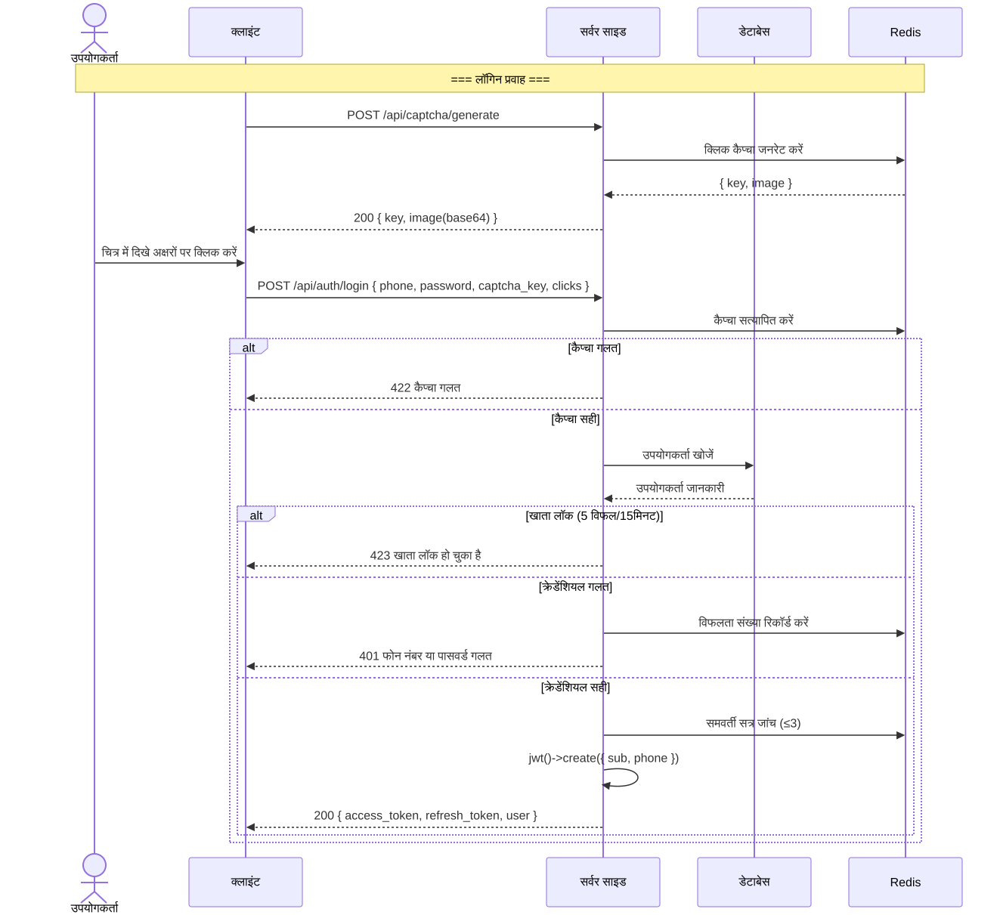
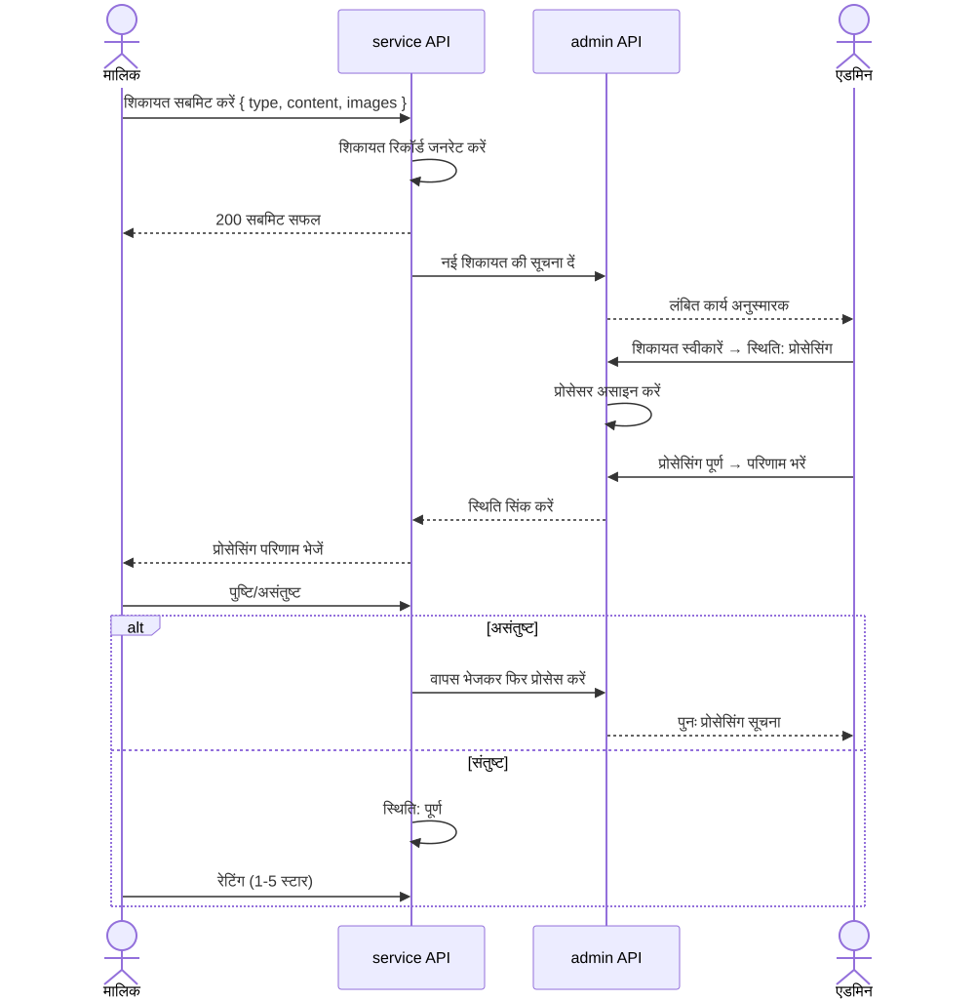

# व्यावसायिक प्रवाह आरेख (Business Flowchart)

> Copyright (c) 2026 erik <erik@erik.xyz> — https://erik.xyz

---

## 1. उपयोगकर्ता प्रमाणीकरण प्रवाह

---

## 2. मुख्य व्यावसायिक प्रवाह — शुल्क प्रबंधन

---

## 3. मरम्मत अनुरोध प्रसंस्करण प्रवाह

---

## 4. संपत्ति प्रबंधन प्रवाह

---

## 5. शिकायत सुझाव प्रसंस्करण प्रवाह

---

## 6. अतिथि प्रवेश प्रवाह

