# फ़ंक्शन मॉड्यूल आरेख (Function Module Diagram)

> Copyright (c) 2026 erik <erik@erik.xyz> — https://erik.xyz

---

## 1. फ़ंक्शन मॉड्यूल पैनोरमा

---

## 2. मॉड्यूल निर्भरता संबंध

---

## 3. एडमिन बैकएंड फ़ंक्शन ट्री

---

## 4. मालिक पोर्टल फ़ंक्शन मैप

