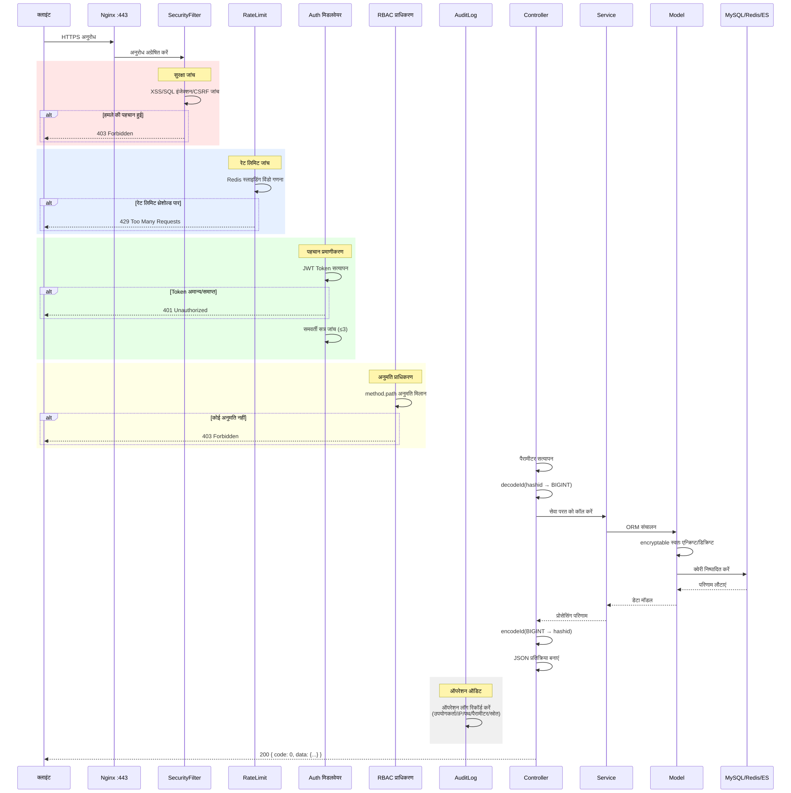
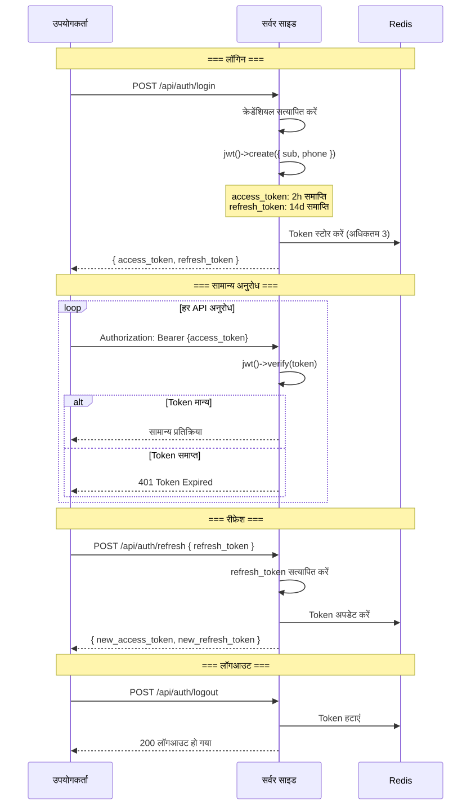

# जीवनचक्र आरेख (Lifecycle Diagram)

> Copyright (c) 2026 erik <erik@erik.xyz> — https://erik.xyz

> English edition: `../../../images/design_lifecycle_en.svg`

---

## 1. अनुरोध जीवनचक्र

---

## 2. डेटा इकाई जीवनचक्र — मालिक (Owner)

---

## 3. डेटा इकाई जीवनचक्र — शुल्क बिल (Fee Bill)

---

## 4. डेटा इकाई जीवनचक्र — मरम्मत कार्य आदेश (Repair Order)

---

## 5. JWT Token जीवनचक्र

---

## 6. डेटाबेस रिकॉर्ड पूर्ण जीवनचक्र

