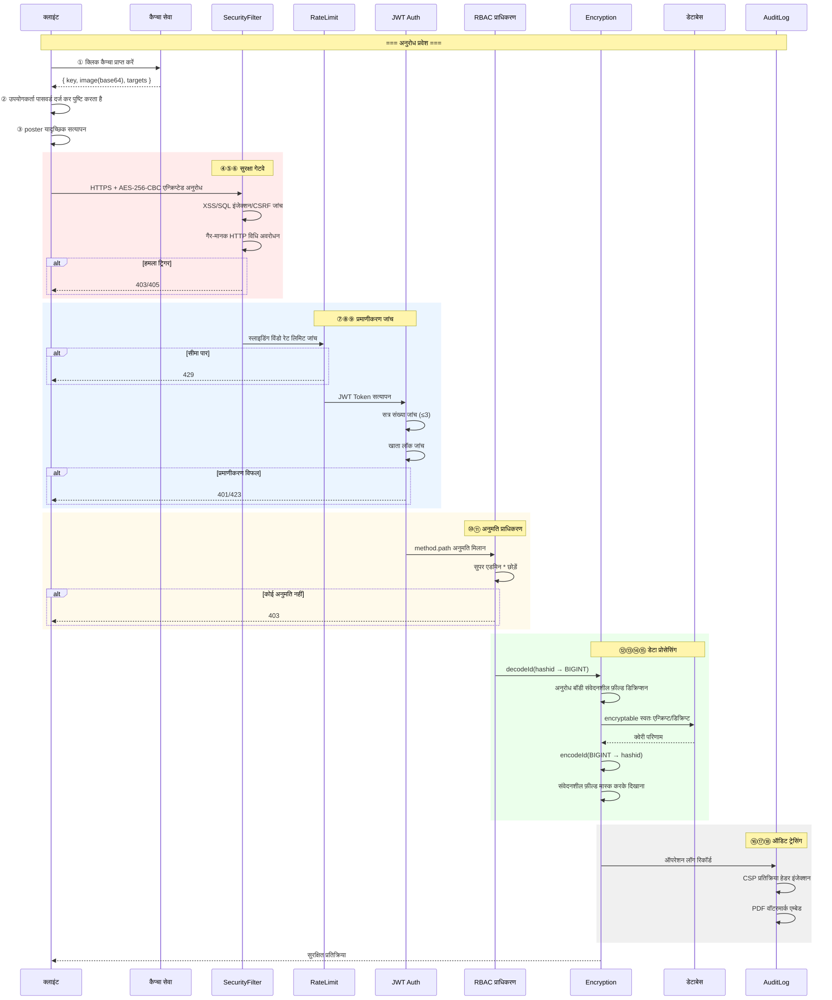

# सुरक्षा आर्किटेक्चर आरेख (Security Architecture Diagram)

> Copyright (c) 2026 erik <erik@erik.xyz> — https://erik.xyz

---

## 1. 18-परत गहराई रक्षा पैनोरमा

---

## 2. अनुरोध सुरक्षा प्रसंस्करण श्रृंखला

---

## 3. डेटा एन्क्रिप्शन पूर्ण श्रृंखला

---

## 4. प्रमाणीकरण और प्राधिकरण मॉडल

---

## 5. हमले की सतह सुरक्षा मैट्रिक्स

---

## 6. ऑडिट ट्रेसिंग प्रणाली

