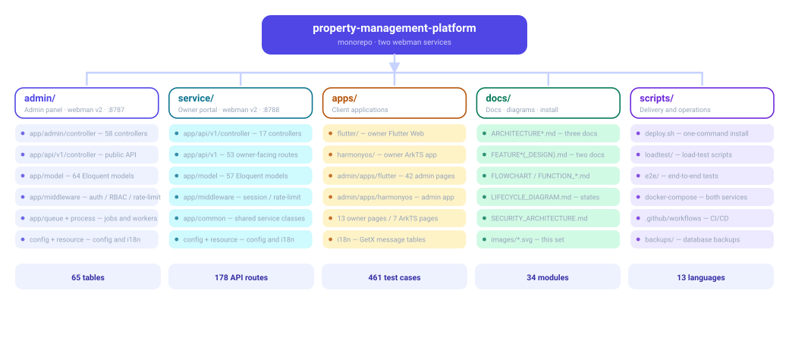
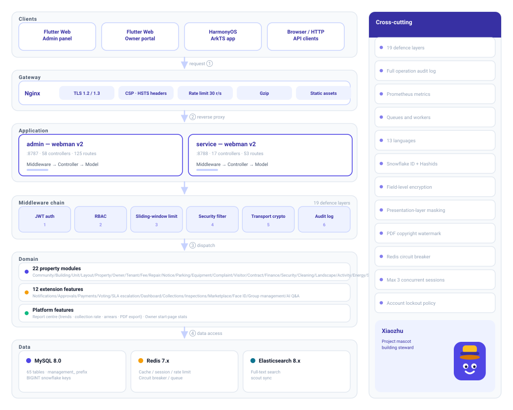
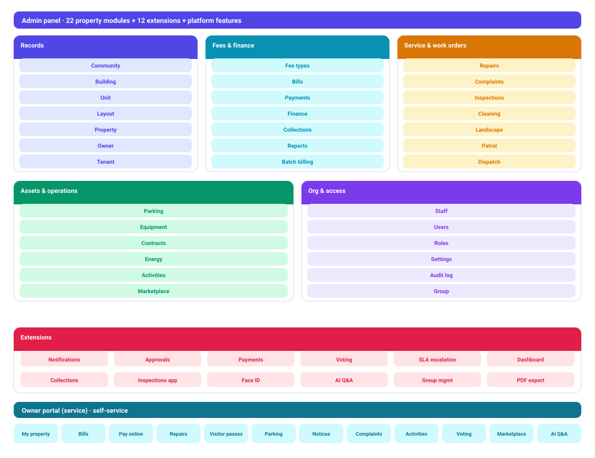
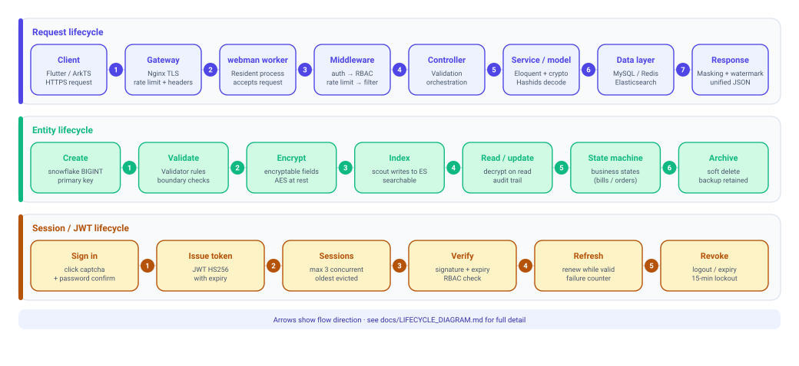

# Sistem Manajemen Properti (Property Management Platform)

[Bahasa Indonesia](../id/README.md) | [中文](../../../README.md)

[English](../en/README.md) | [한국어](../ko/README.md) | [Русский](../ru/README.md) | [Deutsch](../de/README.md) | [Français](../fr/README.md) | [Español](../es/README.md) | [Português](../pt/README.md) | [हिन्दी](../hi/README.md) | [العربية](../ar/README.md) | [বাংলা](../bn/README.md) | [日本語](../ja/README.md) | 中文

> Copyright (c) 2026 erik <erik@erik.xyz> — https://erik.xyz


Sistem manajemen properti full-stack yang mencakup 22 modul bisnis + 12 fitur ekstensi (notifikasi pesan/alur persetujuan/pembayaran/voting/SLA/data besar/penagihan/pemeliharaan/toko/face/group/tanya jawab cerdas). Panel admin dan portal pemilik di-deploy terpisah, frontend mencakup Flutter Web (gaya backoffice PC) dan aplikasi mobile HarmonyOS.

**Xiaozhu** (小筑) adalah maskot proyek — pengelola gedung yang dipersonifikasikan dengan jendela menyala, muncul di wizard instalasi, halaman error, halaman login, dan diagram arsitektur.

## Struktur Proyek

```
property-management-platform/
├── admin/                         # Proyek webman v2 panel admin
│   ├── app/
│   │   ├── admin/controller/      # Controller panel admin
│   │   ├── api/v1/controller/     # Controller API publik
│   │   ├── common/                # Kelas utilitas umum
│   │   ├── middleware/            # Middleware (auth/otorisasi/rate limit/keamanan)
│   │   ├── model/                 # Model data (Eloquent ORM)
│   │   ├── queue/                 # Tugas antrian
│   │   └── process/               # Manajemen proses
│   ├── apps/
│   │   ├── flutter/               # Flutter Web backoffice (gaya PC)
│   │   └── harmonyos/             # Aplikasi HarmonyOS backoffice
│   ├── config/                    # File konfigurasi (dengan komentar bahasa Mandarin)
│   ├── database/
│   │   └── backup/                # Skrip backup database
│   ├── resource/
│   │   └── translations/          # File bahasa internasional (zh_CN / en)
│   ├── docs/                      # Dokumentasi panel admin
│   ├── tests/                     # Unit test
│   └── public/                    # Entry Web
├── service/                       # Proyek webman v2 portal pemilik
│   ├── app/
│   │   ├── api/v1/controller/     # Controller API portal pemilik
│   │   ├── common/                # Kelas utilitas umum
│   │   ├── middleware/            # Middleware
│   │   ├── model/                 # Model data
│   │   └── process/               # Manajemen proses
│   ├── config/                    # File konfigurasi
│   ├── resource/
│   │   └── translations/          # File bahasa internasional
├── apps/
│   ├── flutter/                   # Flutter Web portal pemilik (gaya PC)
│   └── harmonyos/                 # Aplikasi HarmonyOS portal pemilik
└── docs/                          # Dokumentasi proyek
    ├── ARCHITECTURE.md
    ├── ARCHITECTURE_DESIGN.md
    ├── ARCHITECTURE_DIAGRAM.md    # Diagram arsitektur sistem
    ├── FLOWCHART.md               # Diagram alur bisnis
    ├── FUNCTION_DIAGRAM.md        # Diagram modul fungsi
    ├── LIFECYCLE_DIAGRAM.md       # Diagram siklus hidup
    ├── SECURITY_ARCHITECTURE.md   # Diagram arsitektur keamanan
    ├── API.md
    ├── FEATURES.md
    └── FEATURE_DESIGN.md
```



## Skala Proyek

| Lapisan | Jumlah | Detail |
|----|------|------|
| Tabel database | 65 | Semua berprefiks `management_`, primary key BIGINT non-auto-increment |
| Model PHP | admin 64 / service 57 | Semua model Eloquent, berisi field terenkripsi encryptable; 57 di service adalah jumlah file model (termasuk kelas dasar BaseModel) |
| Controller admin | 58 | Umum + 22 modul properti + 12 fitur ekstensi |
| Controller service | 17 | Semua API portal pemilik |
| Route API | 178 | admin 125 + service 53 |
| Flutter backoffice | 42 halaman | 42 modul halaman admin, 96 file/6.662 baris |
| Flutter portal pemilik | 13 halaman | biaya/perbaikan/parkir/tamu/aktivitas/notifikasi/voting/toko/tanya jawab/face, 32 file/3.582 baris |
| HarmonyOS | 7 halaman | login/beranda/tagihan/perbaikan(2)/pengumuman/pusat pribadi, 11 file/927 baris |
| Pengujian | 133 | admin 90 (217 assertion) + service 43 (248 assertion) |

## Arsitektur Sistem dan Diagram Desain

> Berikut diagram ringkasan, diagram detail lihat [Diagram Arsitektur](docs/ARCHITECTURE_DIAGRAM.md) · [Diagram Alur](docs/FLOWCHART.md) · [Diagram Fungsi](docs/FUNCTION_DIAGRAM.md) · [Diagram Siklus Hidup](docs/LIFECYCLE_DIAGRAM.md) · [Diagram Arsitektur Keamanan](docs/SECURITY_ARCHITECTURE.md)

### Arsitektur Panorama Sistem



### Ikhtisar Modul Fungsi



### Siklus Hidup Entitas Data



### Alur Bisnis Inti



### Pertahanan Berlapis Keamanan 18 Lapis



## Modul Fungsi (22 modul besar + 12 ekstensi)

| Batch | Modul | Status |
|------|------|------|
| Batch 1 | komunitas, gedung, unit, tipe ruangan, properti, pemilik, penyewa, biaya, perbaikan, pengumuman (10 modul) | ✅ Semua selesai |
| Batch 2 | parkir, peralatan, keluhan, tamu, kontrak, keuangan (6 modul) + visualisasi panel + ekspor Excel/PDF (fitur platform) | ✅ Semua selesai |
| Batch 3 | patroli keamanan, kebersihan, penghijauan, aktivitas komunitas, energi, karyawan (6 modul) | ✅ Semua selesai |
| Ekstensi | notifikasi pesan, alur persetujuan, integrasi pembayaran, voting pemilik, eskalasi SLA otomatis, data besar, penagihan cerdas, pemeliharaan mobile, toko komunitas, pengenalan wajah, manajemen grup multi-komunitas, tanya jawab cerdas (12 modul) | ✅ Semua selesai |
| Fitur platform | Pusat laporan (tren pendapatan/pengeluaran, tingkat penagihan, distribusi, tunggakan, ekspor PDF) + statistik beranda (keluhan/aktivitas/voting/belum dibaca) | ✅ Semua selesai |

## Tumpukan Teknologi

### Backend
- **Framework**: webman v2 (workerman/webman)
- **Bahasa**: PHP 8.3+
- **Database**: MySQL 8.0+, prefiks tabel `management_`, primary key BIGINT non-auto-increment
- **Mesin pencari**: Elasticsearch 8.x
- **Cache**: Redis 7.x

### Dependensi Inti
| Nama paket | Fungsi |
|------|------|
| `erikwang2013/snowflake-php` | Generator primary key BIGINT unik global |
| `erikwang2013/hashids` | Enkripsi/dekripsi ID lapisan API |
| `erikwang2013/jwt-webman` | Autentikasi JWT (HS256) |
| `erikwang2013/encryption` | Enkripsi AES-256-CBC data sensitif transfer API |
| `erikwang2013/encryptable` | Enkripsi/dekripsi field sensitif database |
| `erikwang2013/webman-scout` | Sinkronisasi data Elasticsearch dan pencarian teks lengkap |
| `erikwang2013/season` | Data bendera negara |
| `erikwang2013/security-php` | Deteksi alat keamanan |
| `erikwang2013/poster-php` | Kode verifikasi acak untuk operasi sensitif |
| `phpoffice/phpspreadsheet` | Ekspor Excel |
| `barryvdh/laravel-dompdf` | Ekspor PDF |
| `hg/apidoc` | Pembuatan otomatis dokumentasi API |

### Frontend
- **Flutter 3.x** + GetX (termasuk i18n) + Dio + fl_chart — backoffice Web gaya PC
- **HarmonyOS ArkTS** + @ohos.net.http — aplikasi mobile

### Dokumentasi API

Seluruh endpoint API dan deskripsi parameter lihat dokumen terpisah [docs/API.md](docs/API.md). Setelah layanan berjalan juga dapat mengakses dokumentasi interaktif yang dibuat otomatis oleh apidoc:

| Sisi | Alamat | Grup |
|----|------|------|
| Panel admin | `http://localhost:8787/apidoc` | 10 grup (common/dashboard/system/property-core/property-aux/property-adv/extensions/export/import/upload) |
| Portal pemilik | `http://localhost:8788/apidoc` | 9 grup (public/beranda/biaya/perbaikan/umpan balik/parkir/aktivitas/pribadi/ekstensi) |

### Internasionalisasi

- **Backend PHP**: symfony/translation, file bahasa di `resource/translations/{zh_CN,en}/messages.php`
- **Flutter Web**: GetX `Translations`, `apps/flutter/lib/i18n/messages.dart`
- **Bahasa default**: Mandarin Sederhana (zh_CN), mendukung peralihan ke Inggris (en)
- **Request header**: mendukung kontrol bahasa respons melalui header `Accept-Language`

## Sistem Keamanan (Pertahanan Berlapis 18 Lapis)

1. Kode verifikasi klik → 2. Konfirmasi ulang kata sandi → 3. Verifikasi acak poster → 4. Pemindaian keamanan security-php → 5. Pemblokiran serangan SecurityFilter → 6. Enkripsi transfer HTTPS + AES-256-CBC → 7. Autentikasi JWT HS256 → 8. Pembatasan sesi konkuren (maks 3) → 9. Penguncian akun (5 kali gagal/15 menit) → 10. Otorisasi RBAC (granularitas method.path) → 11. Rate limit sliding window Redis → 12. Proteksi ID Hashids → 13. Enkripsi field sensitif request body → 14. Penyimpanan terenkripsi field DB → 15. Masking data pada lapisan tampilan → 16. Audit lengkap log operasi (8 sumber platform) → 17. Proteksi header CSP → 18. Watermark hak cipta PDF

## Standar Kode

- Semua file baru menyertakan pernyataan hak cipta di bagian atas: `Copyright (c) 2026 erik <erik@erik.xyz> — https://erik.xyz`
- Referensi fungsi/kelas global menggunakan `use`, tanpa `\` di depan
- File konfigurasi berisi komentar bahasa Mandarin yang menjelaskan setiap item konfigurasi
- Primary key ID menggunakan BIGINT UNSIGNED NOT NULL, dihasilkan oleh snowflake-php di lapisan aplikasi
- ID transfer API menggunakan enkripsi/dekripsi hashids

## Memulai dengan Cepat
### ⚡ Instalasi Sekali Klik (Tercepat)

```bash
bash scripts/deploy.sh
# Otomatis: git pull → buat .env + kunci → jalankan Docker Compose → inisialisasi DB (idempoten) → uji asap monitoring
# Admin http://localhost:8787 · Service http://localhost:8788
```

> Membutuhkan Docker + Docker Compose. Idempoten dan dapat dijalankan ulang; lihat [scripts/deploy.sh](scripts/deploy.sh).


### Cara 1: Panduan Instalasi Web (Disarankan)

Setelah panel admin berjalan, akses `http://localhost:8787/install` untuk menyelesaikan konfigurasi database dan pembuatan akun admin melalui antarmuka.

```bash
cd admin
cp .env.example .env
composer install
php start.php start -d
# Akses http://localhost:8787/install untuk menyelesaikan instalasi
```

Lihat [Panduan Instalasi](docs/INSTALL.md).

### Cara 2: Instalasi Manual

#### Persyaratan Lingkungan

- PHP 8.1+
- MySQL 8.0+
- Redis 6.0+
- Composer 2.x
- Flutter SDK 3.x (pengembangan frontend)

#### 1. Inisialisasi Database

```bash
mysql -u root -e "CREATE DATABASE IF NOT EXISTS management DEFAULT CHARSET utf8mb4 COLLATE utf8mb4_unicode_ci;"
mysql -u root management < docs/install.sql
```

#### 2. Menjalankan Panel Admin

```bash
cd admin
cp .env.example .env
# Edit .env untuk mengubah kata sandi database dan konfigurasi lainnya
composer install
php start.php start -d
# Panel admin berjalan di http://localhost:8787
```

### 3. Menjalankan Portal Pemilik

```bash
cd service
cp .env.example .env
# Edit .env untuk mengubah kata sandi database dan konfigurasi lainnya
composer install
php start.php start -d
# Portal pemilik berjalan di http://localhost:8788
```

### 4. Menjalankan Frontend (Pengembangan)

```bash
cd apps/flutter
flutter pub get
flutter run -d chrome
```

### 5. Menjalankan Pengujian

```bash
# Pengujian panel admin
cd admin && php vendor/bin/phpunit

# Pengujian portal pemilik
cd service && php vendor/bin/phpunit
```

| Proyek | Jumlah tes | Assertion | Tingkat kelulusan |
|------|--------|--------|--------|
| admin | 90 | 217 | 100% |
| service | 43 | 248 | 100% (1 skip) |
| **Total** | **133** | **465** | — |

Cakupan tes service: Snowflake ID, encoding/dekoding Hashids, format respons, skema database, file terjemahan i18n

### Deployment Docker

```bash
cd admin
cp .env.docker .env
docker-compose up -d
# Termasuk Nginx + PHP + MySQL + Redis + Elasticsearch
```

## Topologi Deployment

```
Nginx (:443) → admin webman (:8787) + service webman (:8788) → MySQL + Redis + Elasticsearch
File statis: Flutter Web build/
```

## Panduan Penggunaan

### Panel Admin
1. Buka `http://localhost:8787` dan masuk dengan akun admin default.
2. Data dasar: Komunitas → Gedung → Unit → Tipe Ruangan → Properti → tautkan pemilik.
3. Operasi harian: konfigurasi biaya, buat tagihan, penagihan; perbaikan (tugaskan/progres); keluhan (tangani/kunjungi); Pusat Laporan untuk pendapatan & penagihan.
4. Sistem: tambah admin, RBAC, konfigurasi, log audit.

### Portal Pemilik
Buka `http://localhost:8788` (atau Flutter Web / HarmonyOS): beranda menampilkan properti, tagihan, perbaikan, keluhan, aktivitas, voting dan pesan belum dibaca.

## Admin Default

| Username | Kata sandi | Peran |
|--------|------|------|
| admin | admin123 | Super admin |

> Segera ubah kata sandi default di lingkungan produksi.

## Indeks Dokumen

| Dokumen | Deskripsi |
|------|------|
| [Panduan Instalasi](docs/INSTALL.md) | Panduan deploy dari nol, termasuk inisialisasi database, deployment Docker, FAQ |
| [Skrip instalasi gabungan](docs/install.sql) | Semua 65 tabel + data seed RBAC, impor satu kali |
| [Perbandingan versi](docs/EDITIONS.md) | Perbandingan fitur dan indikator teknis Lite / Standard / Full |
| [Dokumen desain arsitektur](docs/ARCHITECTURE_DESIGN.md) | Arsitektur berlapis sistem, rantai eksekusi middleware, desain pertahanan berlapis keamanan |
| [Dokumen arsitektur](docs/ARCHITECTURE.md) | Diagram arsitektur Mermaid (topologi sistem, siklus hidup request, enkripsi data, deployment) |
| [Diagram arsitektur sistem](docs/ARCHITECTURE_DIAGRAM.md) | Arsitektur panorama, diagram berlapis detail, arsitektur deployment (visualisasi Mermaid) |
| [Diagram alur bisnis](docs/FLOWCHART.md) | Alur autentikasi, manajemen biaya, pemrosesan perbaikan, manajemen properti, keluhan, tamu |
| [Diagram modul fungsi](docs/FUNCTION_DIAGRAM.md) | Panorama 34 modul, hubungan dependensi, pohon fungsi backoffice, peta fungsi portal pemilik |
| [Diagram siklus hidup](docs/LIFECYCLE_DIAGRAM.md) | Siklus hidup request, siklus hidup entitas, siklus hidup Token, alur lengkap CRUD |
| [Diagram arsitektur keamanan](docs/SECURITY_ARCHITECTURE.md) | Panorama pertahanan berlapis 18 lapis, matriks proteksi permukaan serangan, rantai enkripsi lengkap, sistem audit pelacakan |
| [Dokumen desain fitur](docs/FEATURE_DESIGN.md) | Spesifikasi fungsi 34 modul |
| [Dokumen fitur](docs/FEATURES.md) | Daftar fitur dan ikhtisar modul |
| [Dokumentasi API](docs/API.md) | Semua endpoint API dan deskripsi parameter |

## Dukung Proyek

Terima kasih atas dukungan Anda!

|  |  |
|:---:|:---:|
| Pembayaran WeChat | Alipay |

### Donasi Transfer Bank Global

Mendukung transfer bank dari seluruh dunia, akun penerima adalah ZA Bank Hong Kong (Bank Zhong'an):

| Item | Informasi |
|------|------|
| Nama penerima | WANG KEXUN |
| Nomor akun penerima | 881015918251 |
| Bank penerima | ZA Bank Limited |
| SWIFT Code | AABLHKHHXXX |
| Kode bank | 387 |
| Alamat bank | Core F, Cyberport 3, 100 Cyberport Road, Hong Kong |

> **Bank agen transfer lintas batas (bank perantara)**: berikut adalah informasi bank agen (bank perantara), bukan informasi bank penerima. Silakan tanyakan ke bank pengirim apakah perlu menyediakan informasi bank agen.
>
> - **Masuk dalam HKD, RMB, dan USD** (Citibank N.A. Hong Kong): SWIFT `CITIHKXXXX`, kode bank 006, kode cabang 391, alamat: Citibank Tower, Citibank Plaza, 3 Garden Road, Central, Hong Kong
> - **Masuk dalam mata uang lain** (THE BANK OF NEW YORK MELLON): SWIFT `IRVTUS3NXXX`, alamat: 240 GREENWICH STREET, NEW YORK, United States

### Donasi Kripto (Crypto Donation)

Jika proyek ini membantu Anda, silakan pindai kode QR untuk berdonasi, terima kasih!

| <br>**BNB Smart Chain (BEP20)**<br>`0x355d429f97511897ccb4e271ec888205f9ab6629` | <br>**Tron (TRC20)**<br>`TEdDHWLajt1XvqtPDWmQctdrJaC3pzZZzz` |
| <br>**Ethereum (ERC20)**<br>`0x355d429f97511897ccb4e271ec888205f9ab6629` | <br>**Aptos**<br>`0x836e3780edfc3f7b2372b39e2a1a3a5d7adfaccd96c726f21cfde1b50dd68030` |
| <br>**Plasma**<br>`0x355d429f97511897ccb4e271ec888205f9ab6629` | <br>**Polygon POS**<br>`0x355d429f97511897ccb4e271ec888205f9ab6629` |
| <br>**Solana**<br>`2hfhboHdmdrYsY25XfQSsEWxq5ip4EQsR7f4AzSRMUyr` | <br>**The Open Network (TON)**<br>`UQB9kFQohzmXUir9QSSZq01iwl9aQZIDdBpNmDklljRtCoGK` |
| <br>**Arbitrum One**<br>`0x355d429f97511897ccb4e271ec888205f9ab6629` | <br>**AVAX C-Chain**<br>`0x355d429f97511897ccb4e271ec888205f9ab6629` |

Selamat datang untuk mendukung proyek ini!

## Lisensi

Lisensi MIT. Lihat [LICENSE](LICENSE) untuk detail.
