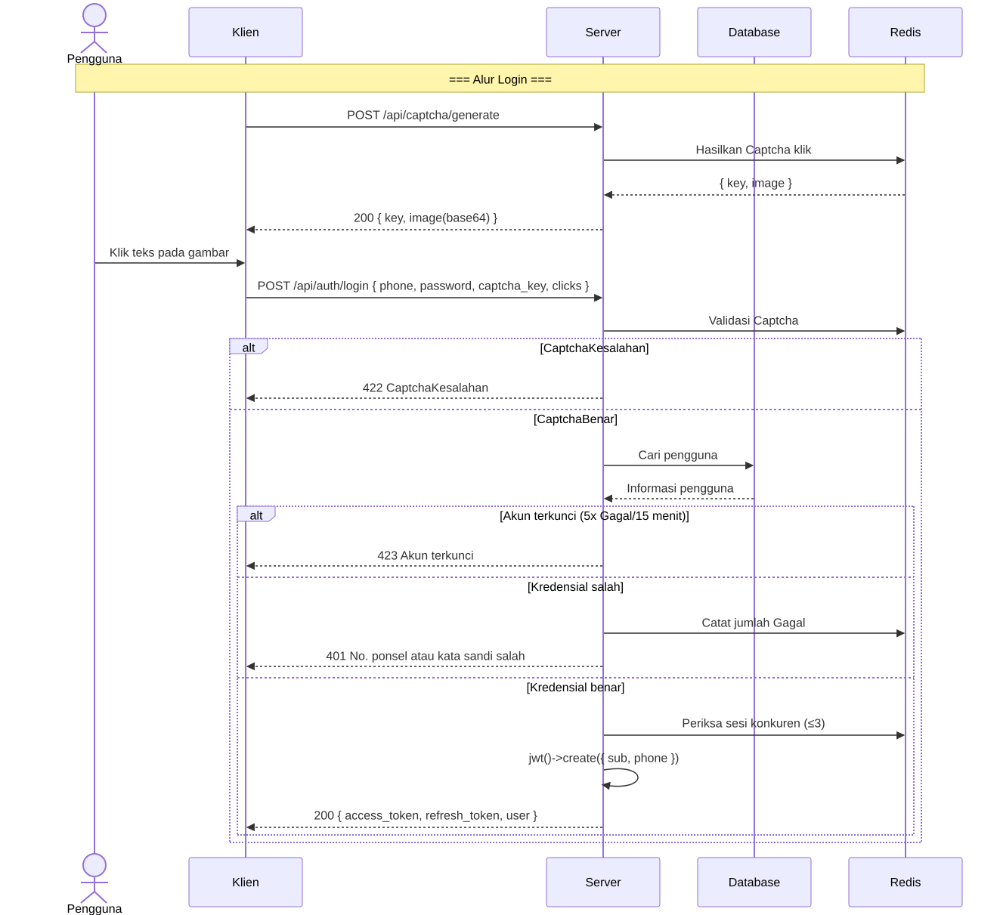
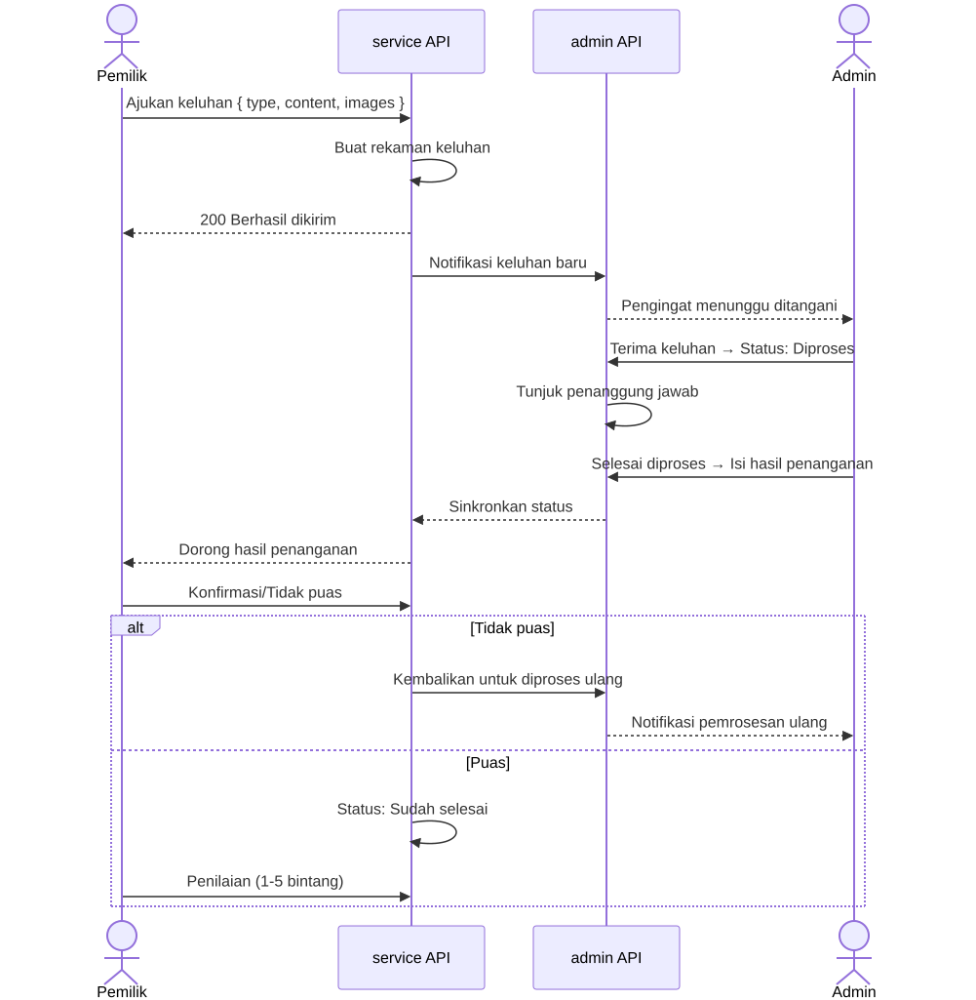

# Diagram Alur Bisnis (Business Flowchart)

> Copyright (c) 2026 erik <erik@erik.xyz> — https://erik.xyz

---

## 1. Alur Autentikasi Pengguna

---

## 2. Alur Bisnis Inti — Manajemen Biaya

---

## 3. Alur Pemrosesan Permintaan Perbaikan

---

## 4. Alur Manajemen Properti

---

## 5. Alur Pemrosesan Keluhan dan Saran

---

## 6. Alur Akses Tamu

